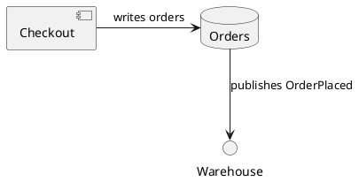

# Architecture Graph Phase 1 Foundation Implementation Plan

> **For agentic workers:** REQUIRED SUB-SKILL: Use `$subagent-driven-development` (recommended, if installed) or `$executing-plans` to implement this plan task-by-task. Steps use checkbox (`- [ ]`) syntax for tracking.

**Goal:** Build the installable skill shell, deterministic JSON/JSONL memory system, source selection, text-native ingestion, and bounded status/get/find commands.

**Architecture:** Keep the repository root as the skill folder and place the Python package under `scripts/architecture_graph/`. Index selected Git-working-tree inputs into an immutable, content-addressed snapshot staged and published with a project lock; keep wall-clock and Git-run facts in a separate atomic observation ledger. Phase 1 stops at source, segment, evidence, derivation, and warning records so Phase 2 can analyze a stable ingestion contract.

**Tech Stack:** uv-managed Python 3.12.13, argparse, dataclasses, jsonlines 4.x, PyYAML 6.x, JMESPath 1.1.x, pytest 9.x, uv.

## Global Constraints

- Durable project state is standard JSON and JSONL; no database is allowed.
- `index` performs no LLM call, network call, model download, or dependency installation.
- Tracked files are eligible by default; only explicitly configured untracked files are eligible.
- Canonical deterministic payloads use NFC UTF-8, sorted object keys, compact separators, LF endings, eight-decimal finite floats, stable record ordering, and no wall-clock fields.
- `current.json`, branch, commit, dirty fingerprint, publication time, and observation ID stay outside snapshot content identity.
- Generated snapshots never overwrite `reviews/reviews.jsonl`.
- Read commands do not create directories, repair state, or mutate current memory.
- Default read limits are 20 records, depth 2, three evidence excerpts per item, and 12,000 rendered characters.
- The first prose adapter is English. Parser failure creates an explicit warning; indexing never triggers a download.
- Phase 1 publication locking uses the POSIX `fcntl` API. A later cross-platform release must replace that adapter or add a scoped lock dependency before claiming Windows support.
- Run each task test-first and commit only after its focused and cumulative tests pass.

---

## File Map

### Skill and package shell

- `SKILL.md`: concise status-first agent workflow and provenance rules.
- `agents/openai.yaml`: Codex UI name, description, and default invocation.
- `references/agent-usage.md`: command examples and output contracts loaded only when needed.
- `references/configuration.md`: strict source-selection, memory-root, and no-download configuration contract.
- `pyproject.toml`: one package version source, dependency ranges, console entry point, and pytest settings.
- `.python-version`: uv-managed Python 3.12.13 selection for byte-reproducible runtime fingerprints and Phase 2 goldens.
- `uv.lock`: resolved dependency graph.
- `bin/architecture-graph`: no-network wrapper that prefers the existing project virtual environment.
- `scripts/architecture_graph/__init__.py`: sole package version constant.
- `scripts/architecture_graph/cli.py`: argparse construction, error mapping, and command dispatch.

### Deterministic storage and source ingestion

- `scripts/architecture_graph/canonical.py`: canonical JSON, hashes, stable IDs, and atomic small-JSON writes.
- `scripts/architecture_graph/records.py`: record kinds, content-digest validation, source spans, and record builders.
- `scripts/architecture_graph/config.py`: typed `.architecture-graph.yaml` loading and defaults.
- `scripts/architecture_graph/project.py`: project identity, memory-root precedence, paths, lock, and Git observation facts.
- `scripts/architecture_graph/fingerprint.py`: deterministic pipeline and material-input digests.
- `scripts/architecture_graph/sources.py`: tracked/configured-untracked discovery and source-version records.
- `scripts/architecture_graph/jsonl_store.py`: sorted JSONL reads/writes, read-only selection, and crash-safe append-only ledgers.
- `scripts/architecture_graph/snapshot.py`: staging, validation, payload digests, collision checks, observation publication, CAS, and current pointer.
- `scripts/architecture_graph/ingest/__init__.py`: adapter dispatch and aggregate ingestion result.
- `scripts/architecture_graph/ingest/markdown.py`: Markdown headings, ADR metadata, paragraphs, lists, and embedded fences.
- `scripts/architecture_graph/ingest/diagrams.py`: Mermaid and PlantUML statement segmentation.
- `scripts/architecture_graph/ingest/structured.py`: safe YAML and JSON object segmentation.
- `scripts/architecture_graph/ingest/plaintext.py`: bounded plain-text paragraph segmentation.
- `scripts/architecture_graph/indexer.py`: Phase 1 orchestration and deterministic ingestion report.
- `scripts/architecture_graph/query.py`: bounded status/get/find result envelopes.

### Tests and fixtures

- `tests/conftest.py`: temporary Git-repository and memory-root helpers.
- `tests/test_cli_smoke.py`: package version, metadata, wrapper, and CLI error contracts.
- `tests/test_canonical.py`: canonicalization and record identity.
- `tests/test_sources.py`: configuration, tracked/dirty/untracked selection, and material fingerprints.
- `tests/test_jsonl_store.py`: sorted records, read-only access, and atomic ledger replacement.
- `tests/test_snapshot.py`: deterministic identity, locking, collision, CAS, and observation behavior.
- `tests/test_markdown_ingest.py`: ADR, Markdown, and embedded Mermaid records.
- `tests/test_other_ingest.py`: PlantUML, YAML, JSON, plain text, and parser warnings.
- `tests/test_phase1_cli.py`: end-to-end indexing, status, get, find, limits, and golden repeatability.
- `tests/fixtures/phase1_repo/`: checked-in architecture corpus copied into temporary Git repositories.

---

### Task 1: Skill Shell, Package, and No-Network CLI

**Files:**
- Create: `SKILL.md`
- Create: `agents/openai.yaml`
- Create: `references/agent-usage.md`
- Create: `.gitignore`
- Create: `pyproject.toml`
- Create: `.python-version`
- Create: `uv.lock`
- Create: `bin/architecture-graph`
- Create: `scripts/architecture_graph/__init__.py`
- Create: `scripts/architecture_graph/cli.py`
- Create: `tests/test_cli_smoke.py`

**Interfaces:**
- Produces: `architecture_graph.__version__: str`.
- Produces: `architecture_graph.cli.build_parser() -> argparse.ArgumentParser`.
- Produces: `architecture_graph.cli.main(argv: list[str] | None = None) -> int`.
- Produces: shell command `bin/architecture-graph` and installed command `architecture-graph`.

- [ ] **Step 1: Generate the required skill scaffold outside the existing repository root**

Run:

```bash
ARCH_GRAPH_SCAFFOLD="$(mktemp -d /private/tmp/architecture-graph-scaffold.XXXXXX)"
python3 /Users/patrick/.codex/skills/.system/skill-creator/scripts/init_skill.py architecture-graph \
  --path "$ARCH_GRAPH_SCAFFOLD" \
  --resources scripts,references \
  --interface 'display_name=Architecture Graph' \
  --interface 'short_description=Rank and review architecture decisions' \
  --interface 'default_prompt=Use $architecture-graph to index repository architecture sources and return a compact, evidence-backed decision brief.'
cp -R "$ARCH_GRAPH_SCAFFOLD/architecture-graph/." .
```

Expected: the initializer reports `architecture-graph` created successfully, and the repository contains `SKILL.md`, `agents/openai.yaml`, `scripts/`, and `references/` without changing `docs/`.

- [ ] **Step 2: Write the failing CLI and metadata tests**

Create `tests/test_cli_smoke.py`:

```python
from importlib.metadata import version
from pathlib import Path
import subprocess

import pytest

from architecture_graph import __version__
from architecture_graph.cli import main


ROOT = Path(__file__).resolve().parents[1]


def test_package_version_has_one_source() -> None:
    assert __version__ == version("architecture-graph-skill")


def test_cli_prints_version(capsys) -> None:
    with pytest.raises(SystemExit) as raised:
        main(["--version"])
    assert raised.value.code == 0
    assert capsys.readouterr().out.strip() == __version__


def test_wrapper_prints_version_from_project_environment() -> None:
    result = subprocess.run(
        [str(ROOT / "bin" / "architecture-graph"), "--version"],
        cwd=ROOT,
        check=False,
        capture_output=True,
        text=True,
    )
    assert result.returncode == 0
    assert result.stdout.strip() == __version__
```

Run:

```bash
uv run pytest tests/test_cli_smoke.py -q
```

Expected: FAIL because `architecture_graph` and its CLI do not exist yet.

- [ ] **Step 3: Add package metadata and the single version source**

Replace `pyproject.toml` with:

```toml
[build-system]
requires = ["setuptools>=75"]
build-backend = "setuptools.build_meta"

[project]
name = "architecture-graph-skill"
dynamic = ["version"]
description = "Deterministic-first architecture decision graph skill."
requires-python = ">=3.12,<3.13"
dependencies = [
  "jmespath>=1.1,<2",
  "jsonlines>=4.0,<5",
  "PyYAML>=6.0,<7",
]

[dependency-groups]
dev = ["pytest>=9.1,<10"]

[project.scripts]
architecture-graph = "architecture_graph.cli:main"

[tool.setuptools]
package-dir = {"" = "scripts"}

[tool.setuptools.dynamic]
version = {attr = "architecture_graph.__version__"}

[tool.setuptools.packages.find]
where = ["scripts"]

[tool.pytest.ini_options]
addopts = "-ra"
pythonpath = ["scripts"]
testpaths = ["tests"]
```

Create `scripts/architecture_graph/__init__.py`:

```python
"""Architecture graph skill runtime."""

__version__ = "0.1.0"
```

Run:

```bash
uv python pin 3.12.13
uv lock
uv sync
```

Expected: `.python-version` contains `3.12.13`, `uv.lock` is created, and the project plus development dependencies install into `.venv`. The exact patch is intentional because `platform.python_version()` participates in the deterministic pipeline fingerprint.

- [ ] **Step 4: Add the minimal argparse entry point and wrapper**

Create `scripts/architecture_graph/cli.py`:

```python
from __future__ import annotations

import argparse
from collections.abc import Mapping, Sequence

from architecture_graph import __version__


def build_parser() -> argparse.ArgumentParser:
    parser = argparse.ArgumentParser(prog="architecture-graph")
    parser.add_argument("--version", action="version", version=__version__)
    return parser


def main(argv: Sequence[str] | None = None) -> int:
    build_parser().parse_args(argv)
    return 0


if __name__ == "__main__":
    raise SystemExit(main())
```

Create `bin/architecture-graph`:

```bash
#!/usr/bin/env bash
set -euo pipefail

SKILL_ROOT="$(cd "$(dirname "${BASH_SOURCE[0]}")/.." && pwd)"
if [[ -x "$SKILL_ROOT/.venv/bin/python" ]]; then
  exec "$SKILL_ROOT/.venv/bin/python" -m architecture_graph.cli "$@"
fi
printf '%s\n' 'architecture-graph: environment missing; run `uv sync --frozen` in the skill directory' >&2
exit 2
```

Run:

```bash
chmod +x bin/architecture-graph
uv run pytest tests/test_cli_smoke.py -q
```

Expected: `3 passed`.

- [ ] **Step 5: Replace generated skill prose and add progressive usage guidance**

Replace `SKILL.md` with:

````markdown
---
name: architecture-graph
description: Build, query, and maintain evidence-backed architecture decision memories from ADRs, architecture notes, Mermaid, PlantUML, YAML, JSON, and selected text files. Use when Codex needs to identify critical design commitments, trace architecture claims to sources, find missing rationale or scope, compare architecture revisions, or prepare focused questions for an architect without loading the full corpus.
---

# Architecture Graph

## Workflow

1. Resolve `SKILL_DIR` as the directory containing this file.
2. Check memory without mutating it:

```bash
"$SKILL_DIR/bin/architecture-graph" memory status .
```

3. If selected sources or pipeline inputs changed, index them:

```bash
"$SKILL_DIR/bin/architecture-graph" index .
```

4. Use bounded `get` and `find` commands before opening broad source files. Phase 2 adds decision, graph, evidence, explanation, context, report, and diff commands.

## Trust Rules

- Treat deterministic, LLM, and human origins as separate fields.
- Require source evidence for every architecture assertion.
- Treat extraction confidence, human review status, criticality, and review priority as independent dimensions.
- Do not promote an unaccepted proposal into current commitments.
- Keep generated snapshots separate from the human review ledger.
- Open full source files only for the small evidence set returned by bounded commands.

## Reference

Read `references/agent-usage.md` for command envelopes, limits, and failure interpretation.
````

Replace `references/agent-usage.md` with:

````markdown
# Architecture Graph Agent Usage

## Phase 1 Commands

```bash
architecture-graph memory status . --json
architecture-graph index . --json
architecture-graph get sources <source-id> --json
architecture-graph get segments <segment-id> --fields id,path,text --json
architecture-graph find segments --contains OrderPlaced --limit 20 --max-chars 12000 --json
```

Read commands return complete JSON objects with `items`, `truncated`, `omitted_count`, and `cursor`. Exit code 2 means missing or invalid project state. Indexing never installs or downloads a parser. Phase 1 parser failures are persisted warnings; Phase 2 defines the optional statistical-model contract.
````

Keep the generated `agents/openai.yaml` values exactly as passed to `init_skill.py`.

- [ ] **Step 6: Add focused ignores and validate the skill**

Create `.gitignore`:

```gitignore
.codex/
.venv/
.architecture-graph/
.pytest_cache/
__pycache__/
*.py[cod]
*.egg-info/
build/
dist/
```

Run:

```bash
uv run python /Users/patrick/.codex/skills/.system/skill-creator/scripts/quick_validate.py .
uv run pytest tests/test_cli_smoke.py -q
uv run python -m compileall -q scripts
```

Expected: `Skill is valid!`, `3 passed`, and compileall exits 0.

- [ ] **Step 7: Commit the shell**

```bash
git add SKILL.md agents/openai.yaml references/agent-usage.md .gitignore .python-version pyproject.toml uv.lock bin/architecture-graph scripts/architecture_graph tests/test_cli_smoke.py
git commit -m "feat: scaffold architecture graph skill"
```

### Task 2: Canonical JSON and Record Contracts

**Files:**
- Create: `scripts/architecture_graph/canonical.py`
- Create: `scripts/architecture_graph/records.py`
- Create: `tests/test_canonical.py`

**Interfaces:**
- Produces: `canonicalize(value: object) -> object`.
- Produces: `canonical_dumps(value: object) -> str` and `canonical_bytes(value: object) -> bytes`.
- Produces: `source_revision_digest(content_hashes: Iterable[str]) -> str`; its preimage is the sorted set of unique selected source content hashes.
- Produces: `stable_id(kind: str, *parts: object) -> str`.
- Produces: `content_digest(record: Mapping[str, object]) -> str`.
- Produces: `finalize_record(record: Mapping[str, object]) -> dict[str, object]`.
- Produces: `validate_record(record: Mapping[str, object], expected_kind: str | None = None) -> None`.

- [ ] **Step 1: Write canonicalization failures first**

Create `tests/test_canonical.py`:

```python
import math

import pytest

from architecture_graph.canonical import canonical_dumps, stable_id
from architecture_graph.records import (
    SourceSpan,
    finalize_record,
    validate_record,
    validate_record_shape,
)


VALID_DIGEST = "sha256:" + "a" * 64


def test_canonical_json_normalizes_unicode_keys_and_floats() -> None:
    left = {"z": -0.0, "name": "Cafe\u0301", "score": 0.1234567891}
    right = {"score": 0.12345679, "name": "Café", "z": 0.0}
    assert canonical_dumps(left) == canonical_dumps(right)
    assert canonical_dumps(left) == '{"name":"Café","score":0.12345679,"z":0.0}'


def test_canonical_json_rejects_non_finite_numbers() -> None:
    with pytest.raises(ValueError, match="finite"):
        canonical_dumps({"score": math.nan})


def test_canonical_json_rejects_non_string_and_colliding_normalized_keys() -> None:
    with pytest.raises(TypeError, match="keys must be strings"):
        canonical_dumps({1: "value"})
    with pytest.raises(ValueError, match="duplicate normalized key"):
        canonical_dumps({"Cafe\u0301": 1, "Café": 2})


def test_source_span_requires_positive_ordered_coordinates() -> None:
    with pytest.raises(ValueError, match="positive"):
        SourceSpan(0, 1)
    with pytest.raises(ValueError, match="before start"):
        SourceSpan(3, 2)
    with pytest.raises(ValueError, match="exclusive"):
        SourceSpan(3, 3, 5, 5)


def test_stable_id_is_repeatable_and_kind_scoped() -> None:
    assert stable_id("source", "docs/adr/1.md", "abc") == stable_id(
        "source", "docs/adr/1.md", "abc"
    )
    assert stable_id("source", "docs/adr/1.md", "abc") != stable_id(
        "segment", "docs/adr/1.md", "abc"
    )


def test_finalized_record_validates_content_digest() -> None:
    record = finalize_record(
        {"id": "source:abc", "kind": "source", "path": "docs/adr/1.md"}
    )
    validate_record(record, "source")
    record["path"] = "docs/adr/2.md"
    with pytest.raises(ValueError, match="content digest"):
        validate_record(record, "source")


@pytest.mark.parametrize(
    ("changes", "message"),
    [
        ({"id": "claim:wrong-kind"}, "evidence ID"),
        ({"source_version_id": "claim:wrong-kind"}, "source_version_id"),
        ({"source_content_hash": "sha256:short"}, "source_content_hash"),
        ({"span": {"start_line": 0, "end_line": 1, "start_column": 1, "end_column": None}}, "span"),
        ({"text": 7}, "text"),
        ({"derivation_ids": []}, "derivation_ids"),
    ],
)
def test_phase1_shapes_fail_closed(changes: dict[str, object], message: str) -> None:
    record = finalize_record(
        {
            "id": "evidence:" + "b" * 64,
            "kind": "evidence",
            "source_version_id": "source:" + "c" * 64,
            "segment_id": "segment:" + "d" * 64,
            "path": "docs/adr/1.md",
            "source_content_hash": VALID_DIGEST,
            "span": {"start_line": 1, "end_line": 1, "start_column": 1, "end_column": 2},
            "text": "A",
            "derivation_ids": ["derivation:" + "e" * 64],
        }
    )
    with pytest.raises(ValueError, match=message):
        validate_record_shape({**record, **changes})


def test_derivation_producer_enum_is_closed() -> None:
    record = finalize_record(
        {
            "id": "derivation:" + "b" * 64,
            "kind": "derivation",
            "producer_kind": "robot",
            "method": "rule",
            "tool": "architecture-graph",
            "tool_version": "0.1.0",
            "model": None,
            "model_version": None,
            "model_artifact_digest": None,
            "configuration_digest": VALID_DIGEST,
            "pipeline_digest": VALID_DIGEST,
            "input_ids": ["source:" + "c" * 64],
            "output_kind": "segment_set",
            "output_identity_key": "source:" + "c" * 64,
            "created_at": None,
        }
    )
    with pytest.raises(ValueError, match="producer_kind"):
        validate_record_shape(record)
```

Run:

```bash
uv run pytest tests/test_canonical.py -q
```

Expected: FAIL because `canonical` and `records` do not exist.

- [ ] **Step 2: Add canonical bytes, hashes, and atomic small-JSON writes**

Create `scripts/architecture_graph/canonical.py` with these public functions and no locale-dependent behavior:

```python
from __future__ import annotations

from collections.abc import Iterable, Mapping
from dataclasses import asdict, is_dataclass
import hashlib
import json
import math
import os
from pathlib import Path
import tempfile
import unicodedata


def canonicalize(value: object) -> object:
    if is_dataclass(value) and not isinstance(value, type):
        return canonicalize(asdict(value))
    if isinstance(value, str):
        return unicodedata.normalize("NFC", value)
    if isinstance(value, float):
        if not math.isfinite(value):
            raise ValueError("canonical floats must be finite")
        rounded = round(value, 8)
        return 0.0 if rounded == 0 else rounded
    if isinstance(value, Mapping):
        normalized_items: dict[str, object] = {}
        for key, item in value.items():
            if not isinstance(key, str):
                raise TypeError("canonical JSON object keys must be strings")
            normalized_key = unicodedata.normalize("NFC", key)
            if normalized_key in normalized_items:
                raise ValueError(f"duplicate normalized key: {normalized_key}")
            normalized_items[normalized_key] = canonicalize(item)
        return {key: normalized_items[key] for key in sorted(normalized_items)}
    if isinstance(value, (list, tuple)):
        return [canonicalize(item) for item in value]
    if value is None or isinstance(value, (bool, int)):
        return value
    raise TypeError(f"unsupported canonical JSON value: {type(value).__name__}")


def canonical_dumps(value: object) -> str:
    return json.dumps(
        canonicalize(value),
        ensure_ascii=False,
        allow_nan=False,
        sort_keys=True,
        separators=(",", ":"),
    )


def canonical_bytes(value: object) -> bytes:
    return (canonical_dumps(value) + "\n").encode("utf-8")


def sha256_digest(value: bytes) -> str:
    return f"sha256:{hashlib.sha256(value).hexdigest()}"


def source_revision_digest(content_hashes: Iterable[str]) -> str:
    return sha256_digest(canonical_bytes(sorted(set(content_hashes))))


def stable_id(kind: str, *parts: object) -> str:
    payload = canonical_bytes([kind, *parts])
    return f"{kind}:{hashlib.sha256(payload).hexdigest()}"


def atomic_write_json(path: Path, value: object) -> None:
    path.parent.mkdir(parents=True, exist_ok=True)
    descriptor, raw_path = tempfile.mkstemp(prefix=f".{path.name}.", dir=path.parent)
    temporary = Path(raw_path)
    try:
        with os.fdopen(descriptor, "wb") as handle:
            handle.write(canonical_bytes(value))
            handle.flush()
            os.fsync(handle.fileno())
        os.replace(temporary, path)
        directory_fd = os.open(path.parent, os.O_RDONLY)
        try:
            os.fsync(directory_fd)
        finally:
            os.close(directory_fd)
    finally:
        temporary.unlink(missing_ok=True)
```

- [ ] **Step 3: Add record kinds and content validation**

Create `scripts/architecture_graph/records.py`:

```python
from __future__ import annotations

from collections.abc import Iterable, Mapping
from dataclasses import dataclass
import re
from typing import TypeAlias

from architecture_graph.canonical import canonical_bytes, sha256_digest


JSONScalar: TypeAlias = str | int | float | bool | None
JSONValue: TypeAlias = JSONScalar | list["JSONValue"] | dict[str, "JSONValue"]
Record: TypeAlias = dict[str, JSONValue]

RECORD_TYPES = (
    "sources",
    "segments",
    "terms",
    "entities",
    "claims",
    "decisions",
    "edges",
    "rankings",
    "derivations",
    "evidence",
    "proposals",
    "reviews",
    "lineage",
    "warnings",
)

RECORD_KIND_BY_TYPE = {
    "sources": "source",
    "segments": "segment",
    "terms": "term",
    "entities": "entity",
    "claims": "claim",
    "decisions": "decision",
    "edges": "edge",
    "rankings": "ranking",
    "derivations": "derivation",
    "evidence": "evidence",
    "proposals": "proposal",
    "reviews": "review",
    "lineage": "lineage",
    "warnings": "warning",
}

PHASE1_REQUIRED_FIELDS = {
    "source": frozenset(
        {
            "logical_source_id",
            "path",
            "source_kind",
            "document_role",
            "authority_class",
            "authority_basis",
            "tracked",
            "git_blob",
            "content_hash",
            "decodable",
            "adr_metadata",
            "adapter_name",
            "adapter_version",
            "parse_status",
            "warning_ids",
            "configuration_digest",
            "deterministic_pipeline_digest",
            "derivation_ids",
        }
    ),
    "segment": frozenset(
        {
            "source_version_id",
            "segment_kind",
            "heading_path",
            "ordinal",
            "text",
            "span",
            "metadata",
            "evidence_ids",
            "derivation_ids",
        }
    ),
    "evidence": frozenset(
        {
            "source_version_id",
            "segment_id",
            "path",
            "source_content_hash",
            "span",
            "text",
            "derivation_ids",
        }
    ),
    "derivation": frozenset(
        {
            "producer_kind",
            "method",
            "tool",
            "tool_version",
            "model",
            "model_version",
            "model_artifact_digest",
            "configuration_digest",
            "pipeline_digest",
            "input_ids",
            "output_kind",
            "output_identity_key",
            "created_at",
        }
    ),
    "warning": frozenset(
        {
            "code",
            "message",
            "source_version_id",
            "span",
            "possible_role",
            "derivation_ids",
        }
    ),
    "observation": frozenset(
        {
            "snapshot_id",
            "previous_current_snapshot_id",
            "base_deterministic_snapshot_id",
            "material_input_digest",
            "source_revision_digest",
            "branch",
            "commit",
            "dirty_fingerprint",
            "observed_at",
        }
    ),
}


@dataclass(frozen=True)
class SourceSpan:
    start_line: int
    end_line: int
    start_column: int = 1
    end_column: int | None = None

    def __post_init__(self) -> None:
        if (
            type(self.start_line) is not int
            or type(self.end_line) is not int
            or type(self.start_column) is not int
            or (
                self.end_column is not None
                and type(self.end_column) is not int
            )
        ):
            raise TypeError("source span coordinates must be integers or null")
        if self.start_line < 1 or self.end_line < 1 or self.start_column < 1:
            raise ValueError("source span coordinates must be positive")
        if self.end_line < self.start_line:
            raise ValueError("source span end is before start")
        if self.end_column is not None:
            if self.end_column < 1:
                raise ValueError("source span coordinates must be positive")
            if self.end_line == self.start_line and self.end_column <= self.start_column:
                raise ValueError("end_column is exclusive and must follow start_column")

    def as_record(self) -> Record:
        return {
            "start_line": self.start_line,
            "end_line": self.end_line,
            "start_column": self.start_column,
            "end_column": self.end_column,
        }


def canonical_set(values: Iterable[str]) -> list[JSONValue]:
    return sorted(set(values))


def content_digest(record: Mapping[str, object]) -> str:
    content = {key: value for key, value in record.items() if key != "content_digest"}
    return sha256_digest(canonical_bytes(content))


def finalize_record(record: Mapping[str, object]) -> Record:
    finalized = dict(record)
    if not isinstance(finalized.get("id"), str) or not finalized["id"]:
        raise ValueError("record id is required")
    if not isinstance(finalized.get("kind"), str) or not finalized["kind"]:
        raise ValueError("record kind is required")
    finalized.pop("content_digest", None)
    finalized["content_digest"] = content_digest(finalized)
    return finalized  # type: ignore[return-value]


def validate_record(
    record: Mapping[str, object], expected_kind: str | None = None
) -> None:
    if not isinstance(record.get("id"), str) or not record["id"]:
        raise ValueError("record id is required")
    if not isinstance(record.get("kind"), str) or not record["kind"]:
        raise ValueError("record kind is required")
    if expected_kind is not None and record["kind"] != expected_kind:
        raise ValueError(f"expected {expected_kind}, got {record['kind']}")
    if record.get("content_digest") != content_digest(record):
        raise ValueError(f"content digest mismatch for {record['id']}")


def validate_record_shape(record: Mapping[str, object]) -> None:
    kind = str(record.get("kind", ""))
    required = PHASE1_REQUIRED_FIELDS.get(kind)
    if required is None:
        return
    missing = sorted(required - record.keys())
    if missing:
        raise ValueError(f"{kind} record is missing fields: {', '.join(missing)}")

    record_id = record.get("id")
    if not isinstance(record_id, str) or not record_id.startswith(f"{kind}:"):
        raise ValueError(f"{kind} ID must start with {kind}:")

    def require_string(field: str, *, nullable: bool = False) -> str | None:
        value = record[field]
        if value is None and nullable:
            return None
        if not isinstance(value, str) or not value:
            raise ValueError(f"{kind}.{field} must be a non-empty string")
        return value

    def require_digest(field: str, *, nullable: bool = False) -> None:
        value = require_string(field, nullable=nullable)
        if value is not None and re.fullmatch(r"sha256:[0-9a-f]{64}", value) is None:
            raise ValueError(f"{kind}.{field} must be a sha256 digest")

    def require_id(field: str, prefix: str, *, nullable: bool = False) -> None:
        value = require_string(field, nullable=nullable)
        if value is not None and not value.startswith(f"{prefix}:"):
            raise ValueError(f"{kind}.{field} must reference {prefix}")

    def require_ids(
        field: str, prefix: str | None = None, *, allow_empty: bool = True
    ) -> None:
        value = record[field]
        if not isinstance(value, list) or any(
            not isinstance(item, str) or not item for item in value
        ):
            raise ValueError(f"{kind}.{field} must be a string list")
        if not allow_empty and not value:
            raise ValueError(f"{kind}.{field} must be non-empty")
        if value != sorted(set(value)):
            raise ValueError(f"{kind}.{field} must be sorted and unique")
        if prefix is not None and any(
            not item.startswith(f"{prefix}:") for item in value
        ):
            raise ValueError(f"{kind}.{field} must reference {prefix}")

    def require_span(field: str, *, nullable: bool = False) -> None:
        value = record[field]
        if value is None and nullable:
            return
        if not isinstance(value, Mapping):
            raise ValueError(f"{kind}.{field} must be a source span")
        try:
            span = SourceSpan(
                start_line=value["start_line"],
                end_line=value["end_line"],
                start_column=value["start_column"],
                end_column=value["end_column"],
            )
        except (KeyError, TypeError, ValueError) as error:
            raise ValueError(f"{kind}.{field} is invalid: {error}") from error
        if span.as_record() != dict(value):
            raise ValueError(f"{kind}.{field} has unknown fields")

    if kind == "source":
        require_id("logical_source_id", "logical-source")
        require_string("path")
        if record["source_kind"] not in {"markdown", "mermaid", "plantuml", "yaml", "json", "text"}:
            raise ValueError("source.source_kind is invalid")
        require_string("document_role")
        if record["authority_class"] not in {
            "accepted_adr_or_active_standard",
            "approved_policy_or_constraint",
            "maintained_architecture",
            "narrative_note",
            "proposal_or_draft",
        }:
            raise ValueError("source.authority_class is invalid")
        require_string("authority_basis")
        if type(record["tracked"]) is not bool or type(record["decodable"]) is not bool:
            raise ValueError("source tracked/decodable fields must be booleans")
        require_string("git_blob", nullable=True)
        require_digest("content_hash")
        if not isinstance(record["adr_metadata"], Mapping):
            raise ValueError("source.adr_metadata must be an object")
        require_string("adapter_name")
        require_string("adapter_version")
        if record["parse_status"] not in {"complete", "partial", "failed"}:
            raise ValueError("source.parse_status is invalid")
        require_ids("warning_ids", "warning")
        require_digest("configuration_digest")
        require_digest("deterministic_pipeline_digest")
        require_ids("derivation_ids", "derivation", allow_empty=False)
    elif kind == "segment":
        require_id("source_version_id", "source")
        require_string("segment_kind")
        if not isinstance(record["heading_path"], list) or any(
            not isinstance(item, str) for item in record["heading_path"]
        ):
            raise ValueError("segment.heading_path must be a string list")
        if type(record["ordinal"]) is not int or record["ordinal"] < 0:
            raise ValueError("segment.ordinal must be a nonnegative integer")
        require_string("text")
        require_span("span")
        if not isinstance(record["metadata"], Mapping):
            raise ValueError("segment.metadata must be an object")
        require_ids("evidence_ids", "evidence", allow_empty=False)
        require_ids("derivation_ids", "derivation", allow_empty=False)
    elif kind == "evidence":
        require_id("source_version_id", "source")
        require_id("segment_id", "segment")
        require_string("path")
        require_digest("source_content_hash")
        require_span("span")
        require_string("text")
        require_ids("derivation_ids", "derivation", allow_empty=False)
    elif kind == "derivation":
        if record["producer_kind"] not in {"deterministic", "llm", "human"}:
            raise ValueError("derivation.producer_kind is invalid")
        for field in ("method", "tool", "tool_version", "output_kind", "output_identity_key"):
            require_string(field)
        for field in ("model", "model_version"):
            require_string(field, nullable=True)
        require_digest("model_artifact_digest", nullable=True)
        require_digest("configuration_digest")
        require_digest("pipeline_digest")
        require_ids("input_ids", allow_empty=False)
        created_at = record["created_at"]
        if record["producer_kind"] == "deterministic" and created_at is not None:
            raise ValueError("deterministic derivation.created_at must be null")
        if record["producer_kind"] != "deterministic" and not isinstance(created_at, str):
            raise ValueError("event derivation.created_at must be a string")
    elif kind == "warning":
        require_string("code")
        require_string("message")
        require_id("source_version_id", "source", nullable=True)
        require_span("span", nullable=True)
        require_string("possible_role", nullable=True)
        require_ids("derivation_ids", "derivation", allow_empty=False)
    elif kind == "observation":
        require_string("snapshot_id")
        require_string("previous_current_snapshot_id", nullable=True)
        require_string("base_deterministic_snapshot_id", nullable=True)
        require_digest("material_input_digest")
        require_digest("source_revision_digest")
        require_string("branch", nullable=True)
        require_string("commit", nullable=True)
        require_digest("dirty_fingerprint")
        require_string("observed_at")
```

- [ ] **Step 4: Run focused and cumulative tests**

```bash
uv run pytest tests/test_canonical.py tests/test_cli_smoke.py -q
uv run python -m compileall -q scripts
```

Expected: all focused tests pass and compileall exits 0.

- [ ] **Step 5: Commit canonical contracts**

```bash
git add scripts/architecture_graph/canonical.py scripts/architecture_graph/records.py tests/test_canonical.py
git commit -m "feat: add canonical record contracts"
```

### Task 3: Configuration, Project Paths, and Source Manifest

**Files:**
- Create: `scripts/architecture_graph/config.py`
- Create: `scripts/architecture_graph/project.py`
- Create: `scripts/architecture_graph/fingerprint.py`
- Create: `scripts/architecture_graph/sources.py`
- Create: `tests/conftest.py`
- Create: `tests/test_sources.py`

**Interfaces:**
- Produces: `ProjectConfig`, `load_config(root: Path, config_path: Path | None = None) -> ProjectConfig`.
- Produces: `ProjectPaths.resolve(root: Path, memory_root: Path | None = None) -> ProjectPaths`.
- Produces: `pipeline_fingerprint(package_root: Path | None = None) -> PipelineFingerprint`; its exact canonical preimage is persisted beside the digest in every snapshot manifest.
- Produces: `discover_sources(root: Path, config: ProjectConfig) -> list[SourceInput]`.
- Produces: `source_record_base(input: SourceInput, logical_source_id: str) -> dict[str, object]`; records are finalized only after adapter provenance, parsed identifiers, rename resolution, and parse status are known.
- Produces: `material_input_digest(inputs: Sequence[SourceInput], config: ProjectConfig, pipeline_digest: str) -> str`.
- Consumes: `canonical.source_revision_digest(content_hashes: Iterable[str]) -> str` from Task 2 so discovery, validation, and publication share one source-revision identity computation.
- Task 10 binds canonical rename-resolution inputs into the snapshot `input_digest`; freshness remains a function of current source/configuration/pipeline material so a completed rename does not force a second rebuild.
- A repeated explicit ADR/document ID is legal only when every occurrence has the same content hash. Exact byte copies share one logical-source identity; the same explicit ID on different bytes is an authoring error and fails before publication.

- [ ] **Step 1: Add temporary-Git and source-selection tests**

Create `tests/conftest.py`:

```python
from pathlib import Path
import subprocess

import pytest


def git(repo: Path, *args: str) -> str:
    result = subprocess.run(
        ["git", "-C", str(repo), *args],
        check=True,
        capture_output=True,
        text=True,
    )
    return result.stdout.strip()


@pytest.fixture
def architecture_repo(tmp_path: Path) -> Path:
    repo = tmp_path / "repo"
    (repo / "docs" / "adr").mkdir(parents=True)
    (repo / "docs" / "adr" / "ADR-001.md").write_text(
        "# ADR-001 Events\n\nStatus: Accepted\n\n## Decision\nCheckout must publish OrderPlaced.\n"
    )
    (repo / "README.md").write_text("not architecture input\n")
    git(repo, "init", "-b", "main")
    git(repo, "config", "user.email", "fixture@example.com")
    git(repo, "config", "user.name", "Fixture")
    git(repo, "add", "docs/adr/ADR-001.md", "README.md")
    git(repo, "commit", "-m", "fixture")
    return repo
```

Create `tests/test_sources.py`:

```python
from pathlib import Path
import subprocess

import pytest

from architecture_graph.canonical import (
    canonical_bytes,
    sha256_digest,
    source_revision_digest,
)
from architecture_graph.config import configuration_digest, load_config
from architecture_graph.fingerprint import pipeline_fingerprint
from architecture_graph.project import ProjectPaths, normalize_remote
from architecture_graph.sources import discover_sources, material_input_digest


def test_defaults_select_only_tracked_architecture_files(
    architecture_repo: Path,
) -> None:
    config = load_config(architecture_repo)
    inputs = discover_sources(architecture_repo, config)
    assert [item.relative_path for item in inputs] == ["docs/adr/ADR-001.md"]
    assert inputs[0].tracked is True
    assert inputs[0].git_blob is not None


def test_git_blob_hashes_the_selected_working_tree_bytes(
    architecture_repo: Path,
) -> None:
    path = architecture_repo / "docs" / "adr" / "ADR-001.md"
    path.write_text(path.read_text() + "\nDirty but selected.\n")
    item = discover_sources(architecture_repo, load_config(architecture_repo))[0]
    index_blob = subprocess.run(
        ["git", "-C", str(architecture_repo), "rev-parse", ":docs/adr/ADR-001.md"],
        check=True,
        capture_output=True,
        text=True,
    ).stdout.strip()
    working_blob = subprocess.run(
        ["git", "-C", str(architecture_repo), "hash-object", "--stdin"],
        check=True,
        input=path.read_bytes(),
        capture_output=True,
    ).stdout.decode("ascii").strip()
    assert item.git_blob == working_blob
    assert item.git_blob != index_blob


def test_only_configured_untracked_files_enter_manifest(architecture_repo: Path) -> None:
    (architecture_repo / "docs" / "adr" / "draft.md").write_text("# Draft\n")
    (architecture_repo / "docs" / "adr" / "secret.md").write_text("# Secret\n")
    (architecture_repo / ".architecture-graph.yaml").write_text(
        "schema_version: 1\nuntracked:\n  - docs/adr/draft.md\n"
    )
    inputs = discover_sources(architecture_repo, load_config(architecture_repo))
    assert [item.relative_path for item in inputs] == [
        "docs/adr/ADR-001.md",
        "docs/adr/draft.md",
    ]
    assert inputs[1].tracked is False


def test_tracked_file_cannot_be_reclassified_through_untracked(
    architecture_repo: Path,
) -> None:
    from conftest import git

    tracked = architecture_repo / "notes.md"
    tracked.write_text("# Tracked but outside default includes\n")
    git(architecture_repo, "add", "notes.md")
    git(architecture_repo, "commit", "-m", "add tracked note")
    (architecture_repo / ".architecture-graph.yaml").write_text(
        "schema_version: 1\nuntracked:\n  - notes.md\n"
    )
    with pytest.raises(ValueError, match="configured untracked source is tracked"):
        discover_sources(architecture_repo, load_config(architecture_repo))


def test_redundant_untracked_entry_keeps_selected_tracked_provenance(
    architecture_repo: Path,
) -> None:
    (architecture_repo / ".architecture-graph.yaml").write_text(
        "schema_version: 1\nuntracked:\n  - docs/adr/ADR-001.md\n"
    )
    item = discover_sources(architecture_repo, load_config(architecture_repo))[0]
    assert item.tracked is True
    assert item.git_blob is not None


def test_plain_text_requires_an_explicit_pattern(architecture_repo: Path) -> None:
    notes = architecture_repo / "docs" / "architecture" / "notes.txt"
    notes.parent.mkdir(parents=True)
    notes.write_text("Checkout depends on Orders.\n")
    from conftest import git

    git(architecture_repo, "add", "docs/architecture/notes.txt")
    git(architecture_repo, "commit", "-m", "add notes")
    assert all(
        item.relative_path != "docs/architecture/notes.txt"
        for item in discover_sources(architecture_repo, load_config(architecture_repo))
    )
    (architecture_repo / ".architecture-graph.yaml").write_text(
        "schema_version: 1\nplaintext:\n  - docs/architecture/notes.txt\n"
    )
    assert any(
        item.relative_path == "docs/architecture/notes.txt"
        for item in discover_sources(architecture_repo, load_config(architecture_repo))
    )


def test_deleted_tracked_source_is_removed_from_the_manifest(
    architecture_repo: Path,
) -> None:
    (architecture_repo / "docs" / "adr" / "ADR-001.md").unlink()
    assert discover_sources(architecture_repo, load_config(architecture_repo)) == []


def test_untracked_plain_text_still_requires_plaintext_selection(
    architecture_repo: Path,
) -> None:
    note = architecture_repo / "docs" / "adr" / "local.txt"
    note.write_text("Local notes.\n")
    (architecture_repo / ".architecture-graph.yaml").write_text(
        "schema_version: 1\nuntracked:\n  - docs/adr/local.txt\n"
    )
    with pytest.raises(ValueError, match="plaintext"):
        discover_sources(architecture_repo, load_config(architecture_repo))


def test_dirty_content_and_pipeline_code_change_material_digest(
    architecture_repo: Path, tmp_path: Path
) -> None:
    config = load_config(architecture_repo)
    first_inputs = discover_sources(architecture_repo, config)
    pipeline_root = tmp_path / "pipeline"
    pipeline_root.mkdir()
    module = pipeline_root / "stage.py"
    module.write_text("RULE = 1\n")
    first_pipeline = pipeline_fingerprint(pipeline_root)
    assert sha256_digest(canonical_bytes(first_pipeline.preimage)) == first_pipeline.digest
    assert set(first_pipeline.preimage) == {
        "schema_version",
        "runtime",
        "files",
        "packages",
    }
    first = material_input_digest(first_inputs, config, first_pipeline.digest)

    (architecture_repo / "docs" / "adr" / "ADR-001.md").write_text("# changed\n")
    second_inputs = discover_sources(architecture_repo, config)
    second = material_input_digest(second_inputs, config, first_pipeline.digest)
    assert second != first

    module.write_text("RULE = 2\n")
    second_pipeline = pipeline_fingerprint(pipeline_root)
    assert material_input_digest(second_inputs, config, second_pipeline.digest) != second


def test_source_revision_digest_uses_unique_content_hashes_only(
    architecture_repo: Path,
) -> None:
    from architecture_graph.sources import SourceInput

    inputs = discover_sources(architecture_repo, load_config(architecture_repo))
    assert source_revision_digest(item.content_hash for item in inputs) == sha256_digest(
        canonical_bytes(sorted({item.content_hash for item in inputs}))
    )
    duplicate = SourceInput(
        **{
            **inputs[0].__dict__,
            "relative_path": "docs/adr/copy.md",
            "absolute_path": architecture_repo / "docs" / "adr" / "copy.md",
        }
    )
    assert source_revision_digest(
        item.content_hash for item in [*inputs, duplicate]
    ) == source_revision_digest(item.content_hash for item in inputs)
    changed = SourceInput(
        **{
            **inputs[0].__dict__,
            "content_hash": "sha256:" + ("f" * 64),
        }
    )
    assert source_revision_digest(
        item.content_hash for item in [changed]
    ) != source_revision_digest(item.content_hash for item in inputs)


def test_memory_root_precedence(architecture_repo: Path, tmp_path: Path, monkeypatch) -> None:
    codex_home = tmp_path / "codex"
    monkeypatch.setenv("CODEX_HOME", str(codex_home))
    paths = ProjectPaths.resolve(architecture_repo)
    assert paths.projects_root == codex_home / "memories" / "architecture-graph" / "projects"
    assert paths.project_dir.parent == paths.projects_root


@pytest.mark.parametrize(
    "contents",
    [
        "schema_version: true\n",
        "include: docs/architecture\n",
        "untracked: [../outside.md]\n",
        "review_authorities: {architect: .nan}\n",
        "source_roles: []\n",
    ],
)
def test_invalid_configuration_types_and_paths_fail_closed(
    architecture_repo: Path, contents: str
) -> None:
    (architecture_repo / ".architecture-graph.yaml").write_text(contents)
    with pytest.raises(ValueError):
        load_config(architecture_repo)


def test_configuration_digest_covers_materialized_defaults(
    architecture_repo: Path,
) -> None:
    default = load_config(architecture_repo)
    (architecture_repo / ".architecture-graph.yaml").write_text(
        "schema_version: 1\nexclude: [docs/architecture/archive/**]\n"
    )
    assert configuration_digest(load_config(architecture_repo)) != configuration_digest(
        default
    )


def test_duplicate_configuration_keys_fail_closed(architecture_repo: Path) -> None:
    (architecture_repo / ".architecture-graph.yaml").write_text(
        "schema_version: 1\ninclude: [docs/adr/*.md]\ninclude: [architecture/**]\n"
    )
    with pytest.raises(ValueError, match="duplicate configuration key"):
        load_config(architecture_repo)


def test_declared_aliases_are_normalized_and_affect_the_digest(
    architecture_repo: Path,
) -> None:
    default = load_config(architecture_repo)
    (architecture_repo / ".architecture-graph.yaml").write_text(
        "schema_version: 1\naliases:\n  Checkout API: checkout-service\n"
    )
    configured = load_config(architecture_repo)
    assert configured.aliases == {"checkout api": "checkout-service"}
    assert configuration_digest(configured) != configuration_digest(default)


def test_alias_targets_are_terminal(architecture_repo: Path) -> None:
    (architecture_repo / ".architecture-graph.yaml").write_text(
        "schema_version: 1\naliases:\n  checkout api: checkout\n  checkout: commerce\n"
    )
    with pytest.raises(ValueError, match="terminal canonical identifiers"):
        load_config(architecture_repo)


def test_remote_normalization_removes_transport_spelling_noise() -> None:
    assert normalize_remote("git@GitHub.com:Org/Repo.git") == normalize_remote(
        "ssh://git@github.com/Org/Repo/"
    )
```

Run:

```bash
uv run pytest tests/test_sources.py -q
```

Expected: FAIL because the configuration, project, fingerprint, and source modules do not exist.

- [ ] **Step 2: Add strict typed configuration**

Create `scripts/architecture_graph/config.py` with these defaults and validation rules:

```python
from __future__ import annotations

from dataclasses import dataclass, field
from pathlib import Path, PurePosixPath
from typing import Any
import math
import unicodedata

import yaml
from yaml.nodes import MappingNode, Node, ScalarNode, SequenceNode

from architecture_graph.canonical import canonical_bytes, sha256_digest


DEFAULT_INCLUDES = (
    "adr/*.md",
    "adr/**/*.md",
    "architecture/*",
    "architecture/**/*",
    "docs/adr/*.md",
    "docs/adr/**/*.md",
    "docs/architecture/*",
    "docs/architecture/**/*",
)
DEFAULT_EXCLUDES = ("**/.git/**", "**/node_modules/**", "**/vendor/**")
ALLOWED_KEYS = {
    "schema_version",
    "include",
    "exclude",
    "untracked",
    "plaintext",
    "source_roles",
    "source_authorities",
    "aliases",
    "max_segment_chars",
    "spacy_model",
    "review_authorities",
}
DOCUMENT_ROLES = frozenset({"adr", "standard", "architecture", "diagram", "narrative"})
AUTHORITY_CLASSES = frozenset(
    {
        "accepted_adr_or_active_standard",
        "approved_policy_or_constraint",
        "maintained_architecture",
        "proposal_or_draft",
        "narrative_note",
    }
)


@dataclass(frozen=True)
class ProjectConfig:
    schema_version: int = 1
    include: tuple[str, ...] = DEFAULT_INCLUDES
    exclude: tuple[str, ...] = DEFAULT_EXCLUDES
    untracked: tuple[str, ...] = ()
    plaintext: tuple[str, ...] = ()
    source_roles: dict[str, str] = field(default_factory=dict)
    source_authorities: dict[str, str] = field(default_factory=dict)
    aliases: dict[str, str] = field(default_factory=dict)
    max_segment_chars: int = 8_000
    spacy_model: str | None = "en_core_web_sm"
    review_authorities: dict[str, float] = field(default_factory=dict)

    def as_digest_input(self) -> dict[str, Any]:
        return {
            "schema_version": self.schema_version,
            "include": sorted(set(self.include)),
            "exclude": sorted(set(self.exclude)),
            "untracked": sorted(set(self.untracked)),
            "plaintext": sorted(set(self.plaintext)),
            "source_roles": dict(sorted(self.source_roles.items())),
            "source_authorities": dict(sorted(self.source_authorities.items())),
            "aliases": dict(sorted(self.aliases.items())),
            "max_segment_chars": self.max_segment_chars,
            "spacy_model": self.spacy_model,
            "review_authorities": dict(sorted(self.review_authorities.items())),
        }


def _relative(value: object, key: str, *, allow_glob: bool) -> str:
    if not isinstance(value, str) or not value:
        raise ValueError(f"{key} entries must be nonempty strings")
    path = PurePosixPath(value)
    if path.is_absolute() or value != path.as_posix() or any(
        part in {"", ".", ".."} for part in path.parts
    ):
        raise ValueError(f"{key} entries must be normalized relative paths")
    if not allow_glob and any(character in value for character in "*?["):
        raise ValueError(f"{key} entries cannot contain glob syntax")
    return value


def _string_tuple(
    raw: dict[str, object], key: str, default: tuple[str, ...], *, allow_glob: bool
) -> tuple[str, ...]:
    value = raw.get(key, default)
    if not isinstance(value, list) and not isinstance(value, tuple):
        raise ValueError(f"{key} must be an array of strings")
    return tuple(_relative(item, key, allow_glob=allow_glob) for item in value)


def _string_map(raw: dict[str, object], key: str) -> dict[str, str]:
    value = raw.get(key, {})
    if not isinstance(value, dict):
        raise ValueError(f"{key} must be an object")
    result: dict[str, str] = {}
    for pattern, selected in value.items():
        normalized = _relative(pattern, key, allow_glob=True)
        if not isinstance(selected, str) or not selected:
            raise ValueError(f"{key} values must be nonempty strings")
        result[normalized] = selected
    return result


def _identifier(value: object, key: str) -> str:
    if not isinstance(value, str):
        raise ValueError(f"{key} entries must be strings")
    normalized = " ".join(unicodedata.normalize("NFKC", value).split()).casefold()
    if not normalized:
        raise ValueError(f"{key} entries must be nonempty strings")
    return normalized


def _alias_map(raw: dict[str, object]) -> dict[str, str]:
    value = raw.get("aliases", {})
    if not isinstance(value, dict):
        raise ValueError("aliases must be an object")
    result: dict[str, str] = {}
    for raw_alias, raw_canonical in value.items():
        alias = _identifier(raw_alias, "aliases")
        canonical = _identifier(raw_canonical, "aliases")
        if alias == canonical:
            raise ValueError(f"alias cannot resolve to itself: {raw_alias}")
        if alias in result:
            raise ValueError(f"duplicate normalized alias: {raw_alias}")
        result[alias] = canonical
    chained = sorted(set(result).intersection(result.values()))
    if chained:
        raise ValueError(
            "alias targets must be terminal canonical identifiers: "
            + ", ".join(chained)
        )
    return result


def _reject_duplicate_mapping_keys(node: Node, path: str = "$") -> None:
    if isinstance(node, MappingNode):
        seen: set[str] = set()
        for key_node, value_node in node.value:
            if not isinstance(key_node, ScalarNode):
                raise ValueError(f"configuration key at {path} must be a scalar")
            key = key_node.value
            if key in seen:
                raise ValueError(f"duplicate configuration key at {path}: {key}")
            seen.add(key)
            _reject_duplicate_mapping_keys(value_node, f"{path}.{key}")
    elif isinstance(node, SequenceNode):
        for index, child in enumerate(node.value):
            _reject_duplicate_mapping_keys(child, f"{path}[{index}]")


def configuration_digest(config: ProjectConfig) -> str:
    return sha256_digest(canonical_bytes(config.as_digest_input()))


def load_config(root: Path, config_path: Path | None = None) -> ProjectConfig:
    path = config_path or root / ".architecture-graph.yaml"
    if not path.exists():
        return ProjectConfig()
    text = path.read_text(encoding="utf-8")
    try:
        composed = yaml.compose(text, Loader=yaml.SafeLoader)
        if composed is not None:
            _reject_duplicate_mapping_keys(composed)
        raw = yaml.safe_load(text)
    except yaml.YAMLError as error:
        raise ValueError(f"invalid architecture graph YAML: {error}") from error
    if raw is None:
        return ProjectConfig()
    if not isinstance(raw, dict):
        raise ValueError("architecture graph configuration must be an object")
    unknown = sorted(set(raw) - ALLOWED_KEYS)
    if unknown:
        raise ValueError(f"unknown configuration keys: {', '.join(unknown)}")
    schema_version = raw.get("schema_version", 1)
    if type(schema_version) is not int or schema_version != 1:
        raise ValueError("only configuration schema_version 1 is supported")
    authority_value = raw.get("review_authorities", {})
    if not isinstance(authority_value, dict):
        raise ValueError("review_authorities must be an object")
    review_authorities: dict[str, float] = {}
    for reviewer, authority in authority_value.items():
        if not isinstance(reviewer, str) or not reviewer:
            raise ValueError("review authority keys must be nonempty strings")
        if isinstance(authority, bool) or not isinstance(authority, (int, float)):
            raise ValueError("review authority values must be numbers")
        normalized_authority = float(authority)
        if not math.isfinite(normalized_authority) or not 0 <= normalized_authority <= 1:
            raise ValueError("review authority values must be finite and between 0 and 1")
        review_authorities[reviewer] = normalized_authority
    spacy_model = raw.get("spacy_model", "en_core_web_sm")
    if spacy_model is not None and (not isinstance(spacy_model, str) or not spacy_model):
        raise ValueError("spacy_model must be a nonempty string or null")
    max_segment_chars = raw.get("max_segment_chars", 8_000)
    if type(max_segment_chars) is not int or max_segment_chars < 256:
        raise ValueError("max_segment_chars must be an integer of at least 256")
    source_roles = _string_map(raw, "source_roles")
    invalid_roles = sorted(set(source_roles.values()) - DOCUMENT_ROLES)
    if invalid_roles:
        raise ValueError(f"invalid source roles: {', '.join(invalid_roles)}")
    source_authorities = _string_map(raw, "source_authorities")
    invalid_authorities = sorted(set(source_authorities.values()) - AUTHORITY_CLASSES)
    if invalid_authorities:
        raise ValueError(f"invalid source authorities: {', '.join(invalid_authorities)}")
    return ProjectConfig(
        include=_string_tuple(raw, "include", DEFAULT_INCLUDES, allow_glob=True),
        exclude=_string_tuple(raw, "exclude", DEFAULT_EXCLUDES, allow_glob=True),
        untracked=_string_tuple(raw, "untracked", (), allow_glob=False),
        plaintext=_string_tuple(raw, "plaintext", (), allow_glob=True),
        source_roles=source_roles,
        source_authorities=source_authorities,
        aliases=_alias_map(raw),
        max_segment_chars=max_segment_chars,
        spacy_model=spacy_model,
        review_authorities=review_authorities,
    )


def path_matches(relative_path: str, patterns: tuple[str, ...]) -> bool:
    path = PurePosixPath(relative_path)
    return any(path.match(pattern) for pattern in patterns)


def source_role(relative_path: str, config: ProjectConfig) -> str:
    matches = [
        (pattern, role)
        for pattern, role in config.source_roles.items()
        if PurePosixPath(relative_path).match(pattern)
    ]
    if not matches:
        path = PurePosixPath(relative_path)
        if "adr" in path.parts or "adrs" in path.parts:
            return "adr"
        if path.suffix.casefold() in {".mmd", ".mermaid", ".puml", ".plantuml"}:
            return "diagram"
        if path.suffix.casefold() == ".txt":
            return "narrative"
        return "architecture"
    return sorted(matches, key=lambda item: (-len(item[0]), item[0]))[0][1]


def source_authority(relative_path: str, config: ProjectConfig) -> tuple[str, str]:
    matches = [
        (pattern, authority)
        for pattern, authority in config.source_authorities.items()
        if PurePosixPath(relative_path).match(pattern)
    ]
    if matches:
        return sorted(matches, key=lambda item: (-len(item[0]), item[0]))[0][1], "configured"
    if source_role(relative_path, config) == "narrative":
        return "narrative_note", "default"
    return "maintained_architecture", "default"
```

- [ ] **Step 3: Add project identity and memory-root precedence**

Create `scripts/architecture_graph/project.py`:

```python
from __future__ import annotations

from dataclasses import dataclass, field
import hashlib
import os
from pathlib import Path
import subprocess
from urllib.parse import urlsplit, urlunsplit


def _git(root: Path, *args: str, check: bool = True) -> str:
    result = subprocess.run(
        ["git", "-C", str(root), *args],
        check=check,
        capture_output=True,
        text=True,
    )
    return result.stdout.strip()


def normalize_remote(remote: str) -> str:
    value = remote.strip().replace("\\", "/")
    if not value:
        return ""
    if value.startswith("git@") and ":" in value:
        host, path = value.split(":", 1)
        value = f"ssh://{host.casefold()}/{path}"
    parsed = urlsplit(value)
    if parsed.scheme:
        path = parsed.path.rstrip("/")
        if path.endswith(".git"):
            path = path[:-4]
        return urlunsplit(
            (parsed.scheme.casefold(), parsed.netloc.casefold(), path, "", "")
        )
    return value.removesuffix(".git").rstrip("/")


def project_id(root: Path) -> str:
    resolved = root.resolve()
    remote = _git(resolved, "config", "--get", "remote.origin.url", check=False)
    identity = f"{normalize_remote(remote)}\n{resolved.as_posix()}".encode("utf-8")
    return hashlib.sha256(identity).hexdigest()


@dataclass(frozen=True)
class ProjectPaths:
    root: Path
    project_id: str
    projects_root: Path
    project_dir: Path
    snapshots_dir: Path
    reviews_dir: Path
    cache_dir: Path
    current_path: Path
    observations_path: Path
    project_file: Path
    lock_path: Path

    @classmethod
    def resolve(cls, root: Path, memory_root: Path | None = None) -> "ProjectPaths":
        resolved = root.resolve()
        if memory_root is not None:
            projects_root = memory_root.resolve()
        elif os.environ.get("ARCHITECTURE_GRAPH_MEMORY_ROOT"):
            projects_root = Path(os.environ["ARCHITECTURE_GRAPH_MEMORY_ROOT"]).resolve()
        else:
            codex_home = Path(os.environ.get("CODEX_HOME", Path.home() / ".codex"))
            projects_root = codex_home / "memories" / "architecture-graph" / "projects"
        identity = project_id(resolved)
        project_dir = projects_root / identity
        return cls(
            root=resolved,
            project_id=identity,
            projects_root=projects_root,
            project_dir=project_dir,
            snapshots_dir=project_dir / "snapshots",
            reviews_dir=project_dir / "reviews",
            cache_dir=project_dir / "cache",
            current_path=project_dir / "current.json",
            observations_path=project_dir / "observations.jsonl",
            project_file=project_dir / "PROJECT.json",
            lock_path=project_dir / ".publish.lock",
        )
```

- [ ] **Step 4: Fingerprint every output-affecting implementation artifact**

Create `scripts/architecture_graph/fingerprint.py`:

```python
from __future__ import annotations

from dataclasses import dataclass
from importlib.metadata import PackageNotFoundError, version
from pathlib import Path
import platform
import sys

from architecture_graph.canonical import canonical_bytes, sha256_digest


PACKAGES = ("jmespath", "jsonlines", "PyYAML")
OUTPUT_SUFFIXES = frozenset({".py", ".json", ".yaml", ".yml", ".md"})


@dataclass(frozen=True)
class PipelineFingerprint:
    digest: str
    preimage: dict[str, object]


def pipeline_fingerprint(
    package_root: Path | None = None,
) -> PipelineFingerprint:
    root = package_root or Path(__file__).resolve().parent
    files = {
        path.relative_to(root).as_posix(): sha256_digest(path.read_bytes())
        for path in sorted(root.rglob("*"))
        if path.is_file()
        and path.suffix.casefold() in OUTPUT_SUFFIXES
        and "__pycache__" not in path.parts
    }
    packages: dict[str, str] = {}
    for package in PACKAGES:
        try:
            packages[package] = version(package)
        except PackageNotFoundError:
            packages[package] = "missing"
    manifest: dict[str, object] = {
        "schema_version": 1,
        "runtime": {
            "implementation": platform.python_implementation(),
            "python_version": platform.python_version(),
            "cache_tag": sys.implementation.cache_tag,
        },
        "files": files,
        "packages": packages,
    }
    return PipelineFingerprint(
        digest=sha256_digest(canonical_bytes(manifest)),
        preimage=manifest,
    )
```

- [ ] **Step 5: Discover only eligible tracked and explicit untracked sources**

Create `scripts/architecture_graph/sources.py` with the following data contract and behavior:

```python
from __future__ import annotations

from dataclasses import dataclass
import hashlib
from pathlib import Path
import subprocess
from collections.abc import Sequence

from architecture_graph.canonical import canonical_bytes, sha256_digest, stable_id
from architecture_graph.config import (
    ProjectConfig,
    path_matches,
    source_authority,
    source_role,
)


@dataclass(frozen=True)
class SourceInput:
    relative_path: str
    absolute_path: Path
    source_kind: str
    document_role: str
    authority_class: str
    authority_basis: str
    tracked: bool
    git_blob: str | None
    content_hash: str
    text: str
    decode_error: str | None


def _git_bytes(root: Path, *args: str) -> bytes:
    return subprocess.run(
        ["git", "-C", str(root), *args],
        check=True,
        capture_output=True,
    ).stdout


def _kind(path: str) -> str:
    suffix = Path(path).suffix.casefold()
    return {
        ".md": "markdown",
        ".markdown": "markdown",
        ".mmd": "mermaid",
        ".mermaid": "mermaid",
        ".puml": "plantuml",
        ".plantuml": "plantuml",
        ".yaml": "yaml",
        ".yml": "yaml",
        ".json": "json",
        ".txt": "text",
    }.get(suffix, "unsupported")


def _read_source(root: Path, relative_path: str, tracked: bool) -> SourceInput:
    absolute = (root / relative_path).resolve()
    if not absolute.is_relative_to(root.resolve()):
        raise ValueError(f"source escapes repository root: {relative_path}")
    raw = absolute.read_bytes()
    try:
        text = raw.decode("utf-8")
        decode_error = None
    except UnicodeDecodeError as error:
        text = ""
        decode_error = str(error)
    git_blob = None
    if tracked:
        result = subprocess.run(
            ["git", "-C", str(root), "hash-object", "--stdin"],
            check=True,
            input=raw,
            capture_output=True,
        )
        git_blob = result.stdout.decode("ascii").strip() or None
    return SourceInput(
        relative_path=relative_path,
        absolute_path=absolute,
        source_kind=_kind(relative_path),
        document_role="architecture",
        authority_class="maintained_architecture",
        authority_basis="default",
        tracked=tracked,
        git_blob=git_blob,
        content_hash=f"sha256:{hashlib.sha256(raw).hexdigest()}",
        text=text,
        decode_error=decode_error,
    )


def discover_sources(root: Path, config: ProjectConfig) -> list[SourceInput]:
    tracked = sorted(
        item.decode("utf-8")
        for item in _git_bytes(root, "ls-files", "-z").split(b"\0")
        if item
    )
    tracked_set = set(tracked)
    selected = {
        path: True
        for path in tracked
        if (root / path).is_file()
        and path_matches(path, config.include)
        and not path_matches(path, config.exclude)
        and _kind(path) != "unsupported"
        and (_kind(path) != "text" or path_matches(path, config.plaintext))
    }
    for path in config.untracked:
        normalized = Path(path).as_posix()
        if normalized in selected:
            continue
        if normalized in tracked_set:
            raise ValueError(
                "configured untracked source is tracked but excluded by include/exclude: "
                f"{normalized}"
            )
        if not (root / normalized).is_file():
            raise ValueError(f"configured untracked source does not exist: {normalized}")
        if _kind(normalized) == "unsupported":
            raise ValueError(f"unsupported configured source: {normalized}")
        if _kind(normalized) == "text" and not path_matches(
            normalized, config.plaintext
        ):
            raise ValueError(
                f"configured untracked plaintext requires plaintext selection: {normalized}"
            )
        selected[normalized] = False
    inputs = [_read_source(root, path, tracked) for path, tracked in sorted(selected.items())]
    resolved: list[SourceInput] = []
    for item in inputs:
        authority_class, authority_basis = source_authority(item.relative_path, config)
        resolved.append(SourceInput(
            relative_path=item.relative_path,
            absolute_path=item.absolute_path,
            source_kind=item.source_kind,
            document_role=source_role(item.relative_path, config),
            authority_class=authority_class,
            authority_basis=authority_basis,
            tracked=item.tracked,
            git_blob=item.git_blob,
            content_hash=item.content_hash,
            text=item.text,
            decode_error=item.decode_error,
        ))
    return resolved


def source_record_base(
    item: SourceInput, logical_source_id: str
) -> dict[str, object]:
    if not logical_source_id.startswith("logical-source:"):
        raise ValueError("logical source ID must start with logical-source:")
    return {
        "id": source_record_id(item),
        "kind": "source",
        "logical_source_id": logical_source_id,
        "path": item.relative_path,
        "source_kind": item.source_kind,
        "document_role": item.document_role,
        "authority_class": item.authority_class,
        "authority_basis": item.authority_basis,
        "tracked": item.tracked,
        "git_blob": item.git_blob,
        "content_hash": item.content_hash,
        "decodable": item.decode_error is None,
    }


def source_record_id(item: SourceInput) -> str:
    return stable_id("source", item.relative_path, item.content_hash)


def material_input_digest(
    inputs: Sequence[SourceInput], config: ProjectConfig, pipeline_digest: str
) -> str:
    payload = {
        "sources": [
            {
                "path": item.relative_path,
                "content_hash": item.content_hash,
                "source_kind": item.source_kind,
                "document_role": item.document_role,
                "authority_class": item.authority_class,
                "authority_basis": item.authority_basis,
                "tracked": item.tracked,
            }
            for item in inputs
        ],
        "config": config.as_digest_input(),
        "pipeline_digest": pipeline_digest,
    }
    return sha256_digest(canonical_bytes(payload))
```

`git_blob` is the repository's Git-object hash of the exact working-tree bytes already read into `raw`, not the potentially stale index entry at `:path`. It is therefore a deterministic function of the selected bytes under the repository's object format. Staging unchanged working bytes cannot make a reused snapshot's source provenance stale.

- [ ] **Step 6: Run source and regression tests**

```bash
uv run pytest tests/test_sources.py tests/test_canonical.py tests/test_cli_smoke.py -q
```

Expected: all tests pass.

- [ ] **Step 7: Commit project discovery**

```bash
git add scripts/architecture_graph/config.py scripts/architecture_graph/project.py scripts/architecture_graph/fingerprint.py scripts/architecture_graph/sources.py tests/conftest.py tests/test_sources.py
git commit -m "feat: discover architecture source inputs"
```

### Task 4: Sorted JSONL and Crash-Safe Ledgers

**Files:**
- Create: `scripts/architecture_graph/jsonl_store.py`
- Create: `tests/test_jsonl_store.py`

**Interfaces:**
- Produces: `write_records(path: Path, records: Iterable[Record]) -> None`.
- Produces: `iter_records(path: Path, expected_kind: str | None = None) -> Iterator[Record]`.
- Produces: `get_record(path: Path, record_id: str) -> Record | None`.
- Produces: `select_records(path: Path, filters: Mapping[str, JSONValue], fields: Sequence[str] | None, limit: int) -> list[Record]`.
- Produces: `AtomicJsonlLedger(path: Path).append(record: Record) -> None`.

- [ ] **Step 1: Write ordering, read-only, and crash tests**

Create `tests/test_jsonl_store.py`:

```python
from pathlib import Path

import pytest

from architecture_graph.jsonl_store import (
    AtomicJsonlLedger,
    get_record,
    iter_records,
    select_records,
    write_records,
)
from architecture_graph.records import finalize_record


def record(record_id: str, path: str) -> dict[str, object]:
    return finalize_record({"id": record_id, "kind": "source", "path": path})


def observation_record(record_id: str) -> dict[str, object]:
    digest = "sha256:" + ("a" * 64)
    return finalize_record(
        {
            "id": record_id,
            "kind": "observation",
            "snapshot_id": "deterministic:" + ("b" * 64),
            "previous_current_snapshot_id": None,
            "base_deterministic_snapshot_id": "deterministic:" + ("b" * 64),
            "material_input_digest": digest,
            "source_revision_digest": digest,
            "branch": "main",
            "commit": "abc123",
            "dirty_fingerprint": digest,
            "observed_at": "2026-07-19T10:00:00Z",
        }
    )


def warning_record(record_id: str) -> dict[str, object]:
    return finalize_record(
        {
            "id": record_id,
            "kind": "warning",
            "code": "fixture",
            "message": "fixture warning",
            "source_version_id": None,
            "span": None,
            "possible_role": None,
            "derivation_ids": ["derivation:fixture"],
        }
    )


def test_snapshot_records_are_sorted_and_lf_terminated(tmp_path: Path) -> None:
    path = tmp_path / "sources.jsonl"
    write_records(path, [record("source:b", "b.md"), record("source:a", "a.md")])
    assert [item["id"] for item in iter_records(path, "source")] == [
        "source:a",
        "source:b",
    ]
    assert path.read_bytes().endswith(b"\n")


def test_get_and_select_do_not_create_missing_paths(tmp_path: Path) -> None:
    path = tmp_path / "missing" / "sources.jsonl"
    assert get_record(path, "source:a") is None
    assert select_records(path, {}, None, 20) == []
    assert not path.parent.exists()


def test_select_applies_filters_fields_and_limit(tmp_path: Path) -> None:
    path = tmp_path / "sources.jsonl"
    write_records(path, [record("source:a", "a.md"), record("source:b", "b.md")])
    assert select_records(path, {"path": "b.md"}, ["id", "path"], 1) == [
        {"id": "source:b", "path": "b.md"}
    ]


def test_atomic_ledger_keeps_old_file_when_replace_fails(
    tmp_path: Path, monkeypatch
) -> None:
    path = tmp_path / "observations.jsonl"
    ledger = AtomicJsonlLedger(path)
    ledger.append(observation_record("observation:1"))
    before = path.read_bytes()

    def fail_replace(source: Path, target: Path) -> None:
        raise OSError("simulated replace failure")

    monkeypatch.setattr("architecture_graph.jsonl_store.os.replace", fail_replace)
    with pytest.raises(OSError, match="simulated"):
        ledger.append(observation_record("observation:2"))
    assert path.read_bytes() == before


def test_malformed_or_duplicate_ledger_append_preserves_original_bytes(
    tmp_path: Path,
) -> None:
    malformed = tmp_path / "malformed.jsonl"
    malformed.write_bytes(b'{"broken":\n')
    before = malformed.read_bytes()
    with pytest.raises(Exception):
        AtomicJsonlLedger(malformed).append(observation_record("observation:1"))
    assert malformed.read_bytes() == before

    valid = tmp_path / "valid.jsonl"
    item = observation_record("observation:1")
    AtomicJsonlLedger(valid).append(item)
    before = valid.read_bytes()
    with pytest.raises(ValueError, match="duplicate"):
        AtomicJsonlLedger(valid).append(item)
    assert valid.read_bytes() == before


def test_ledger_validates_new_and_existing_shapes_and_one_kind(
    tmp_path: Path,
) -> None:
    path = tmp_path / "observations.jsonl"
    ledger = AtomicJsonlLedger(path)
    ledger.append(observation_record("observation:1"))
    before = path.read_bytes()

    with pytest.raises(ValueError, match="ledger record kind"):
        ledger.append(warning_record("warning:1"))
    assert path.read_bytes() == before

    invalid_new = finalize_record({"id": "observation:2", "kind": "observation"})
    with pytest.raises(ValueError, match="missing fields"):
        ledger.append(invalid_new)
    assert path.read_bytes() == before

    invalid_existing = tmp_path / "invalid-existing.jsonl"
    write_records(
        invalid_existing,
        [finalize_record({"id": "observation:old", "kind": "observation"})],
    )
    invalid_before = invalid_existing.read_bytes()
    with pytest.raises(ValueError, match="missing fields"):
        AtomicJsonlLedger(invalid_existing).append(
            observation_record("observation:new")
        )
    assert invalid_existing.read_bytes() == invalid_before
```

Run:

```bash
uv run pytest tests/test_jsonl_store.py -q
```

Expected: FAIL because `jsonl_store` does not exist.

- [ ] **Step 2: Add deterministic snapshot-file reads and writes**

Create `scripts/architecture_graph/jsonl_store.py` with these functions:

```python
from __future__ import annotations

from collections.abc import Iterable, Iterator, Mapping, Sequence
import os
from pathlib import Path
import tempfile

import jsonlines

from architecture_graph.canonical import canonical_dumps
from architecture_graph.records import (
    JSONValue,
    Record,
    validate_record,
    validate_record_shape,
)


def _write(path: Path, records: Iterable[Record], *, sort_ids: bool) -> None:
    materialized = list(records)
    if sort_ids:
        materialized.sort(key=lambda item: str(item["id"]))
    with path.open("w", encoding="utf-8", newline="\n") as handle:
        writer = jsonlines.Writer(handle, dumps=canonical_dumps, flush=True)
        try:
            writer.write_all(materialized)
        finally:
            writer.close()


def write_records(path: Path, records: Iterable[Record]) -> None:
    path.parent.mkdir(parents=True, exist_ok=True)
    _write(path, records, sort_ids=True)


def iter_records(
    path: Path, expected_kind: str | None = None
) -> Iterator[Record]:
    if not path.is_file():
        return
    with jsonlines.open(path, mode="r") as reader:
        for raw in reader:
            if not isinstance(raw, dict):
                raise ValueError(f"JSONL record is not an object: {path}")
            validate_record(raw, expected_kind)
            yield raw


def get_record(path: Path, record_id: str) -> Record | None:
    for record in iter_records(path):
        if record["id"] == record_id:
            return record
    return None


def select_records(
    path: Path,
    filters: Mapping[str, JSONValue],
    fields: Sequence[str] | None,
    limit: int,
) -> list[Record]:
    if limit < 1:
        raise ValueError("limit must be positive")
    selected: list[Record] = []
    for record in iter_records(path):
        if any(record.get(key) != value for key, value in filters.items()):
            continue
        if fields is None:
            projected = dict(record)
        else:
            projected = {field: record[field] for field in fields if field in record}
        selected.append(projected)
        if len(selected) == limit:
            break
    return selected
```

- [ ] **Step 3: Add atomic record-level append semantics**

Append this class to `scripts/architecture_graph/jsonl_store.py`:

```python
class AtomicJsonlLedger:
    """Crash-safe record append; callers must hold the project publication lock."""

    def __init__(self, path: Path) -> None:
        self.path = path

    def append(self, record: Record) -> None:
        validate_record(record)
        validate_record_shape(record)
        existing = list(iter_records(self.path))
        for item in existing:
            validate_record_shape(item)
            if item["kind"] != record["kind"]:
                raise ValueError(
                    f"ledger record kind mismatch: {item['kind']} != {record['kind']}"
                )
        if any(item["id"] == record["id"] for item in existing):
            raise ValueError(f"duplicate ledger record id: {record['id']}")
        self.path.parent.mkdir(parents=True, exist_ok=True)
        descriptor, raw_path = tempfile.mkstemp(
            prefix=f".{self.path.name}.", dir=self.path.parent
        )
        temporary = Path(raw_path)
        os.close(descriptor)
        try:
            _write(temporary, [*existing, record], sort_ids=False)
            with temporary.open("rb") as handle:
                os.fsync(handle.fileno())
            os.replace(temporary, self.path)
            directory_fd = os.open(self.path.parent, os.O_RDONLY)
            try:
                os.fsync(directory_fd)
            finally:
                os.close(directory_fd)
        finally:
            temporary.unlink(missing_ok=True)
```

Do not add repair behavior to `iter_records`. A malformed ledger is an explicit error and publication must stop.

- [ ] **Step 4: Run focused and cumulative tests**

```bash
uv run pytest tests/test_jsonl_store.py tests/test_canonical.py tests/test_sources.py -q
```

Expected: all tests pass.

- [ ] **Step 5: Commit the flat-file store**

```bash
git add scripts/architecture_graph/jsonl_store.py tests/test_jsonl_store.py
git commit -m "feat: add atomic JSONL storage"
```

### Task 5: Immutable Snapshot Publication and Observations

**Files:**
- Modify: `scripts/architecture_graph/project.py`
- Modify: `scripts/architecture_graph/records.py`
- Create: `scripts/architecture_graph/snapshot.py`
- Create: `tests/test_snapshot.py`

**Interfaces:**
- Produces: `ProjectLock(path: Path)` context manager.
- Produces: `capture_git_observation(root: Path, observed_at: str | None = None) -> dict[str, JSONValue]`.
- Produces: `SnapshotBundle` and `PublishedSnapshot` dataclasses.
- Produces: `SnapshotWriter.create/append/extend/finalize` and `SnapshotFinalizer.validate/publish` thin public APIs over the same immutable bundle path.
- Produces: `SnapshotReader.open(project: ProjectPaths, snapshot_id: str | None = None) -> SnapshotReader`.
- Produces: `publish_snapshot(project: ProjectPaths, bundle: SnapshotBundle, observation: Mapping[str, JSONValue], expected_current_snapshot_id: str | None) -> PublishedSnapshot`.
- Produces: `observe_existing_snapshot(project, reader, observation, expected_current_snapshot_id) -> PublishedSnapshot` without rebuilding payloads.
- Requires `source_revision_digest` on every bundle and persists it in both `manifest.json` and every observation record so later history reduction does not require a schema migration. `SnapshotFinalizer.validate()` and the publication boundary independently recompute it with the Task 2 canonical helper from finalized, deduplicated, normalized source records.
- Restricts the Phase 1 writer to deterministic bundles with no layered parent fields. The reader recognizes layered IDs for forward compatibility; Phase 2 supplies enriched/reviewed kind-specific publication validators.
- Persists the exact runtime, dependency-version, and implementation-file fingerprint preimage in `manifest.json` and verifies that it hashes to `deterministic_pipeline_digest`.

- [ ] **Step 1: Write snapshot identity, reuse, CAS, and collision tests**

Create `tests/test_snapshot.py`:

```python
from pathlib import Path

import pytest

from architecture_graph.canonical import (
    canonical_bytes,
    sha256_digest,
    source_revision_digest,
)
from architecture_graph.project import ProjectPaths
from architecture_graph.records import finalize_record
from architecture_graph.snapshot import (
    SnapshotBundle,
    SnapshotFinalizer,
    SnapshotReader,
    observe_existing_snapshot,
    publish_snapshot,
)


CONFIG_DIGEST = "sha256:" + "a" * 64
PIPELINE_PREIMAGE = {
    "schema_version": 1,
    "runtime": {
        "implementation": "CPython",
        "python_version": "3.12.0",
        "cache_tag": "cpython-312",
    },
    "files": {"adapter.py": "sha256:" + ("1" * 64)},
    "packages": {"PyYAML": "6.0.2", "jmespath": "1.1.0", "jsonlines": "4.0.0"},
}
PIPELINE_DIGEST = sha256_digest(canonical_bytes(PIPELINE_PREIMAGE))
CONTENT_DIGEST = "sha256:" + "c" * 64
EMPTY_REVIEWS_DIGEST = "sha256:" + "d" * 64
MATERIAL_DIGEST = "sha256:" + "e" * 64
SOURCE_REVISION_DIGEST = source_revision_digest([CONTENT_DIGEST])
INPUT_DIGEST = "sha256:" + "f" * 64


def bundle(path: str = "docs/adr/ADR-001.md") -> SnapshotBundle:
    source_id = f"source:{path}"
    derivation = finalize_record(
        {
            "id": "derivation:source-manifest",
            "kind": "derivation",
            "producer_kind": "deterministic",
            "method": "source_manifest",
            "tool": "architecture-graph",
            "tool_version": "0.1.0",
            "model": None,
            "model_version": None,
            "model_artifact_digest": None,
            "configuration_digest": CONFIG_DIGEST,
            "pipeline_digest": PIPELINE_DIGEST,
            "input_ids": [source_id],
            "output_kind": "source",
            "output_identity_key": source_id,
            "created_at": None,
        }
    )
    source = finalize_record(
        {
            "id": source_id,
            "kind": "source",
            "logical_source_id": f"logical-source:{path}",
            "path": path,
            "source_kind": "markdown",
            "document_role": "adr",
            "authority_class": "accepted_adr_or_active_standard",
            "authority_basis": "adr_status",
            "tracked": True,
            "git_blob": "fixture-blob",
            "content_hash": CONTENT_DIGEST,
            "decodable": True,
            "adr_metadata": {"id": "ADR-001", "status": "accepted"},
            "adapter_name": "markdown",
            "adapter_version": "v1",
            "parse_status": "complete",
            "warning_ids": [],
            "configuration_digest": CONFIG_DIGEST,
            "deterministic_pipeline_digest": PIPELINE_DIGEST,
            "derivation_ids": [derivation["id"]],
        }
    )
    return SnapshotBundle(
        snapshot_kind="deterministic",
        configuration_digest=CONFIG_DIGEST,
        schema_versions={"snapshot": 1, "records": 1},
        frozen_review_set_digest=EMPTY_REVIEWS_DIGEST,
        material_input_digest=MATERIAL_DIGEST,
        source_revision_digest=SOURCE_REVISION_DIGEST,
        deterministic_pipeline_digest=PIPELINE_DIGEST,
        pipeline_fingerprint=PIPELINE_PREIMAGE,
        input_digest=INPUT_DIGEST,
        analysis_parent_snapshot_id=None,
        parent_snapshot_id=None,
        base_deterministic_snapshot_id=None,
        records_by_type={"sources": [source], "derivations": [derivation]},
        report="# Ingestion\n\nOne source.\n",
    )


def observation(observed_at: str) -> dict[str, object]:
    return {
        "branch": "main",
        "commit": "abc123",
        "dirty_fingerprint": CONFIG_DIGEST,
        "observed_at": observed_at,
    }


def test_observation_time_does_not_change_snapshot_identity(
    architecture_repo: Path, tmp_path: Path
) -> None:
    project = ProjectPaths.resolve(architecture_repo, tmp_path / "memory")
    first = publish_snapshot(project, bundle(), observation("2026-07-19T10:00:00Z"), None)
    second = publish_snapshot(
        project,
        bundle(),
        observation("2026-07-19T11:00:00Z"),
        first.snapshot_id,
    )
    assert second.snapshot_id == first.snapshot_id
    assert second.snapshot_id.startswith("deterministic:")
    assert len(list((project.observations_path).read_text().splitlines())) == 2
    assert "2026-07-19" not in (first.snapshot_dir / "report.md").read_text()


def test_reader_defaults_to_current_and_is_read_only(
    architecture_repo: Path, tmp_path: Path
) -> None:
    project = ProjectPaths.resolve(architecture_repo, tmp_path / "memory")
    published = publish_snapshot(project, bundle(), observation("2026-07-19T10:00:00Z"), None)
    reader = SnapshotReader.open(project)
    assert reader.snapshot_id == published.snapshot_id
    assert reader.get("sources", "source:docs/adr/ADR-001.md")["path"] == "docs/adr/ADR-001.md"


def test_stale_expected_current_cannot_replace_pointer(
    architecture_repo: Path, tmp_path: Path
) -> None:
    project = ProjectPaths.resolve(architecture_repo, tmp_path / "memory")
    first = publish_snapshot(project, bundle(), observation("2026-07-19T10:00:00Z"), None)
    with pytest.raises(RuntimeError, match="current snapshot changed"):
        publish_snapshot(
            project,
            bundle("docs/adr/ADR-002.md"),
            observation("2026-07-19T11:00:00Z"),
            None,
        )
    assert SnapshotReader.open(project).snapshot_id == first.snapshot_id


def test_existing_digest_with_different_payload_is_fatal(
    architecture_repo: Path, tmp_path: Path
) -> None:
    project = ProjectPaths.resolve(architecture_repo, tmp_path / "memory")
    published = publish_snapshot(project, bundle(), observation("2026-07-19T10:00:00Z"), None)
    (published.snapshot_dir / "sources.jsonl").write_text("corrupt\n")
    with pytest.raises(ValueError, match="snapshot integrity"):
        SnapshotReader.open(project, published.snapshot_id)
    with pytest.raises(ValueError, match="collision"):
        publish_snapshot(
            project,
            bundle(),
            observation("2026-07-19T11:00:00Z"),
            published.snapshot_id,
        )


def test_collision_rejects_unexpected_directories(
    architecture_repo: Path, tmp_path: Path
) -> None:
    project = ProjectPaths.resolve(architecture_repo, tmp_path / "memory")
    published = publish_snapshot(project, bundle(), observation("2026-07-19T10:00:00Z"), None)
    (published.snapshot_dir / "unexpected").mkdir()
    with pytest.raises(ValueError, match="collision"):
        publish_snapshot(
            project,
            bundle(),
            observation("2026-07-19T11:00:00Z"),
            published.snapshot_id,
        )


def test_invalid_snapshot_id_and_unknown_payload_type_fail_closed(
    architecture_repo: Path, tmp_path: Path
) -> None:
    project = ProjectPaths.resolve(architecture_repo, tmp_path / "memory")
    with pytest.raises(ValueError, match="invalid snapshot ID"):
        SnapshotReader.open(project, "deterministic:../../escape")
    invalid = bundle()
    invalid = SnapshotBundle(
        **{**invalid.__dict__, "records_by_type": {"soruces": []}}
    )
    with pytest.raises(ValueError, match="unknown snapshot record types"):
        publish_snapshot(project, invalid, observation("2026-07-19T10:00:00Z"), None)


def test_phase1_writer_rejects_layered_kinds_and_fingerprint_mismatch(
    architecture_repo: Path, tmp_path: Path
) -> None:
    project = ProjectPaths.resolve(architecture_repo, tmp_path / "memory")
    layered = SnapshotBundle(**{**bundle().__dict__, "snapshot_kind": "reviewed"})
    with pytest.raises(ValueError, match="Phase 1 publishes deterministic"):
        publish_snapshot(
            project, layered, observation("2026-07-19T10:00:00Z"), None
        )

    mismatched = SnapshotBundle(
        **{
            **bundle().__dict__,
            "pipeline_fingerprint": {
                **PIPELINE_PREIMAGE,
                "packages": {"PyYAML": "different"},
            },
        }
    )
    with pytest.raises(ValueError, match="pipeline fingerprint"):
        publish_snapshot(
            project, mismatched, observation("2026-07-19T10:00:00Z"), None
        )


def test_false_source_revision_fails_validation_and_publication_without_pointer_change(
    architecture_repo: Path, tmp_path: Path
) -> None:
    project = ProjectPaths.resolve(architecture_repo, tmp_path / "memory")
    published = publish_snapshot(
        project, bundle(), observation("2026-07-19T10:00:00Z"), None
    )
    current_before = project.current_path.read_bytes()
    wrong_digest = "sha256:" + ("8" * 64)
    assert wrong_digest != SOURCE_REVISION_DIGEST
    invalid = SnapshotBundle(
        **{**bundle().__dict__, "source_revision_digest": wrong_digest}
    )

    with pytest.raises(ValueError, match="source revision digest mismatch"):
        SnapshotFinalizer(project, invalid).validate()
    with pytest.raises(ValueError, match="source revision digest mismatch"):
        publish_snapshot(
            project,
            invalid,
            observation("2026-07-19T11:00:00Z"),
            published.snapshot_id,
        )

    assert project.current_path.read_bytes() == current_before
    assert SnapshotReader.open(project).snapshot_id == published.snapshot_id


def test_exact_duplicate_is_deduplicated_but_conflict_is_rejected(
    architecture_repo: Path, tmp_path: Path
) -> None:
    project = ProjectPaths.resolve(architecture_repo, tmp_path / "memory")
    original = bundle()
    source = original.records_by_type["sources"][0]
    duplicate = SnapshotBundle(
        **{
            **original.__dict__,
            "records_by_type": {
                **original.records_by_type,
                "sources": [source, source],
            },
        }
    )
    published = publish_snapshot(
        project, duplicate, observation("2026-07-19T10:00:00Z"), None
    )
    assert len(list(SnapshotReader.open(project).iter("sources"))) == 1

    conflicting_record = dict(source)
    conflicting_record["path"] = "docs/adr/ADR-002.md"
    conflicting = SnapshotBundle(
        **{
            **original.__dict__,
            "records_by_type": {
                **original.records_by_type,
                "sources": [source, finalize_record(conflicting_record)]
            },
        }
    )
    with pytest.raises(ValueError, match="conflicting duplicate"):
        publish_snapshot(
            project,
            conflicting,
            observation("2026-07-19T11:00:00Z"),
            published.snapshot_id,
        )


def test_broken_references_fail_before_publication(
    architecture_repo: Path, tmp_path: Path
) -> None:
    project = ProjectPaths.resolve(architecture_repo, tmp_path / "memory")
    original = bundle()
    source = dict(original.records_by_type["sources"][0])
    source["warning_ids"] = ["warning:missing"]
    broken = SnapshotBundle(
        **{
            **original.__dict__,
            "records_by_type": {
                **original.records_by_type,
                "sources": [finalize_record(source)],
            },
        }
    )
    with pytest.raises(ValueError, match="broken reference"):
        publish_snapshot(
            project, broken, observation("2026-07-19T10:00:00Z"), None
        )
    assert not project.current_path.exists()
```

Run:

```bash
uv run pytest tests/test_snapshot.py -q
```

Expected: FAIL because `snapshot` does not exist.

- [ ] **Step 2: Add Git observation capture and the POSIX project lock**

Add to `scripts/architecture_graph/project.py`:

```python
from contextlib import AbstractContextManager
from datetime import datetime, timezone
import fcntl

from architecture_graph.canonical import sha256_digest
from architecture_graph.records import JSONValue


class ProjectLock(AbstractContextManager["ProjectLock"]):
    def __init__(self, path: Path) -> None:
        self.path = path
        self._handle = None

    def __enter__(self) -> "ProjectLock":
        self.path.parent.mkdir(parents=True, exist_ok=True)
        self._handle = self.path.open("a+")
        fcntl.flock(self._handle.fileno(), fcntl.LOCK_EX)
        return self

    def __exit__(self, exc_type, exc_value, traceback) -> None:
        if self._handle is not None:
            fcntl.flock(self._handle.fileno(), fcntl.LOCK_UN)
            self._handle.close()
            self._handle = None


def capture_git_observation(
    root: Path, observed_at: str | None = None
) -> dict[str, JSONValue]:
    branch = _git(root, "symbolic-ref", "--short", "-q", "HEAD", check=False) or None
    commit = _git(root, "rev-parse", "HEAD", check=False) or None
    dirty = subprocess.run(
        ["git", "-C", str(root), "status", "--porcelain=v2", "-z"],
        check=True,
        capture_output=True,
    ).stdout
    timestamp = observed_at or datetime.now(timezone.utc).isoformat().replace("+00:00", "Z")
    return {
        "branch": branch,
        "commit": commit,
        "dirty_fingerprint": sha256_digest(dirty),
        "observed_at": timestamp,
    }
```

- [ ] **Step 3: Add snapshot bundles, a read-only reader, and deterministic staging**

Create `scripts/architecture_graph/snapshot.py` with these types and helpers:

```python
from __future__ import annotations

from collections.abc import Mapping, Sequence
from dataclasses import dataclass, field
import json
import os
from pathlib import Path
import re
import shutil
import tempfile

from architecture_graph.canonical import (
    atomic_write_json,
    canonical_bytes,
    sha256_digest,
    source_revision_digest,
    stable_id,
)
from architecture_graph.jsonl_store import (
    AtomicJsonlLedger,
    get_record,
    iter_records,
    select_records,
    write_records,
)
from architecture_graph.project import ProjectLock, ProjectPaths
from architecture_graph.records import (
    JSONValue,
    RECORD_KIND_BY_TYPE,
    RECORD_TYPES,
    Record,
    finalize_record,
    validate_record,
    validate_record_shape,
)


SNAPSHOT_ID = re.compile(r"^(deterministic|enriched|reviewed):([0-9a-f]{64})$")


@dataclass(frozen=True)
class SnapshotBundle:
    snapshot_kind: str
    configuration_digest: str
    schema_versions: Mapping[str, JSONValue]
    frozen_review_set_digest: str
    material_input_digest: str
    source_revision_digest: str
    deterministic_pipeline_digest: str
    pipeline_fingerprint: Mapping[str, JSONValue]
    input_digest: str
    analysis_parent_snapshot_id: str | None
    parent_snapshot_id: str | None
    base_deterministic_snapshot_id: str | None
    records_by_type: Mapping[str, Sequence[Record]]
    report: str


@dataclass(frozen=True)
class PublishedSnapshot:
    snapshot_id: str
    snapshot_dir: Path
    observation_id: str
    reused: bool


@dataclass
class SnapshotWriter:
    project: ProjectPaths
    manifest_core: Mapping[str, JSONValue]
    records_by_type: dict[str, list[Record]] = field(
        default_factory=lambda: {record_type: [] for record_type in RECORD_TYPES}
    )

    @classmethod
    def create(
        cls, project: ProjectPaths, manifest_core: Mapping[str, JSONValue]
    ) -> "SnapshotWriter":
        required = {
            "snapshot_kind",
            "configuration_digest",
            "schema_versions",
            "frozen_review_set_digest",
            "material_input_digest",
            "source_revision_digest",
            "deterministic_pipeline_digest",
            "pipeline_fingerprint",
            "input_digest",
            "analysis_parent_snapshot_id",
            "parent_snapshot_id",
            "base_deterministic_snapshot_id",
        }
        missing = sorted(required - manifest_core.keys())
        if missing:
            raise ValueError(f"snapshot manifest core missing: {', '.join(missing)}")
        return cls(project, dict(manifest_core))

    def append(self, record_type: str, record: Record) -> None:
        if record_type not in RECORD_KIND_BY_TYPE:
            raise ValueError(f"unknown record type: {record_type}")
        self.records_by_type[record_type].append(record)

    def extend(self, record_type: str, records: Sequence[Record]) -> None:
        for record in records:
            self.append(record_type, record)

    def finalize(self, report: str) -> "SnapshotFinalizer":
        core = self.manifest_core
        bundle = SnapshotBundle(
            snapshot_kind=str(core["snapshot_kind"]),
            configuration_digest=str(core["configuration_digest"]),
            schema_versions=dict(core["schema_versions"]),
            frozen_review_set_digest=str(core["frozen_review_set_digest"]),
            material_input_digest=str(core["material_input_digest"]),
            source_revision_digest=str(core["source_revision_digest"]),
            deterministic_pipeline_digest=str(core["deterministic_pipeline_digest"]),
            pipeline_fingerprint=dict(core["pipeline_fingerprint"]),
            input_digest=str(core["input_digest"]),
            analysis_parent_snapshot_id=core["analysis_parent_snapshot_id"],
            parent_snapshot_id=core["parent_snapshot_id"],
            base_deterministic_snapshot_id=core["base_deterministic_snapshot_id"],
            records_by_type=self.records_by_type,
            report=report,
        )
        return SnapshotFinalizer(self.project, bundle)


@dataclass(frozen=True)
class SnapshotFinalizer:
    project: ProjectPaths
    bundle: SnapshotBundle

    def validate(self) -> None:
        if self.bundle.snapshot_kind != "deterministic":
            raise ValueError("Phase 1 publishes deterministic snapshots only")
        if (
            self.bundle.parent_snapshot_id is not None
            or self.bundle.base_deterministic_snapshot_id is not None
        ):
            raise ValueError(
                "Phase 1 deterministic snapshots cannot set layered parent fields"
            )
        if not isinstance(self.bundle.pipeline_fingerprint, Mapping) or (
            sha256_digest(canonical_bytes(self.bundle.pipeline_fingerprint))
            != self.bundle.deterministic_pipeline_digest
        ):
            raise ValueError(
                "pipeline fingerprint preimage does not match its digest"
            )
        normalized = {
            record_type: _deduplicate(
                record_type, list(self.bundle.records_by_type.get(record_type, ()))
            )
            for record_type in RECORD_TYPES
        }
        _validate_source_revision(self.bundle, normalized)
        _validate_references(normalized)

    def publish(
        self,
        observation: Mapping[str, JSONValue],
        expected_current_snapshot_id: str | None,
    ) -> PublishedSnapshot:
        self.validate()
        return publish_snapshot(
            self.project,
            self.bundle,
            observation,
            expected_current_snapshot_id,
        )


@dataclass(frozen=True)
class SnapshotReader:
    project: ProjectPaths
    snapshot_id: str
    snapshot_dir: Path
    manifest: Mapping[str, JSONValue]

    @classmethod
    def open(
        cls, project: ProjectPaths, snapshot_id: str | None = None
    ) -> "SnapshotReader":
        selected = snapshot_id
        if selected is None:
            if not project.current_path.is_file():
                raise FileNotFoundError("architecture graph current.json not found")
            current = json.loads(project.current_path.read_text(encoding="utf-8"))
            selected = current["snapshot_id"]
        if not isinstance(selected, str):
            raise ValueError("invalid snapshot ID")
        match = SNAPSHOT_ID.fullmatch(selected)
        if match is None:
            raise ValueError(f"invalid snapshot ID: {selected}")
        snapshot_dir = project.snapshots_dir / match.group(2)
        manifest_path = snapshot_dir / "manifest.json"
        if not manifest_path.is_file():
            raise FileNotFoundError(f"snapshot not found: {selected}")
        manifest = _validate_snapshot_contents(snapshot_dir, selected)
        return cls(project, selected, snapshot_dir, manifest)

    def iter(self, record_type: str):
        if record_type not in RECORD_KIND_BY_TYPE:
            raise ValueError(f"unknown record type: {record_type}")
        return iter_records(
            self.snapshot_dir / f"{record_type}.jsonl",
            RECORD_KIND_BY_TYPE[record_type],
        )

    def get(self, record_type: str, record_id: str) -> Record | None:
        if record_type not in RECORD_KIND_BY_TYPE:
            raise ValueError(f"unknown record type: {record_type}")
        return get_record(self.snapshot_dir / f"{record_type}.jsonl", record_id)

    def select(
        self,
        record_type: str,
        filters: Mapping[str, JSONValue],
        fields: Sequence[str] | None,
        limit: int,
    ) -> list[Record]:
        if record_type not in RECORD_KIND_BY_TYPE:
            raise ValueError(f"unknown record type: {record_type}")
        return select_records(
            self.snapshot_dir / f"{record_type}.jsonl", filters, fields, limit
        )


def _file_digest(path: Path) -> str:
    return sha256_digest(path.read_bytes())


def _validate_snapshot_contents(
    snapshot_dir: Path, expected_snapshot_id: str
) -> Mapping[str, JSONValue]:
    manifest_path = snapshot_dir / "manifest.json"
    try:
        manifest = json.loads(manifest_path.read_text(encoding="utf-8"))
    except (OSError, json.JSONDecodeError) as error:
        raise ValueError(f"snapshot integrity error at {snapshot_dir}: {error}") from error
    if not isinstance(manifest, dict):
        raise ValueError(f"snapshot integrity error at {snapshot_dir}: manifest is not an object")
    content_digest = manifest.get("content_digest")
    manifest_core = {
        key: value for key, value in manifest.items() if key != "content_digest"
    }
    computed = sha256_digest(canonical_bytes(manifest_core))
    snapshot_kind = manifest.get("snapshot_kind")
    if (
        content_digest != computed
        or expected_snapshot_id != f"{snapshot_kind}:{computed.removeprefix('sha256:')}"
    ):
        raise ValueError(f"snapshot integrity error at {snapshot_dir}: manifest identity mismatch")
    payload_files = manifest.get("payload_files")
    if not isinstance(payload_files, dict) or any(
        not isinstance(name, str)
        or not isinstance(digest, str)
        or re.fullmatch(r"sha256:[0-9a-f]{64}", digest) is None
        for name, digest in payload_files.items()
    ):
        raise ValueError(f"snapshot integrity error at {snapshot_dir}: invalid payload table")
    expected_names = {"manifest.json", *payload_files}
    entries = list(snapshot_dir.iterdir())
    if {path.name for path in entries} != expected_names or any(
        not path.is_file() for path in entries
    ):
        raise ValueError(f"snapshot integrity error at {snapshot_dir}: unexpected payload")
    for name, digest in payload_files.items():
        if _file_digest(snapshot_dir / name) != digest:
            raise ValueError(f"snapshot integrity error at {snapshot_dir}: digest mismatch for {name}")
    return manifest


def _current(project: ProjectPaths) -> Mapping[str, JSONValue] | None:
    if not project.current_path.is_file():
        return None
    return json.loads(project.current_path.read_text(encoding="utf-8"))


def _deduplicate(record_type: str, records: Sequence[Record]) -> list[Record]:
    by_id: dict[str, Record] = {}
    for record in records:
        validate_record(record, RECORD_KIND_BY_TYPE[record_type])
        validate_record_shape(record)
        record_id = str(record["id"])
        previous = by_id.get(record_id)
        if previous is not None and previous["content_digest"] != record["content_digest"]:
            raise ValueError(f"conflicting duplicate stable ID in {record_type}: {record_id}")
        by_id[record_id] = record
    return [by_id[record_id] for record_id in sorted(by_id)]


def _validate_source_revision(
    bundle: SnapshotBundle,
    records_by_type: Mapping[str, Sequence[Record]],
) -> None:
    expected = source_revision_digest(
        str(record["content_hash"])
        for record in records_by_type.get("sources", ())
    )
    if bundle.source_revision_digest != expected:
        raise ValueError(
            "source revision digest mismatch: "
            f"expected {expected}, got {bundle.source_revision_digest}"
        )


def _validate_references(records_by_type: Mapping[str, Sequence[Record]]) -> None:
    ids = {
        str(record["id"])
        for records in records_by_type.values()
        for record in records
    }
    checks = {
        "sources": ("warning_ids", "derivation_ids"),
        "segments": ("source_version_id", "evidence_ids", "derivation_ids"),
        "evidence": ("source_version_id", "segment_id", "derivation_ids"),
        "warnings": ("source_version_id", "derivation_ids"),
        "derivations": ("input_ids",),
    }
    for record_type, fields in checks.items():
        for record in records_by_type.get(record_type, ()):
            for field in fields:
                raw = record.get(field)
                values = raw if isinstance(raw, list) else [raw]
                for value in values:
                    if value is not None and str(value) not in ids:
                        raise ValueError(
                            f"broken reference {record['id']}.{field}: {value}"
                        )


def _sync(path: Path) -> None:
    descriptor = os.open(path, os.O_RDONLY)
    try:
        os.fsync(descriptor)
    finally:
        os.close(descriptor)


def _write_stage(
    project: ProjectPaths, bundle: SnapshotBundle
) -> tuple[Path, dict[str, JSONValue]]:
    if bundle.snapshot_kind != "deterministic":
        raise ValueError(
            "Phase 1 publishes deterministic snapshots only; "
            "Phase 2 adds kind-specific enriched/reviewed validators"
        )
    if bundle.parent_snapshot_id is not None or bundle.base_deterministic_snapshot_id is not None:
        raise ValueError("Phase 1 deterministic snapshots cannot set layered parent fields")
    for field, digest in {
        "configuration_digest": bundle.configuration_digest,
        "frozen_review_set_digest": bundle.frozen_review_set_digest,
        "material_input_digest": bundle.material_input_digest,
        "source_revision_digest": bundle.source_revision_digest,
        "deterministic_pipeline_digest": bundle.deterministic_pipeline_digest,
        "input_digest": bundle.input_digest,
    }.items():
        if re.fullmatch(r"sha256:[0-9a-f]{64}", digest) is None:
            raise ValueError(f"invalid snapshot {field}")
    for parent in (
        bundle.analysis_parent_snapshot_id,
        bundle.parent_snapshot_id,
        bundle.base_deterministic_snapshot_id,
    ):
        if parent is not None and SNAPSHOT_ID.fullmatch(parent) is None:
            raise ValueError(f"invalid parent snapshot ID: {parent}")
    if not isinstance(bundle.pipeline_fingerprint, Mapping):
        raise ValueError("pipeline fingerprint preimage must be an object")
    if (
        sha256_digest(canonical_bytes(bundle.pipeline_fingerprint))
        != bundle.deterministic_pipeline_digest
    ):
        raise ValueError("pipeline fingerprint preimage does not match its digest")
    if not isinstance(bundle.schema_versions, Mapping) or any(
        not isinstance(key, str) or type(value) is not int or value < 1
        for key, value in bundle.schema_versions.items()
    ):
        raise ValueError("schema_versions must be a positive integer map")
    unknown = sorted(set(bundle.records_by_type) - set(RECORD_TYPES))
    if unknown:
        raise ValueError(f"unknown snapshot record types: {', '.join(unknown)}")
    project.project_dir.mkdir(parents=True, exist_ok=True)
    staging_root = project.project_dir / ".staging"
    staging_root.mkdir(exist_ok=True)
    staging = Path(tempfile.mkdtemp(prefix="snapshot-", dir=staging_root))
    try:
        normalized = {
            record_type: _deduplicate(
                record_type, list(bundle.records_by_type.get(record_type, ()))
            )
            for record_type in RECORD_TYPES
        }
        _validate_source_revision(bundle, normalized)
        _validate_references(normalized)
        for record_type, records in normalized.items():
            path = staging / f"{record_type}.jsonl"
            write_records(path, records)
            _sync(path)
        report = bundle.report if bundle.report.endswith("\n") else f"{bundle.report}\n"
        report_path = staging / "report.md"
        report_path.write_text(report, encoding="utf-8", newline="\n")
        _sync(report_path)
        payload_files = {
            path.name: _file_digest(path)
            for path in sorted(staging.iterdir())
            if path.name != "manifest.json"
        }
        manifest_core: dict[str, JSONValue] = {
            "schema_version": 1,
            "schema_versions": dict(bundle.schema_versions),
            "snapshot_kind": bundle.snapshot_kind,
            "configuration_digest": bundle.configuration_digest,
            "frozen_review_set_digest": bundle.frozen_review_set_digest,
            "material_input_digest": bundle.material_input_digest,
            "source_revision_digest": bundle.source_revision_digest,
            "deterministic_pipeline_digest": bundle.deterministic_pipeline_digest,
            "pipeline_fingerprint": dict(bundle.pipeline_fingerprint),
            "input_digest": bundle.input_digest,
            "analysis_parent_snapshot_id": bundle.analysis_parent_snapshot_id,
            "parent_snapshot_id": bundle.parent_snapshot_id,
            "base_deterministic_snapshot_id": bundle.base_deterministic_snapshot_id,
            "payload_files": payload_files,
        }
        content_digest = sha256_digest(canonical_bytes(manifest_core))
        manifest = {**manifest_core, "content_digest": content_digest}
        atomic_write_json(staging / "manifest.json", manifest)
        _sync(staging)
        return staging, manifest
    except BaseException:
        shutil.rmtree(staging, ignore_errors=True)
        raise
```

- [ ] **Step 4: Publish under lock with collision verification, observation, and CAS**

Append to `scripts/architecture_graph/snapshot.py`:

```python
def _verify_collision(target: Path, manifest: Mapping[str, JSONValue]) -> None:
    existing_path = target / "manifest.json"
    if not existing_path.is_file():
        raise ValueError(f"snapshot digest collision at {target}")
    existing = json.loads(existing_path.read_text(encoding="utf-8"))
    if existing != manifest:
        raise ValueError(f"snapshot digest collision at {target}")
    expected_snapshot_id = (
        f"{manifest['snapshot_kind']}:"
        f"{str(manifest['content_digest']).removeprefix('sha256:')}"
    )
    try:
        _validate_snapshot_contents(target, expected_snapshot_id)
    except ValueError as error:
        raise ValueError(f"snapshot digest collision at {target}: {error}") from error


def publish_snapshot(
    project: ProjectPaths,
    bundle: SnapshotBundle,
    observation: Mapping[str, JSONValue],
    expected_current_snapshot_id: str | None,
) -> PublishedSnapshot:
    allowed_observation_keys = {"branch", "commit", "dirty_fingerprint", "observed_at"}
    unknown_observation_keys = sorted(set(observation) - allowed_observation_keys)
    if unknown_observation_keys:
        raise ValueError(
            f"unknown observation keys: {', '.join(unknown_observation_keys)}"
        )
    missing_observation_keys = sorted(allowed_observation_keys - observation.keys())
    if missing_observation_keys:
        raise ValueError(
            f"missing observation keys: {', '.join(missing_observation_keys)}"
        )
    staging, manifest = _write_stage(project, bundle)
    content_digest = str(manifest["content_digest"])
    digest_hex = content_digest.removeprefix("sha256:")
    snapshot_id = f"{bundle.snapshot_kind}:{digest_hex}"
    target = project.snapshots_dir / digest_hex
    reused = False
    observation_record = finalize_record(
        {
            "id": stable_id(
                "observation",
                snapshot_id,
                observation.get("observed_at"),
                observation.get("commit"),
                observation.get("dirty_fingerprint"),
            ),
            "kind": "observation",
            "snapshot_id": snapshot_id,
            "previous_current_snapshot_id": expected_current_snapshot_id,
            "base_deterministic_snapshot_id": (
                bundle.base_deterministic_snapshot_id or snapshot_id
            ),
            "material_input_digest": bundle.material_input_digest,
            "source_revision_digest": bundle.source_revision_digest,
            **dict(observation),
        }
    )
    validate_record_shape(observation_record)
    try:
        with ProjectLock(project.lock_path):
            current = _current(project)
            actual_current = None if current is None else str(current["snapshot_id"])
            if actual_current != expected_current_snapshot_id:
                raise RuntimeError(
                    f"current snapshot changed: expected {expected_current_snapshot_id}, got {actual_current}"
                )
            project.snapshots_dir.mkdir(parents=True, exist_ok=True)
            if target.exists():
                _verify_collision(target, manifest)
                reused = True
            else:
                os.replace(staging, target)
                _sync(project.snapshots_dir)
            atomic_write_json(
                project.project_file,
                {
                    "schema_version": 1,
                    "project_id": project.project_id,
                    "repository_root": project.root.as_posix(),
                },
            )
            AtomicJsonlLedger(project.observations_path).append(observation_record)
            atomic_write_json(
                project.current_path,
                {
                    "schema_version": 1,
                    "snapshot_id": snapshot_id,
                    "observation_id": observation_record["id"],
                    "published_at": observation.get("observed_at"),
                },
            )
            return PublishedSnapshot(
                snapshot_id=snapshot_id,
                snapshot_dir=target,
                observation_id=str(observation_record["id"]),
                reused=reused,
            )
    finally:
        if staging.exists():
            shutil.rmtree(staging)


def observe_existing_snapshot(
    project: ProjectPaths,
    reader: SnapshotReader,
    observation: Mapping[str, JSONValue],
    expected_current_snapshot_id: str,
) -> PublishedSnapshot:
    allowed = {"branch", "commit", "dirty_fingerprint", "observed_at"}
    if set(observation) != allowed:
        raise ValueError("existing-snapshot observation fields are invalid")
    with ProjectLock(project.lock_path):
        current = _current(project)
        actual = None if current is None else str(current["snapshot_id"])
        if actual != expected_current_snapshot_id or actual != reader.snapshot_id:
            raise RuntimeError(
                f"current snapshot changed: expected {expected_current_snapshot_id}, got {actual}"
            )
        record = finalize_record(
            {
                "id": stable_id(
                    "observation",
                    reader.snapshot_id,
                    observation["observed_at"],
                    observation["commit"],
                    observation["dirty_fingerprint"],
                ),
                "kind": "observation",
                "snapshot_id": reader.snapshot_id,
                "previous_current_snapshot_id": actual,
                "base_deterministic_snapshot_id": reader.manifest.get(
                    "base_deterministic_snapshot_id"
                )
                or reader.snapshot_id,
                "material_input_digest": reader.manifest["material_input_digest"],
                "source_revision_digest": reader.manifest["source_revision_digest"],
                **dict(observation),
            }
        )
        validate_record_shape(record)
        AtomicJsonlLedger(project.observations_path).append(record)
        atomic_write_json(
            project.current_path,
            {
                "schema_version": 1,
                "snapshot_id": reader.snapshot_id,
                "observation_id": record["id"],
                "published_at": observation["observed_at"],
            },
        )
        return PublishedSnapshot(
            snapshot_id=reader.snapshot_id,
            snapshot_dir=reader.snapshot_dir,
            observation_id=str(record["id"]),
            reused=True,
        )
```

The observation record may be present when `current.json` replacement fails; `current.json` remains authoritative and Task 11 status reports the orphan.

- [ ] **Step 5: Run snapshot and storage tests**

```bash
uv run pytest tests/test_snapshot.py tests/test_jsonl_store.py tests/test_canonical.py -q
```

Expected: all tests pass.

- [ ] **Step 6: Commit immutable publication**

```bash
git add scripts/architecture_graph/project.py scripts/architecture_graph/records.py scripts/architecture_graph/snapshot.py tests/test_snapshot.py
git commit -m "feat: publish immutable architecture snapshots"
```

### Task 6: Markdown, ADR, and Embedded Mermaid Segmentation

**Files:**
- Create: `scripts/architecture_graph/ingest/__init__.py`
- Create: `scripts/architecture_graph/ingest/markdown.py`
- Create: `scripts/architecture_graph/ingest/diagrams.py`
- Create: `tests/fixtures/phase1_repo/docs/adr/ADR-001-events.md`
- Create: `tests/test_markdown_ingest.py`

**Interfaces:**
- Produces: `IngestionResult(segments, evidence, derivations, warnings)`.
- Produces: `segment_markdown(source: SourceInput) -> IngestionResult`.
- Produces: `diagram_statement_records(source: SourceInput, language: str, lines: Sequence[tuple[int, str]], heading_path: Sequence[str], section_role: str, derivation_id: str, ordinal_start: int) -> IngestionResult`.

- [ ] **Step 1: Add an ADR fixture and failing span/provenance tests**

Create `tests/fixtures/phase1_repo/docs/adr/ADR-001-events.md`:

````markdown
---
id: ADR-001
status: accepted
---

# Publish order events

## Context

Checkout and fulfillment must evolve independently.

## Decision

Checkout must publish OrderPlaced events in production.

```mermaid
graph LR
Checkout --> Orders : publishes OrderPlaced
```

## Consequences

Consumers may process an event more than once.
````

Create `tests/test_markdown_ingest.py`:

```python
from pathlib import Path

from architecture_graph.ingest.markdown import segment_markdown
from architecture_graph.records import validate_record_shape
from architecture_graph.sources import SourceInput


FIXTURE = Path(__file__).parent / "fixtures" / "phase1_repo" / "docs" / "adr" / "ADR-001-events.md"


def fixture_source() -> SourceInput:
    text = FIXTURE.read_text(encoding="utf-8")
    return SourceInput(
        relative_path="docs/adr/ADR-001-events.md",
        absolute_path=FIXTURE,
        source_kind="markdown",
        document_role="adr",
        authority_class="accepted_adr_or_active_standard",
        authority_basis="adr_status",
        tracked=True,
        git_blob="fixture-blob",
        content_hash="sha256:fixture-content",
        text=text,
        decode_error=None,
    )


def test_adr_segments_keep_roles_metadata_and_exact_evidence() -> None:
    result = segment_markdown(fixture_source())
    decision = next(
        item for item in result.segments
        if item["segment_kind"] == "paragraph"
        and item["metadata"]["section_role"] == "decision"
    )
    assert decision["text"] == "Checkout must publish OrderPlaced events in production."
    assert decision["heading_path"] == ["Publish order events", "Decision"]
    assert decision["metadata"]["adr_id"] == "ADR-001"
    assert decision["metadata"]["adr_status"] == "accepted"
    evidence = next(item for item in result.evidence if item["segment_id"] == decision["id"])
    assert evidence["text"] == decision["text"]
    assert evidence["span"]["start_line"] == 14

    status = next(
        item
        for item in result.segments
        if item["segment_kind"] == "metadata_field"
        and item["metadata"]["metadata_key"] == "status"
    )
    assert status["text"] == "status: accepted"
    status_evidence = next(
        item for item in result.evidence if item["segment_id"] == status["id"]
    )
    assert status_evidence["span"]["start_line"] == 3


def test_embedded_mermaid_is_statement_bounded() -> None:
    result = segment_markdown(fixture_source())
    statements = [
        item for item in result.segments if item["segment_kind"] == "diagram_statement"
    ]
    assert [item["text"] for item in statements] == [
        "Checkout --> Orders : publishes OrderPlaced"
    ]
    assert statements[0]["metadata"]["diagram_language"] == "mermaid"


def test_all_generated_records_have_deterministic_derivations() -> None:
    result = segment_markdown(fixture_source())
    derivation_ids = {item["id"] for item in result.derivations}
    assert derivation_ids
    assert all(set(item["derivation_ids"]) <= derivation_ids for item in result.segments)
    assert all(item["created_at"] is None for item in result.derivations)
    assert all(validate_record_shape(item) is None for item in result.derivations)
```

Run:

```bash
uv run pytest tests/test_markdown_ingest.py -q
```

Expected: FAIL because the ingestion modules do not exist.

- [ ] **Step 2: Add the immutable ingestion result contract**

Create `scripts/architecture_graph/ingest/__init__.py`:

```python
from __future__ import annotations

from dataclasses import dataclass

from architecture_graph.records import Record


@dataclass(frozen=True)
class IngestionResult:
    segments: tuple[Record, ...] = ()
    evidence: tuple[Record, ...] = ()
    derivations: tuple[Record, ...] = ()
    warnings: tuple[Record, ...] = ()

    def merge(self, other: "IngestionResult") -> "IngestionResult":
        return IngestionResult(
            segments=(*self.segments, *other.segments),
            evidence=(*self.evidence, *other.evidence),
            derivations=(*self.derivations, *other.derivations),
            warnings=(*self.warnings, *other.warnings),
        )
```

- [ ] **Step 3: Add shared segment, evidence, derivation, and warning builders**

Create `scripts/architecture_graph/ingest/diagrams.py` with reusable builders and conservative diagram filtering:

```python
from __future__ import annotations

from collections.abc import Sequence

from architecture_graph.canonical import stable_id
from architecture_graph.ingest import IngestionResult
from architecture_graph.records import Record, SourceSpan, finalize_record
from architecture_graph.sources import SourceInput, source_record_id


CHECKPOINT_DIGEST = "sha256:" + ("0" * 64)


def derivation_record(source: SourceInput, method: str) -> Record:
    source_id = source_record_id(source)
    derivation_id = stable_id(
        "derivation",
        "deterministic",
        method,
        "v1",
        CHECKPOINT_DIGEST,
        CHECKPOINT_DIGEST,
        source_id,
        "segment_set",
        source_id,
    )
    return finalize_record(
        {
            "id": derivation_id,
            "kind": "derivation",
            "producer_kind": "deterministic",
            "method": method,
            "tool": "architecture-graph",
            "tool_version": "0.1.0",
            "model": None,
            "model_version": None,
            "model_artifact_digest": None,
            # Task 7 replaces this valid transitional preimage with actual context.
            "configuration_digest": CHECKPOINT_DIGEST,
            "pipeline_digest": CHECKPOINT_DIGEST,
            "input_ids": [source_id],
            "output_kind": "segment_set",
            "output_identity_key": source_id,
            "created_at": None,
        }
    )


def segment_and_evidence(
    source: SourceInput,
    *,
    segment_kind: str,
    text: str,
    span: SourceSpan,
    heading_path: Sequence[str],
    metadata: dict[str, object],
    derivation_id: str,
    ordinal: int,
) -> tuple[Record, Record]:
    source_id = source_record_id(source)
    segment_id = stable_id(
        "segment", source_id, segment_kind, list(heading_path), ordinal, span.as_record()
    )
    evidence_id = stable_id(
        "evidence",
        source.relative_path,
        source.content_hash,
        span.as_record(),
        segment_id,
    )
    segment = finalize_record(
        {
            "id": segment_id,
            "kind": "segment",
            "source_version_id": source_id,
            "segment_kind": segment_kind,
            "heading_path": list(heading_path),
            "ordinal": ordinal,
            "text": text,
            "span": span.as_record(),
            "metadata": metadata,
            "evidence_ids": [evidence_id],
            "derivation_ids": [derivation_id],
        }
    )
    evidence = finalize_record(
        {
            "id": evidence_id,
            "kind": "evidence",
            "source_version_id": source_id,
            "segment_id": segment_id,
            "path": source.relative_path,
            "source_content_hash": source.content_hash,
            "span": span.as_record(),
            "text": text,
            "derivation_ids": [derivation_id],
        }
    )
    return segment, evidence


def warning_record(
    source: SourceInput,
    *,
    code: str,
    message: str,
    span: SourceSpan | None,
    possible_role: str | None,
    derivation_id: str,
) -> Record:
    return finalize_record(
        {
            "id": stable_id("warning", source_record_id(source), code, message, span),
            "kind": "warning",
            "code": code,
            "message": message,
            "source_version_id": source_record_id(source),
            "span": None if span is None else span.as_record(),
            "possible_role": possible_role,
            "derivation_ids": [derivation_id],
        }
    )


def diagram_statement_records(
    source: SourceInput,
    language: str,
    lines: Sequence[tuple[int, str]],
    heading_path: Sequence[str],
    section_role: str,
    derivation_id: str,
    ordinal_start: int,
) -> IngestionResult:
    segments: list[Record] = []
    evidence: list[Record] = []
    ignored_prefixes = ("graph ", "flowchart ", "sequenceDiagram", "@startuml", "@enduml")
    for line_number, raw in lines:
        text = raw.strip()
        if not text or text.startswith(("%%", "'")) or text.startswith(ignored_prefixes):
            continue
        if not any(token in text for token in ("-->", "->", "<--", "..>")):
            continue
        span = SourceSpan(line_number, line_number, raw.index(text) + 1, len(raw) + 1)
        segment, item_evidence = segment_and_evidence(
            source,
            segment_kind="diagram_statement",
            text=text,
            span=span,
            heading_path=heading_path,
            metadata={
                "diagram_language": language,
                "content_role": "diagram",
                "section_role": section_role,
            },
            derivation_id=derivation_id,
            ordinal=ordinal_start + len(segments),
        )
        segments.append(segment)
        evidence.append(item_evidence)
    return IngestionResult(tuple(segments), tuple(evidence))
```

- [ ] **Step 4: Parse Markdown structure without fixed character chunks**

Create `scripts/architecture_graph/ingest/markdown.py`. Use the shared builders above and this exact state machine:

```python
from __future__ import annotations

import re

import yaml

from architecture_graph.ingest import IngestionResult
from architecture_graph.ingest.diagrams import (
    derivation_record,
    diagram_statement_records,
    segment_and_evidence,
    warning_record,
)
from architecture_graph.records import Record, SourceSpan
from architecture_graph.sources import SourceInput


HEADING = re.compile(r"^(#{1,6})\s+(.+?)\s*$")
FENCE_OPEN = re.compile(r"^ {0,3}(?P<marker>`{3,}|~{3,})(?P<info>.*)$")
SECTION_ROLES = {
    "context": "context",
    "driver": "rationale",
    "drivers": "rationale",
    "rationale": "rationale",
    "decision": "decision",
    "options": "option",
    "alternatives": "option",
    "consequences": "consequence",
    "tradeoffs": "consequence",
    "risks": "consequence",
    "outcomes": "consequence",
    "status": "status",
}


def _opening_fence(raw: str) -> tuple[str, int, str] | None:
    match = FENCE_OPEN.fullmatch(raw)
    if match is None:
        return None
    marker = match.group("marker")
    info = match.group("info").strip()
    if marker[0] == "`" and "`" in info:
        return None
    language = info.split(maxsplit=1)[0] if info else ""
    return marker[0], len(marker), language


def _is_closing_fence(raw: str, marker: str, opening_length: int) -> bool:
    return re.fullmatch(
        rf" {{0,3}}{re.escape(marker)}{{{opening_length},}}[ \t]*", raw
    ) is not None


def segment_markdown(source: SourceInput) -> IngestionResult:
    derivation = derivation_record(source, "markdown_segmenter")
    derivation_id = str(derivation["id"])
    if source.decode_error is not None:
        warning = warning_record(
            source,
            code="parse_failed",
            message=source.decode_error,
            span=None,
            possible_role=None,
            derivation_id=derivation_id,
        )
        return IngestionResult(derivations=(derivation,), warnings=(warning,))

    lines = source.text.splitlines()
    metadata: dict[str, object] = {}
    metadata_lines: dict[str, int] = {}
    cursor = 0
    if lines and lines[0].strip() == "---":
        try:
            closing = next(index for index in range(1, len(lines)) if lines[index].strip() == "---")
            raw_metadata = yaml.safe_load("\n".join(lines[1:closing])) or {}
            if isinstance(raw_metadata, dict):
                metadata = {str(key): value for key, value in raw_metadata.items()}
                for index, raw_line in enumerate(lines[1:closing], start=2):
                    match = re.match(r"^([A-Za-z0-9_-]+)\s*:", raw_line)
                    if match and match.group(1) not in metadata_lines:
                        metadata_lines[match.group(1)] = index
            cursor = closing + 1
        except (StopIteration, yaml.YAMLError) as error:
            warning = warning_record(
                source,
                code="unsupported_construct",
                message=f"invalid Markdown front matter: {error}",
                span=SourceSpan(1, min(len(lines), 2)),
                possible_role="status",
                derivation_id=derivation_id,
            )
            return IngestionResult(derivations=(derivation,), warnings=(warning,))

    heading_levels: list[tuple[int, str]] = []
    segments: list[Record] = []
    evidence: list[Record] = []
    warnings: list[Record] = []
    paragraph: list[tuple[int, str]] = []

    for key in ("id", "status"):
        if key not in metadata or key not in metadata_lines:
            continue
        line_number = metadata_lines[key]
        text = lines[line_number - 1].strip()
        segment, item_evidence = segment_and_evidence(
            source,
            segment_kind="metadata_field",
            text=text,
            span=SourceSpan(line_number, line_number),
            heading_path=(),
            metadata={
                "section_role": "status" if key == "status" else "context",
                "metadata_key": key,
                "metadata_value": metadata[key],
                "adr_id": metadata.get("id"),
                "adr_status": metadata.get("status"),
            },
            derivation_id=derivation_id,
            ordinal=len(segments),
        )
        segments.append(segment)
        evidence.append(item_evidence)

    def heading_path() -> list[str]:
        return [title for _, title in heading_levels]

    def section_role() -> str:
        if not heading_levels:
            return "context"
        return SECTION_ROLES.get(heading_levels[-1][1].strip().casefold(), "context")

    def emit_paragraph() -> None:
        if not paragraph:
            return
        text = " ".join(line.strip() for _, line in paragraph).strip()
        if text:
            span = SourceSpan(paragraph[0][0], paragraph[-1][0])
            segment_kind = "list_item" if paragraph[0][1].lstrip().startswith(("- ", "* ")) else "paragraph"
            segment, item_evidence = segment_and_evidence(
                source,
                segment_kind=segment_kind,
                text=text,
                span=span,
                heading_path=heading_path(),
                metadata={
                    "section_role": section_role(),
                    "adr_id": metadata.get("id"),
                    "adr_status": metadata.get("status"),
                },
                derivation_id=derivation_id,
                ordinal=len(segments),
            )
            segments.append(segment)
            evidence.append(item_evidence)
        paragraph.clear()

    while cursor < len(lines):
        raw = lines[cursor]
        line_number = cursor + 1
        opening = _opening_fence(raw)
        if opening is not None:
            emit_paragraph()
            marker, opening_length, language = opening
            enclosing_role = section_role()
            block: list[tuple[int, str]] = []
            cursor += 1
            while cursor < len(lines) and not _is_closing_fence(
                lines[cursor], marker, opening_length
            ):
                block.append((cursor + 1, lines[cursor]))
                cursor += 1
            if cursor == len(lines):
                warnings.append(
                    warning_record(
                        source,
                        code="unsupported_construct",
                        message=f"unclosed {language or 'code'} fence",
                        span=SourceSpan(line_number, len(lines)),
                        possible_role=enclosing_role,
                        derivation_id=derivation_id,
                    )
                )
            elif language.casefold() in {"mermaid", "mmd"}:
                result = diagram_statement_records(
                    source,
                    "mermaid",
                    block,
                    heading_path(),
                    enclosing_role,
                    derivation_id,
                    len(segments),
                )
                segments.extend(result.segments)
                evidence.extend(result.evidence)
            else:
                warnings.append(
                    warning_record(
                        source,
                        code="unsupported_construct",
                        message=(
                            "unsupported fenced code language: "
                            f"{language or '(unlabeled)'}"
                        ),
                        span=SourceSpan(line_number, cursor + 1),
                        possible_role=enclosing_role,
                        derivation_id=derivation_id,
                    )
                )
            cursor += 1
            continue
        heading = HEADING.match(raw)
        if heading:
            emit_paragraph()
            level = len(heading.group(1))
            title = heading.group(2).strip()
            heading_levels = [item for item in heading_levels if item[0] < level]
            heading_levels.append((level, title))
            segment, item_evidence = segment_and_evidence(
                source,
                segment_kind="heading",
                text=title,
                span=SourceSpan(line_number, line_number, 1, len(raw) + 1),
                heading_path=heading_path(),
                metadata={
                    "section_role": section_role(),
                    "heading_level": level,
                    "adr_id": metadata.get("id"),
                    "adr_status": metadata.get("status"),
                },
                derivation_id=derivation_id,
                ordinal=len(segments),
            )
            segments.append(segment)
            evidence.append(item_evidence)
            cursor += 1
            continue
        if not raw.strip():
            emit_paragraph()
        elif raw.lstrip().startswith(("- ", "* ")):
            emit_paragraph()
            paragraph.append((line_number, raw))
            emit_paragraph()
        else:
            paragraph.append((line_number, raw))
        cursor += 1
    emit_paragraph()
    return IngestionResult(
        segments=tuple(segments),
        evidence=tuple(evidence),
        derivations=(derivation,),
        warnings=tuple(warnings),
    )
```

- [ ] **Step 5: Run Markdown tests and inspect exact evidence lines**

```bash
uv run pytest tests/test_markdown_ingest.py -q
```

Expected: `3 passed`.

- [ ] **Step 6: Commit the first ingestion vertical slice**

```bash
git add scripts/architecture_graph/ingest tests/fixtures/phase1_repo/docs/adr/ADR-001-events.md tests/test_markdown_ingest.py
git commit -m "feat: segment ADRs and Mermaid evidence"
```

### Task 7: Provenance-Complete Ingestion Contracts

**Files:**
- Modify: `scripts/architecture_graph/ingest/__init__.py`
- Modify: `scripts/architecture_graph/ingest/diagrams.py`
- Modify: `scripts/architecture_graph/ingest/markdown.py`
- Modify: `tests/test_markdown_ingest.py`
- Modify: `tests/test_markdown_ingest_regressions.py`

**Interfaces:**
- Produces: `IngestionContext(configuration_digest, pipeline_digest, tool_version, max_segment_chars=8_000)`.
- Changes: `segment_markdown(source: SourceInput, context: IngestionContext) -> IngestionResult`.
- Changes shared builders to accept all actual derivation IDs and separate normalized segment text from exact source evidence text.
- Bounds and segments the supported ADR front-matter fields (`id`, `title`, `date`, `status`). Other front-matter keys remain outside the Phase 1 semantic contract and are not used as size-bound test inputs.

**Preservation requirement:** Task 7 is a delta on the reviewed Task 6 parser, not permission to restore an older replacement snippet. Preserve strict YAML node and JSON-safe value validation, rejection of exact/NFKC key collisions and all YAML aliases, CommonMark `-`/`+`/`*`/ordered list boundaries, exact source-slice evidence, semicolon-bounded Mermaid statements, and fail-closed diagram warnings. Where the sample replacements below differ, port the Task 7 context/provenance/bounding changes into the current hardened implementation. Migrate every `segment_markdown` call in both Markdown test modules to the required context and keep all Task 6 regressions green.

- [ ] **Step 1: Add failing provenance, recovery, and exact-evidence tests**

In `tests/test_markdown_ingest.py`, add this context and pass it as the second argument in every existing `segment_markdown` call. Import the same context in `tests/test_markdown_ingest_regressions.py` and pass it to every call there as well:

```python
from architecture_graph.ingest import IngestionContext


CONTEXT = IngestionContext(
    configuration_digest="sha256:" + ("a" * 64),
    pipeline_digest="sha256:" + ("b" * 64),
    tool_version="0.1.0",
)
```

Append these tests:

```python
def test_multiline_segment_normalizes_text_but_preserves_evidence() -> None:
    source = fixture_source()
    source = SourceInput(
        **{
            **source.__dict__,
            "text": "# Decision\n\nCheckout must publish\nOrderPlaced events.\n",
            "content_hash": "sha256:multiline",
        }
    )
    result = segment_markdown(source, CONTEXT)
    segment = next(item for item in result.segments if item["segment_kind"] == "paragraph")
    evidence = next(item for item in result.evidence if item["segment_id"] == segment["id"])
    assert segment["text"] == "Checkout must publish OrderPlaced events."
    assert evidence["text"] == "Checkout must publish\nOrderPlaced events."


def test_malformed_front_matter_warns_but_keeps_recoverable_body() -> None:
    source = fixture_source()
    source = SourceInput(
        **{
            **source.__dict__,
            "text": "---\nstatus: [accepted\n---\n# Decision\n\nCheckout must publish events.\n",
            "content_hash": "sha256:malformed-frontmatter",
        }
    )
    result = segment_markdown(source, CONTEXT)
    assert [item["code"] for item in result.warnings] == ["unsupported_construct"]
    assert any("Checkout must publish events." == item["text"] for item in result.segments)


def test_embedded_diagram_records_both_structure_and_diagram_derivation() -> None:
    result = segment_markdown(fixture_source(), CONTEXT)
    statement = next(
        item for item in result.segments if item["segment_kind"] == "diagram_statement"
    )
    methods = {
        item["id"]: item["method"]
        for item in result.derivations
    }
    assert {methods[item] for item in statement["derivation_ids"]} == {
        "markdown_segmenter",
        "mermaid_segmenter",
    }
    assert all(
        item["configuration_digest"] == CONTEXT.configuration_digest
        for item in result.derivations
    )


def test_longer_fence_token_does_not_close_a_shorter_fence() -> None:
    source = fixture_source()
    source = SourceInput(
        **{
            **source.__dict__,
            "text": "# Decision\n\n```mermaid\nA --> B\n````python\nB --> C\n```\n",
            "content_hash": "sha256:fence",
        }
    )
    result = segment_markdown(source, CONTEXT)
    assert [
        item["text"]
        for item in result.segments
        if item["segment_kind"] == "diagram_statement"
    ] == ["A --> B", "B --> C"]


def test_commonmark_fence_lengths_indentation_and_unsupported_languages() -> None:
    source = fixture_source()
    source = SourceInput(
        **{
            **source.__dict__,
            "text": (
                "# Decision\n\n"
                "````mermaid\nA --> B\n`````\n"
                "    ```mermaid\nC --> D\n    ```\n"
                "```python\nprint('not architecture')\n```\n"
            ),
            "content_hash": "sha256:commonmark-fences",
        }
    )
    result = segment_markdown(source, CONTEXT)
    statements = [
        item for item in result.segments
        if item["segment_kind"] == "diagram_statement"
    ]
    assert [item["text"] for item in statements] == ["A --> B"]
    assert any(
        item["code"] == "unsupported_construct"
        and "python" in item["message"]
        for item in result.warnings
    )


def test_headings_are_first_class_segments_with_exact_evidence() -> None:
    result = segment_markdown(fixture_source(), CONTEXT)
    decision = next(
        item for item in result.segments
        if item["segment_kind"] == "heading" and item["text"] == "Decision"
    )
    evidence = next(
        item for item in result.evidence if item["segment_id"] == decision["id"]
    )
    assert decision["heading_path"] == ["Publish order events", "Decision"]
    assert decision["metadata"]["section_role"] == "decision"
    assert evidence["text"] == "## Decision"
    assert evidence["span"]["start_line"] == 12


def test_duplicate_front_matter_key_warns_and_recovers_body() -> None:
    source = fixture_source()
    source = SourceInput(
        **{
            **source.__dict__,
            "text": (
                "---\n"
                "status: proposed\n"
                "status: accepted\n"
                "---\n"
                "# Decision\n\n"
                "Checkout must publish events.\n"
            ),
            "content_hash": "sha256:duplicate-frontmatter",
        }
    )
    result = segment_markdown(source, CONTEXT)
    assert [item["code"] for item in result.warnings] == ["unsupported_construct"]
    assert "duplicate mapping key: status" in result.warnings[0]["message"]
    assert not any(
        item["segment_kind"] == "metadata_field" for item in result.segments
    )
    assert any(
        item["text"] == "Checkout must publish events." for item in result.segments
    )


def test_markdown_paragraphs_respect_the_configured_character_bound() -> None:
    bounded_context = IngestionContext(
        configuration_digest=CONTEXT.configuration_digest,
        pipeline_digest=CONTEXT.pipeline_digest,
        tool_version=CONTEXT.tool_version,
        max_segment_chars=256,
    )
    source = fixture_source()
    source = SourceInput(
        **{
            **source.__dict__,
            "text": "# Decision\n\n" + ("A" * 300) + "\n",
            "content_hash": "sha256:bounded-markdown",
        }
    )
    result = segment_markdown(source, bounded_context)
    paragraphs = [
        item for item in result.segments if item["segment_kind"] == "paragraph"
    ]
    assert [len(item["text"]) for item in paragraphs] == [256, 44]
    assert [item["span"] for item in paragraphs] == [
        {"start_line": 3, "end_line": 3, "start_column": 1, "end_column": 257},
        {"start_line": 3, "end_line": 3, "start_column": 257, "end_column": 301},
    ]
    evidence_by_segment = {
        item["segment_id"]: item for item in result.evidence
    }
    assert all(
        evidence_by_segment[item["id"]]["text"] == item["text"]
        for item in paragraphs
    )


def test_markdown_multiline_evidence_preserves_crlf_bytes() -> None:
    source = fixture_source()
    source = SourceInput(
        **{
            **source.__dict__,
            "text": "# Context\r\n\r\nCheckout owns orders.\r\nWorkers read them.\r\n",
            "content_hash": "sha256:crlf-markdown",
        }
    )
    result = segment_markdown(source, CONTEXT)
    paragraph = next(
        item for item in result.segments
        if item["segment_kind"] == "paragraph"
    )
    evidence = next(
        item for item in result.evidence
        if item["segment_id"] == paragraph["id"]
    )
    assert evidence["text"] == "Checkout owns orders.\r\nWorkers read them."


def test_oversized_diagram_and_front_matter_fields_are_visible_and_skipped() -> None:
    bounded_context = IngestionContext(
        configuration_digest=CONTEXT.configuration_digest,
        pipeline_digest=CONTEXT.pipeline_digest,
        tool_version=CONTEXT.tool_version,
        max_segment_chars=256,
    )
    source = fixture_source()
    source = SourceInput(
        **{
            **source.__dict__,
            "text": (
                "---\ntitle: " + ("A" * 300) + "\n---\n"
                "# Decision\n\n```mermaid\nCheckout --> "
                + ("B" * 300)
                + "\n```\n"
            ),
            "content_hash": "sha256:oversized-fields",
        }
    )
    result = segment_markdown(source, bounded_context)
    assert [item["segment_kind"] for item in result.segments] == ["heading"]
    assert [item["code"] for item in result.warnings] == [
        "segment_too_large",
        "segment_too_large",
    ]
    derivations = {item["id"] for item in result.derivations}
    assert all(set(item["derivation_ids"]) <= derivations for item in result.warnings)
```

Run:

```bash
uv run pytest tests/test_markdown_ingest.py -q
```

Expected: FAIL because the parser lacks an ingestion context, exact evidence text, recovery, and diagram-specific derivation.

- [ ] **Step 2: Add the immutable ingestion context**

Add before `IngestionResult` in `scripts/architecture_graph/ingest/__init__.py`:

```python
@dataclass(frozen=True)
class IngestionContext:
    configuration_digest: str
    pipeline_digest: str
    tool_version: str
    max_segment_chars: int = 8_000
```

- [ ] **Step 3: Replace the shared derivation and evidence builders**

In `scripts/architecture_graph/ingest/diagrams.py`, replace `derivation_record`, `segment_and_evidence`, and `warning_record` with:

```python
def derivation_record(
    source: SourceInput, method: str, context: IngestionContext
) -> Record:
    source_id = source_record_id(source)
    derivation_id = stable_id(
        "derivation",
        "deterministic",
        method,
        context.tool_version,
        context.configuration_digest,
        context.pipeline_digest,
        source_id,
        "segment_set",
        source_id,
    )
    return finalize_record(
        {
            "id": derivation_id,
            "kind": "derivation",
            "producer_kind": "deterministic",
            "method": method,
            "tool": "architecture-graph",
            "tool_version": context.tool_version,
            "model": None,
            "model_version": None,
            "model_artifact_digest": None,
            "configuration_digest": context.configuration_digest,
            "pipeline_digest": context.pipeline_digest,
            "input_ids": [source_id],
            "output_kind": "segment_set",
            "output_identity_key": source_id,
            "created_at": None,
        }
    )


def segment_and_evidence(
    source: SourceInput,
    *,
    segment_kind: str,
    segment_text: str,
    evidence_text: str,
    span: SourceSpan,
    heading_path: Sequence[str],
    metadata: dict[str, object],
    derivation_ids: Sequence[str],
    ordinal: int,
) -> tuple[Record, Record]:
    source_id = source_record_id(source)
    canonical_derivations = sorted(set(derivation_ids))
    segment_id = stable_id(
        "segment", source_id, segment_kind, list(heading_path), ordinal, span.as_record()
    )
    evidence_id = stable_id(
        "evidence",
        source.relative_path,
        source.content_hash,
        span.as_record(),
        segment_id,
    )
    segment = finalize_record(
        {
            "id": segment_id,
            "kind": "segment",
            "source_version_id": source_id,
            "segment_kind": segment_kind,
            "heading_path": list(heading_path),
            "ordinal": ordinal,
            "text": segment_text,
            "span": span.as_record(),
            "metadata": metadata,
            "evidence_ids": [evidence_id],
            "derivation_ids": canonical_derivations,
        }
    )
    evidence = finalize_record(
        {
            "id": evidence_id,
            "kind": "evidence",
            "source_version_id": source_id,
            "segment_id": segment_id,
            "path": source.relative_path,
            "source_content_hash": source.content_hash,
            "span": span.as_record(),
            "text": evidence_text,
            "derivation_ids": canonical_derivations,
        }
    )
    return segment, evidence


def warning_record(
    source: SourceInput,
    *,
    code: str,
    message: str,
    span: SourceSpan | None,
    possible_role: str | None,
    derivation_ids: Sequence[str],
) -> Record:
    return finalize_record(
        {
            "id": stable_id("warning", source_record_id(source), code, message, span),
            "kind": "warning",
            "code": code,
            "message": message,
            "source_version_id": source_record_id(source),
            "span": None if span is None else span.as_record(),
            "possible_role": possible_role,
            "derivation_ids": sorted(set(derivation_ids)),
        }
    )
```

Import `IngestionContext` beside `IngestionResult`, then replace `diagram_statement_records` with:

```python
def diagram_statement_records(
    source: SourceInput,
    language: str,
    lines: Sequence[tuple[int, str]],
    heading_path: Sequence[str],
    section_role: str,
    derivation_ids: Sequence[str],
    ordinal_start: int,
    max_segment_chars: int,
) -> IngestionResult:
    segments: list[Record] = []
    evidence: list[Record] = []
    warnings: list[Record] = []
    ignored_prefixes = (
        "graph ",
        "flowchart ",
        "sequenceDiagram",
        "@startuml",
        "@enduml",
    )
    for line_number, raw in lines:
        text = raw.strip()
        if (
            not text
            or text.startswith(("%%", "'"))
            or text.startswith(ignored_prefixes)
        ):
            continue
        if not any(token in text for token in ("-->", "->", "<--", "..>")):
            continue
        start_column = raw.index(text) + 1
        span = SourceSpan(
            line_number,
            line_number,
            start_column,
            start_column + len(text),
        )
        if len(text) > max_segment_chars:
            warnings.append(
                warning_record(
                    source,
                    code="segment_too_large",
                    message=(
                        f"{language} statement exceeds max_segment_chars "
                        f"at line {line_number}"
                    ),
                    span=span,
                    possible_role=section_role,
                    derivation_ids=derivation_ids,
                )
            )
            continue
        segment, item_evidence = segment_and_evidence(
            source,
            segment_kind="diagram_statement",
            segment_text=text,
            evidence_text=text,
            span=span,
            heading_path=heading_path,
            metadata={
                "diagram_language": language,
                "content_role": "diagram",
                "section_role": section_role,
            },
            derivation_ids=derivation_ids,
            ordinal=ordinal_start + len(segments),
        )
        segments.append(segment)
        evidence.append(item_evidence)
    return IngestionResult(
        segments=tuple(segments),
        evidence=tuple(evidence),
        warnings=tuple(warnings),
    )
```

- [ ] **Step 4: Apply bounded, recovering context behavior to the hardened Markdown parser**

Use the following as the Task 7 context/provenance/bounding contract, while retaining every Task 6 preservation requirement above:

```python
from __future__ import annotations

import re

import yaml
from yaml.nodes import MappingNode, ScalarNode

from architecture_graph.ingest import IngestionContext, IngestionResult
from architecture_graph.ingest.diagrams import (
    derivation_record,
    diagram_statement_records,
    segment_and_evidence,
    warning_record,
)
from architecture_graph.records import Record, SourceSpan
from architecture_graph.sources import SourceInput


HEADING = re.compile(r"^(#{1,6})\s+(.+?)\s*$")
FENCE_OPEN = re.compile(r"^ {0,3}(?P<marker>`{3,}|~{3,})(?P<info>.*)$")
SUPPORTED_METADATA = ("id", "title", "date", "status")
SECTION_ROLES = {
    "context": "context",
    "driver": "rationale",
    "drivers": "rationale",
    "rationale": "rationale",
    "decision": "decision",
    "options": "option",
    "alternatives": "option",
    "consequences": "consequence",
    "tradeoffs": "consequence",
    "risks": "consequence",
    "outcomes": "consequence",
    "status": "status",
}


def _opening_fence(raw: str) -> tuple[str, int, str] | None:
    match = FENCE_OPEN.fullmatch(raw)
    if match is None:
        return None
    marker = match.group("marker")
    info = match.group("info").strip()
    if marker[0] == "`" and "`" in info:
        return None
    language = info.split(maxsplit=1)[0] if info else ""
    return marker[0], len(marker), language


def _is_closing_fence(raw: str, marker: str, opening_length: int) -> bool:
    return re.fullmatch(
        rf" {{0,3}}{re.escape(marker)}{{{opening_length},}}[ \t]*", raw
    ) is not None


def _exact_line_slice(text: str, start_line: int, end_line: int) -> str:
    if end_line < start_line:
        return ""
    lines = text.splitlines(keepends=True)
    start = sum(len(item) for item in lines[: start_line - 1])
    end = sum(len(item) for item in lines[:end_line])
    last = lines[end_line - 1]
    if last.endswith("\r\n"):
        end -= 2
    elif last.endswith(("\r", "\n")):
        end -= 1
    return text[start:end]


def _parse_front_matter(
    front_text: str,
) -> tuple[dict[str, str], dict[str, tuple[SourceSpan, str]]]:
    root = yaml.compose(front_text, Loader=yaml.SafeLoader)
    if root is None:
        return {}, {}
    if not isinstance(root, MappingNode):
        raise ValueError("Markdown front matter must be a mapping")
    value_nodes: dict[str, ScalarNode] = {}
    locations: dict[str, tuple[SourceSpan, str]] = {}
    seen: set[str] = set()
    for key_node, value_node in root.value:
        if not isinstance(key_node, ScalarNode) or not key_node.tag.endswith(":str"):
            raise ValueError("Markdown front matter keys must be strings")
        key = key_node.value
        if key in seen:
            raise ValueError(f"duplicate mapping key: {key}")
        seen.add(key)
        if key not in SUPPORTED_METADATA:
            continue
        if not isinstance(value_node, ScalarNode):
            raise ValueError(f"Markdown front matter field {key} must be scalar")
        value_nodes[key] = value_node
        locations[key] = (
            SourceSpan(
                key_node.start_mark.line + 2,
                value_node.end_mark.line + 2,
                key_node.start_mark.column + 1,
                value_node.end_mark.column + 1,
            ),
            front_text[key_node.start_mark.index : value_node.end_mark.index],
        )
    loaded = yaml.safe_load(front_text) or {}
    if not isinstance(loaded, dict):
        raise ValueError("Markdown front matter must be a mapping")
    metadata: dict[str, str] = {}
    for key in SUPPORTED_METADATA:
        if key in value_nodes:
            normalized = "" if loaded[key] is None else str(loaded[key])
            metadata[key] = normalized.casefold() if key == "status" else normalized
    return metadata, locations


def _bounded_paragraphs(
    paragraph: list[tuple[int, str]], max_chars: int, source_text: str
) -> list[tuple[str, str, SourceSpan]]:
    normalized = " ".join(raw.strip() for _, raw in paragraph).strip()
    if len(normalized) <= max_chars:
        return [
            (
                normalized,
                _exact_line_slice(
                    source_text, paragraph[0][0], paragraph[-1][0]
                ),
                SourceSpan(paragraph[0][0], paragraph[-1][0]),
            )
        ]
    chunks: list[tuple[str, str, SourceSpan]] = []
    for line_number, raw in paragraph:
        leading = len(raw) - len(raw.lstrip())
        stripped = raw.strip()
        for offset in range(0, len(stripped), max_chars):
            text = stripped[offset : offset + max_chars]
            if text:
                start_column = leading + offset + 1
                chunks.append(
                    (
                        text,
                        text,
                        SourceSpan(
                            line_number,
                            line_number,
                            start_column,
                            start_column + len(text),
                        ),
                    )
                )
    return chunks


def segment_markdown(
    source: SourceInput, context: IngestionContext
) -> IngestionResult:
    derivation = derivation_record(source, "markdown_segmenter", context)
    derivation_id = str(derivation["id"])
    if source.decode_error is not None:
        warning = warning_record(
            source,
            code="parse_failed",
            message=source.decode_error,
            span=None,
            possible_role=None,
            derivation_ids=(derivation_id,),
        )
        return IngestionResult(derivations=(derivation,), warnings=(warning,))

    lines = source.text.splitlines()
    metadata: dict[str, str] = {}
    metadata_locations: dict[str, tuple[SourceSpan, str]] = {}
    warnings: list[Record] = []
    cursor = 0
    if lines and lines[0].strip() == "---":
        closing = next(
            (
                index
                for index in range(1, len(lines))
                if lines[index].strip() == "---"
            ),
            None,
        )
        if closing is None:
            warnings.append(
                warning_record(
                    source,
                    code="unsupported_construct",
                    message="invalid Markdown front matter: closing delimiter not found",
                    span=SourceSpan(1, max(1, len(lines))),
                    possible_role="status",
                    derivation_ids=(derivation_id,),
                )
            )
            cursor = 1
        else:
            cursor = closing + 1
            try:
                metadata, metadata_locations = _parse_front_matter(
                    _exact_line_slice(source.text, 2, closing)
                )
            except (ValueError, yaml.YAMLError) as error:
                warnings.append(
                    warning_record(
                        source,
                        code="unsupported_construct",
                        message=f"invalid Markdown front matter: {error}",
                        span=SourceSpan(1, closing + 1),
                        possible_role="status",
                        derivation_ids=(derivation_id,),
                    )
                )

    heading_levels: list[tuple[int, str]] = []
    segments: list[Record] = []
    evidence: list[Record] = []
    paragraph: list[tuple[int, str]] = []
    diagram_derivations: dict[str, Record] = {}
    for key in SUPPORTED_METADATA:
        if key not in metadata_locations:
            continue
        span, exact_text = metadata_locations[key]
        if len(exact_text) > context.max_segment_chars:
            warnings.append(
                warning_record(
                    source,
                    code="segment_too_large",
                    message=(
                        f"Markdown front matter field {key} exceeds "
                        "max_segment_chars"
                    ),
                    span=span,
                    possible_role="status" if key == "status" else "context",
                    derivation_ids=(derivation_id,),
                )
            )
            continue
        segment, item_evidence = segment_and_evidence(
            source,
            segment_kind="metadata_field",
            segment_text=exact_text.strip(),
            evidence_text=exact_text,
            span=span,
            heading_path=(),
            metadata={
                "section_role": "status" if key == "status" else "context",
                "metadata_key": key,
                "metadata_value": metadata[key],
                "adr_id": metadata.get("id"),
                "adr_status": metadata.get("status"),
            },
            derivation_ids=(derivation_id,),
            ordinal=len(segments),
        )
        segments.append(segment)
        evidence.append(item_evidence)

    def heading_path() -> list[str]:
        remaining = context.max_segment_chars
        bounded: list[str] = []
        for _, title in heading_levels:
            if remaining <= 0:
                break
            selected = title[:remaining]
            if selected:
                bounded.append(selected)
                remaining -= len(selected)
        return bounded

    def section_role() -> str:
        if not heading_levels:
            return "context"
        return SECTION_ROLES.get(
            heading_levels[-1][1].strip().casefold(), "context"
        )

    def emit_paragraph() -> None:
        if not paragraph:
            return
        segment_kind = (
            "list_item"
            if paragraph[0][1].lstrip().startswith(("- ", "* "))
            else "paragraph"
        )
        for text, exact_text, span in _bounded_paragraphs(
            paragraph, context.max_segment_chars, source.text
        ):
            segment, item_evidence = segment_and_evidence(
                source,
                segment_kind=segment_kind,
                segment_text=text,
                evidence_text=exact_text,
                span=span,
                heading_path=heading_path(),
                metadata={
                    "section_role": section_role(),
                    "adr_id": metadata.get("id"),
                    "adr_status": metadata.get("status"),
                },
                derivation_ids=(derivation_id,),
                ordinal=len(segments),
            )
            segments.append(segment)
            evidence.append(item_evidence)
        paragraph.clear()

    while cursor < len(lines):
        raw = lines[cursor]
        line_number = cursor + 1
        opening = _opening_fence(raw)
        if opening is not None:
            emit_paragraph()
            marker, opening_length, language = opening
            enclosing_role = section_role()
            block: list[tuple[int, str]] = []
            cursor += 1
            while cursor < len(lines) and not _is_closing_fence(
                lines[cursor], marker, opening_length
            ):
                block.append((cursor + 1, lines[cursor]))
                cursor += 1
            if cursor == len(lines):
                warnings.append(
                    warning_record(
                        source,
                        code="unsupported_construct",
                        message=f"unclosed {language or 'code'} fence",
                        span=SourceSpan(line_number, len(lines)),
                        possible_role=enclosing_role,
                        derivation_ids=(derivation_id,),
                    )
                )
            elif language.casefold() in {"mermaid", "mmd"}:
                diagram_derivation = derivation_record(
                    source, "mermaid_segmenter", context
                )
                diagram_id = str(diagram_derivation["id"])
                result = diagram_statement_records(
                    source,
                    "mermaid",
                    block,
                    heading_path(),
                    enclosing_role,
                    (derivation_id, diagram_id),
                    len(segments),
                    context.max_segment_chars,
                )
                # Warning-only diagram results still cite this derivation.
                diagram_derivations[diagram_id] = diagram_derivation
                segments.extend(result.segments)
                evidence.extend(result.evidence)
                warnings.extend(result.warnings)
            else:
                warnings.append(
                    warning_record(
                        source,
                        code="unsupported_construct",
                        message=(
                            "unsupported fenced code language: "
                            f"{language or '(unlabeled)'}"
                        ),
                        span=SourceSpan(line_number, cursor + 1),
                        possible_role=enclosing_role,
                        derivation_ids=(derivation_id,),
                    )
                )
            cursor += 1
            continue
        heading = HEADING.match(raw)
        if heading:
            emit_paragraph()
            level = len(heading.group(1))
            title = heading.group(2).strip()
            heading_levels = [item for item in heading_levels if item[0] < level]
            heading_levels.append((level, title))
            path_size = sum(len(item[1]) for item in heading_levels)
            if max(path_size, len(title), len(raw)) > context.max_segment_chars:
                warnings.append(
                    warning_record(
                        source,
                        code="segment_too_large",
                        message="Markdown heading path exceeds max_segment_chars",
                        span=SourceSpan(line_number, line_number),
                        possible_role="context",
                        derivation_ids=(derivation_id,),
                    )
                )
            else:
                heading_span = SourceSpan(
                    line_number, line_number, 1, len(raw) + 1
                )
                segment, item_evidence = segment_and_evidence(
                    source,
                    segment_kind="heading",
                    segment_text=title,
                    evidence_text=raw,
                    span=heading_span,
                    heading_path=heading_path(),
                    metadata={
                        "section_role": section_role(),
                        "heading_level": level,
                        "adr_id": metadata.get("id"),
                        "adr_status": metadata.get("status"),
                    },
                    derivation_ids=(derivation_id,),
                    ordinal=len(segments),
                )
                segments.append(segment)
                evidence.append(item_evidence)
            cursor += 1
            continue
        if not raw.strip():
            emit_paragraph()
        elif raw.lstrip().startswith(("- ", "* ")):
            emit_paragraph()
            paragraph.append((line_number, raw))
            emit_paragraph()
        else:
            paragraph.append((line_number, raw))
        cursor += 1
    emit_paragraph()
    all_derivations = {derivation_id: derivation, **diagram_derivations}
    return IngestionResult(
        segments=tuple(segments),
        evidence=tuple(evidence),
        derivations=tuple(
            all_derivations[item_id] for item_id in sorted(all_derivations)
        ),
        warnings=tuple(warnings),
    )
```

- [ ] **Step 5: Run the hardening regression**

```bash
uv run pytest tests/test_markdown_ingest.py tests/test_markdown_ingest_regressions.py tests/test_canonical.py -q
uv run pytest -q
```

Expected: focused and cumulative tests pass. No derivation contains a hard-coded configuration digest, and evidence preserves source newlines.

- [ ] **Step 6: Commit provenance-complete Markdown ingestion**

```bash
git add scripts/architecture_graph/ingest tests/test_markdown_ingest.py tests/test_markdown_ingest_regressions.py
git commit -m "fix: make ingestion evidence and provenance complete"
```

### Task 8: Standalone Mermaid and PlantUML Adapters

**Files:**
- Modify: `scripts/architecture_graph/ingest/diagrams.py`
- Modify: `scripts/architecture_graph/ingest/markdown.py`
- Create: `tests/fixtures/phase1_repo/architecture/deployment.puml`
- Create: `tests/test_other_ingest.py`

**Interfaces:**
- Produces: `segment_diagram(source: SourceInput, context: IngestionContext, language: str | None = None) -> IngestionResult`.
- Extends Markdown fence dispatch to `mermaid`, `mmd`, `plantuml`, and `puml` without changing inherited heading or section metadata.
- Uses `content_role: diagram` to describe syntax while preserving the enclosing Markdown `section_role` (`decision`, `context`, and so on); standalone diagrams use `section_role: diagram`.

- [ ] **Step 1: Add a PlantUML fixture and failing standalone/fenced tests**

Create `tests/fixtures/phase1_repo/architecture/deployment.puml`:



Create `tests/test_other_ingest.py` with the first two tests:

```python
from pathlib import Path

from architecture_graph.ingest import IngestionContext
from architecture_graph.ingest.diagrams import segment_diagram
from architecture_graph.ingest.markdown import segment_markdown
from architecture_graph.sources import SourceInput


FIXTURES = Path(__file__).parent / "fixtures" / "phase1_repo"
CONTEXT = IngestionContext(
    "sha256:" + ("a" * 64),
    "sha256:" + ("b" * 64),
    "0.1.0",
)


def source(relative_path: str, source_kind: str, text: str | None = None) -> SourceInput:
    path = FIXTURES / relative_path
    content = path.read_text(encoding="utf-8") if text is None else text
    return SourceInput(
        relative_path=relative_path,
        absolute_path=path,
        source_kind=source_kind,
        document_role="architecture",
        authority_class="maintained_architecture",
        authority_basis="default",
        tracked=True,
        git_blob="fixture-blob",
        content_hash=f"sha256:{relative_path}",
        text=content,
        decode_error=None,
    )


def test_standalone_plantuml_emits_only_directional_statements() -> None:
    result = segment_diagram(
        source("architecture/deployment.puml", "plantuml"), CONTEXT, "plantuml"
    )
    assert [item["text"] for item in result.segments] == [
        "Checkout -> Orders : writes orders",
        "Orders --> Warehouse : publishes OrderPlaced",
    ]
    assert all(
        item["metadata"]["diagram_language"] == "plantuml"
        for item in result.segments
    )
    assert len(result.derivations) == 1


def test_fenced_plantuml_inherits_markdown_section() -> None:
    markdown = source(
        "docs/architecture/embedded.md",
        "markdown",
        "# Runtime\n\n## Decision\n\n```plantuml\nAPI -> Queue : publishes Job\n```\n",
    )
    result = segment_markdown(markdown, CONTEXT)
    statement = next(
        item for item in result.segments if item["segment_kind"] == "diagram_statement"
    )
    assert statement["heading_path"] == ["Runtime", "Decision"]
    assert statement["metadata"] == {
        "diagram_language": "plantuml",
        "content_role": "diagram",
        "section_role": "decision",
    }
```

Run:

```bash
uv run pytest tests/test_other_ingest.py -q
```

Expected: FAIL because `segment_diagram` does not exist and Markdown does not dispatch PlantUML fences.

- [ ] **Step 2: Add the standalone diagram adapter**

Append to `scripts/architecture_graph/ingest/diagrams.py`:

```python
def segment_diagram(
    source: SourceInput,
    context: IngestionContext,
    language: str | None = None,
) -> IngestionResult:
    selected_language = language or source.source_kind
    if selected_language not in {"mermaid", "plantuml"}:
        raise ValueError(f"unsupported diagram language: {selected_language}")
    derivation = derivation_record(source, f"{selected_language}_segmenter", context)
    derivation_id = str(derivation["id"])
    if source.decode_error is not None:
        warning = warning_record(
            source,
            code="parse_failed",
            message=source.decode_error,
            span=None,
            possible_role="diagram",
            derivation_ids=(derivation_id,),
        )
        return IngestionResult(derivations=(derivation,), warnings=(warning,))
    result = diagram_statement_records(
        source,
        selected_language,
        list(enumerate(source.text.splitlines(), start=1)),
        (),
        "diagram",
        (derivation_id,),
        0,
        context.max_segment_chars,
    )
    if source.text.strip() and not result.segments and not result.warnings:
        warning = warning_record(
            source,
            code="unsupported_construct",
            message=f"no supported {selected_language} relationship statements found",
            span=SourceSpan(1, max(1, len(source.text.splitlines()))),
            possible_role="diagram",
            derivation_ids=(derivation_id,),
        )
        return IngestionResult(
            derivations=(derivation,),
            warnings=(warning,),
        )
    return IngestionResult(
        segments=result.segments,
        evidence=result.evidence,
        derivations=(derivation,),
        warnings=result.warnings,
    )
```

- [ ] **Step 3: Dispatch PlantUML code fences through the same statement contract**

In `scripts/architecture_graph/ingest/markdown.py`, replace the exact Task 7 Mermaid branch:

```python
            elif language.casefold() in {"mermaid", "mmd"}:
                diagram_derivation = derivation_record(
                    source, "mermaid_segmenter", context
                )
                diagram_id = str(diagram_derivation["id"])
                result = diagram_statement_records(
                    source,
                    "mermaid",
                    block,
                    heading_path(),
                    enclosing_role,
                    (derivation_id, diagram_id),
                    len(segments),
                    context.max_segment_chars,
                )
                diagram_derivations[diagram_id] = diagram_derivation
                segments.extend(result.segments)
                evidence.extend(result.evidence)
                warnings.extend(result.warnings)
```

with:

```python
            elif language.casefold() in {
                "mermaid",
                "mmd",
                "plantuml",
                "puml",
            }:
                diagram_language = (
                    "mermaid"
                    if language.casefold() in {"mermaid", "mmd"}
                    else "plantuml"
                )
                diagram_derivation = derivation_record(
                    source, f"{diagram_language}_segmenter", context
                )
                diagram_id = str(diagram_derivation["id"])
                result = diagram_statement_records(
                    source,
                    diagram_language,
                    block,
                    heading_path(),
                    enclosing_role,
                    (derivation_id, diagram_id),
                    len(segments),
                    context.max_segment_chars,
                )
                diagram_derivations[diagram_id] = diagram_derivation
                segments.extend(result.segments)
                evidence.extend(result.evidence)
                warnings.extend(result.warnings)
```

- [ ] **Step 4: Run focused and cumulative ingestion tests**

```bash
uv run pytest tests/test_other_ingest.py tests/test_markdown_ingest.py -q
uv run pytest -q
```

Expected: all selected tests and the complete suite pass.

- [ ] **Step 5: Commit diagram ingestion**

```bash
git add scripts/architecture_graph/ingest/diagrams.py scripts/architecture_graph/ingest/markdown.py tests/fixtures/phase1_repo/architecture/deployment.puml tests/test_other_ingest.py
git commit -m "feat: ingest PlantUML architecture relations"
```

### Task 9: Structured Data, Explicit Plain Text, and Adapter Dispatch

**Files:**
- Modify: `scripts/architecture_graph/ingest/__init__.py`
- Create: `scripts/architecture_graph/ingest/structured.py`
- Create: `scripts/architecture_graph/ingest/plaintext.py`
- Create: `tests/fixtures/phase1_repo/architecture/services.yaml`
- Create: `tests/fixtures/phase1_repo/architecture/interfaces.json`
- Create: `tests/fixtures/phase1_repo/architecture/notes.txt`
- Modify: `tests/test_other_ingest.py`

**Interfaces:**
- Produces: `segment_structured(source: SourceInput, context: IngestionContext) -> IngestionResult`.
- Produces: `segment_plaintext(source: SourceInput, context: IngestionContext) -> IngestionResult`.
- Produces: `ingest_source(source: SourceInput, context: IngestionContext) -> IngestionResult`.
- Produces: `ingest_sources(sources: Sequence[SourceInput], context: IngestionContext) -> IngestionResult`.

- [ ] **Step 1: Add structured and text fixtures**

Create `tests/fixtures/phase1_repo/architecture/services.yaml`:

```yaml
services:
  checkout:
    database: orders
    owner: commerce
```

Create `tests/fixtures/phase1_repo/architecture/interfaces.json`:

```json
{"events":{"OrderPlaced":{"publisher":"checkout","retention_days":30}}}
```

Create `tests/fixtures/phase1_repo/architecture/notes.txt`:

```text
Checkout owns the order lifecycle.
It publishes OrderPlaced after payment authorization.

Warehouse consumes OrderPlaced idempotently.
```

- [ ] **Step 2: Extend the failing adapter tests**

Append to `tests/test_other_ingest.py`:

```python
import pytest

from architecture_graph.ingest import ingest_source
from architecture_graph.ingest.plaintext import segment_plaintext
from architecture_graph.ingest.structured import segment_structured


def test_yaml_and_json_emit_pointer_addressed_scalar_segments() -> None:
    yaml_result = segment_structured(
        source("architecture/services.yaml", "yaml"), CONTEXT
    )
    json_result = segment_structured(
        source("architecture/interfaces.json", "json"), CONTEXT
    )
    assert {
        item["metadata"]["json_pointer"]: item["metadata"]["scalar_value"]
        for item in yaml_result.segments
    } == {
        "/services/checkout/database": "orders",
        "/services/checkout/owner": "commerce",
    }
    assert next(iter(json_result.segments))["metadata"]["json_pointer"].startswith(
        "/events/OrderPlaced/"
    )
    assert all(item["evidence_ids"] for item in json_result.segments)


def test_duplicate_or_malformed_structured_input_is_a_visible_warning() -> None:
    duplicate = source(
        "architecture/duplicate.yaml",
        "yaml",
        "service: checkout\nservice: orders\n",
    )
    result = segment_structured(duplicate, CONTEXT)
    assert result.segments == ()
    assert [item["code"] for item in result.warnings] == ["parse_failed"]
    assert "duplicate mapping key" in result.warnings[0]["message"]


def test_structured_scalar_failure_does_not_drop_valid_siblings() -> None:
    result = segment_structured(
        source(
            "architecture/isolated-scalar-failure.yaml",
            "yaml",
            "good: 7\nbad: !!int nope\nlater: commerce\n",
        ),
        CONTEXT,
    )
    assert {
        item["metadata"]["json_pointer"]: item["metadata"]["scalar_value"]
        for item in result.segments
    } == {"/good": 7, "/later": "commerce"}
    assert [item["code"] for item in result.warnings] == ["parse_failed"]
    assert "/bad" in result.warnings[0]["message"]


def test_yaml_non_finite_scalars_are_rejected_independently() -> None:
    result = segment_structured(
        source(
            "architecture/non-finite.yaml",
            "yaml",
            "finite: 1.5\nnan: .nan\ninfinity: .inf\n",
        ),
        CONTEXT,
    )
    assert [
        item["metadata"]["json_pointer"] for item in result.segments
    ] == ["/finite"]
    assert len(result.warnings) == 2
    assert all("non-finite" in item["message"] for item in result.warnings)


@pytest.mark.parametrize("token", ["NaN", "Infinity", "1e999"])
def test_json_non_finite_numbers_reject_the_source(token: str) -> None:
    result = segment_structured(
        source(
            "architecture/non-finite.json",
            "json",
            '{"valid":1,"invalid":' + token + "}",
        ),
        CONTEXT,
    )
    assert result.segments == ()
    assert [item["code"] for item in result.warnings] == ["parse_failed"]
    assert "non-finite JSON number" in result.warnings[0]["message"]


def test_json_uses_json_scalar_semantics_with_yaml_only_for_spans() -> None:
    result = segment_structured(
        source(
            "architecture/scalars.json",
            "json",
            '{"exponent":1e2,"integer":7,"flag":true,"empty":null}',
        ),
        CONTEXT,
    )
    values = {
        item["metadata"]["json_pointer"]: (
            item["metadata"]["scalar_type"],
            item["metadata"]["scalar_value"],
        )
        for item in result.segments
    }
    assert values == {
        "/empty": ("null", None),
        "/exponent": ("float", 100.0),
        "/flag": ("bool", True),
        "/integer": ("int", 7),
    }


def test_recursive_yaml_alias_is_rejected_without_recursing() -> None:
    result = segment_structured(
        source(
            "architecture/cycle.yaml",
            "yaml",
            "root: &loop\n  self: *loop\n",
        ),
        CONTEXT,
    )
    assert result.segments == ()
    assert [item["code"] for item in result.warnings] == ["parse_failed"]
    assert "cyclic YAML alias at /root/self" in result.warnings[0]["message"]


def test_shared_yaml_anchor_keeps_distinct_segment_evidence_links() -> None:
    result = segment_structured(
        source(
            "architecture/shared.yaml",
            "yaml",
            "owner: &owner commerce\nprimary: *owner\nbackup: *owner\n",
        ),
        CONTEXT,
    )
    aliased = [
        item for item in result.segments
        if item["metadata"]["json_pointer"] in {"/primary", "/backup"}
    ]
    assert len(aliased) == 2
    evidence = {
        item["segment_id"]: item for item in result.evidence
    }
    assert len({evidence[item["id"]]["id"] for item in aliased}) == 2
    assert {evidence[item["id"]]["text"] for item in aliased} == {"commerce"}


def test_multiline_scalar_evidence_is_the_exact_source_slice() -> None:
    result = segment_structured(
        source(
            "architecture/multiline.yaml",
            "yaml",
            'summary: "Checkout owns\n  orders"\nowner: commerce\n',
        ),
        CONTEXT,
    )
    summary = next(
        item
        for item in result.segments
        if item["metadata"]["json_pointer"] == "/summary"
    )
    item_evidence = next(
        item for item in result.evidence if item["segment_id"] == summary["id"]
    )
    assert item_evidence["text"] == '"Checkout owns\n  orders"'


def test_oversized_structured_scalar_is_visible_and_skipped() -> None:
    bounded_context = IngestionContext(
        configuration_digest=CONTEXT.configuration_digest,
        pipeline_digest=CONTEXT.pipeline_digest,
        tool_version=CONTEXT.tool_version,
        max_segment_chars=256,
    )
    result = segment_structured(
        source(
            "architecture/large.yaml",
            "yaml",
            "large: " + ("A" * 300) + "\nsmall: orders\n",
        ),
        bounded_context,
    )
    assert [item["metadata"]["json_pointer"] for item in result.segments] == [
        "/small"
    ]
    assert [item["code"] for item in result.warnings] == ["segment_too_large"]


def test_plain_text_uses_paragraph_boundaries() -> None:
    result = segment_plaintext(source("architecture/notes.txt", "text"), CONTEXT)
    assert [item["text"] for item in result.segments] == [
        "Checkout owns the order lifecycle. It publishes OrderPlaced after payment authorization.",
        "Warehouse consumes OrderPlaced idempotently.",
    ]
    assert [item["span"] for item in result.segments] == [
        {"start_line": 1, "end_line": 2, "start_column": 1, "end_column": None},
        {"start_line": 4, "end_line": 4, "start_column": 1, "end_column": None},
    ]


def test_plain_text_splits_oversized_paragraphs_with_exact_evidence() -> None:
    bounded_context = IngestionContext(
        configuration_digest=CONTEXT.configuration_digest,
        pipeline_digest=CONTEXT.pipeline_digest,
        tool_version=CONTEXT.tool_version,
        max_segment_chars=256,
    )
    result = segment_plaintext(
        source("architecture/long.txt", "text", "A" * 300 + "\n"),
        bounded_context,
    )
    assert [len(item["text"]) for item in result.segments] == [256, 44]
    assert [item["span"] for item in result.segments] == [
        {"start_line": 1, "end_line": 1, "start_column": 1, "end_column": 257},
        {"start_line": 1, "end_line": 1, "start_column": 257, "end_column": 301},
    ]
    evidence_by_id = {item["id"]: item for item in result.evidence}
    assert all(
        evidence_by_id[item["evidence_ids"][0]]["text"] == item["text"]
        for item in result.segments
    )


def test_plain_text_multiline_evidence_preserves_crlf_bytes() -> None:
    result = segment_plaintext(
        source(
            "architecture/crlf.txt",
            "text",
            "Checkout owns orders.\r\nWorkers read them.\r\n",
        ),
        CONTEXT,
    )
    assert result.evidence[0]["text"] == (
        "Checkout owns orders.\r\nWorkers read them."
    )


@pytest.mark.parametrize(
    ("kind", "expected_method"),
    [
        ("markdown", "markdown_segmenter"),
        ("mermaid", "mermaid_segmenter"),
        ("plantuml", "plantuml_segmenter"),
        ("yaml", "structured_segmenter"),
        ("json", "structured_segmenter"),
        ("text", "plaintext_segmenter"),
    ],
)
def test_dispatch_is_explicit_and_records_the_adapter(
    kind: str, expected_method: str
) -> None:
    fixtures = {
        "markdown": source(
            "docs/architecture/one.md", "markdown", "# Decision\n\nA must call B.\n"
        ),
        "mermaid": source("architecture/one.mmd", "mermaid", "A --> B\n"),
        "plantuml": source("architecture/one.puml", "plantuml", "A -> B\n"),
        "yaml": source("architecture/one.yaml", "yaml", "service: checkout\n"),
        "json": source("architecture/one.json", "json", '{"service":"checkout"}'),
        "text": source("architecture/one.txt", "text", "A calls B.\n"),
    }
    result = ingest_source(fixtures[kind], CONTEXT)
    assert result.derivations[0]["method"] == expected_method
```

Run:

```bash
uv run pytest tests/test_other_ingest.py -q
```

Expected: FAIL because the structured, plain-text, and dispatch functions do not exist.

- [ ] **Step 3: Add safe YAML/JSON node traversal with duplicate-key rejection**

Create `scripts/architecture_graph/ingest/structured.py`:

```python
from __future__ import annotations

import json
import math
from typing import Any

import yaml
from yaml.nodes import MappingNode, Node, ScalarNode, SequenceNode

from architecture_graph.ingest import IngestionContext, IngestionResult
from architecture_graph.ingest.diagrams import (
    derivation_record,
    segment_and_evidence,
    warning_record,
)
from architecture_graph.records import Record, SourceSpan
from architecture_graph.sources import SourceInput


def _reject_duplicate_json(
    pairs: list[tuple[str, Any]],
) -> dict[str, Any]:
    result: dict[str, Any] = {}
    for key, value in pairs:
        if key in result:
            raise ValueError(f"duplicate mapping key: {key}")
        result[key] = value
    return result


def _reject_json_constant(token: str) -> None:
    raise ValueError(f"non-finite JSON number: {token}")


def _finite_json_float(token: str) -> float:
    value = float(token)
    if not math.isfinite(value):
        raise ValueError(f"non-finite JSON number: {token}")
    return value


def _pointer_token(value: str) -> str:
    return value.replace("~", "~0").replace("/", "~1")


def _pointer_value(root: object, pointer: str) -> object:
    if pointer == "/" and not isinstance(root, (dict, list)):
        return root
    value = root
    for raw in pointer.removeprefix("/").split("/"):
        token = raw.replace("~1", "/").replace("~0", "~")
        if isinstance(value, list):
            value = value[int(token)]
        elif isinstance(value, dict):
            value = value[token]
        else:
            raise ValueError(f"JSON pointer crosses a scalar: {pointer}")
    return value


def _scalar_type(value: object) -> str:
    if value is None:
        return "null"
    if type(value) is bool:
        return "bool"
    if type(value) is int:
        return "int"
    if type(value) is float:
        return "float"
    if isinstance(value, str):
        return "str"
    raise ValueError(f"JSON pointer does not resolve to a scalar: {type(value).__name__}")


def _scalar_value(node: ScalarNode) -> object:
    scalar_type = node.tag.rsplit(":", 1)[-1]
    if scalar_type == "null":
        return None
    if scalar_type not in {"bool", "int", "float"}:
        return node.value
    loader = yaml.SafeLoader("")
    try:
        try:
            if scalar_type == "bool":
                value = loader.construct_yaml_bool(node)
            elif scalar_type == "int":
                value = loader.construct_yaml_int(node)
            else:
                value = loader.construct_yaml_float(node)
        except (KeyError, TypeError, ValueError) as error:
            raise ValueError(f"invalid {scalar_type} scalar: {node.value}") from error
    finally:
        loader.dispose()
    if isinstance(value, float) and not math.isfinite(value):
        raise ValueError(f"non-finite numeric scalar: {node.value}")
    return value


def _leaves(
    node: Node,
    pointer: str = "",
    active: frozenset[int] = frozenset(),
) -> list[tuple[str, ScalarNode]]:
    if isinstance(node, ScalarNode):
        return [(pointer or "/", node)]
    identity = id(node)
    if identity in active:
        raise ValueError(f"cyclic YAML alias at {pointer or '/'}")
    descendants = active | {identity}
    if isinstance(node, SequenceNode):
        leaves: list[tuple[str, ScalarNode]] = []
        for index, child in enumerate(node.value):
            leaves.extend(_leaves(child, f"{pointer}/{index}", descendants))
        return leaves
    if isinstance(node, MappingNode):
        leaves = []
        seen: set[str] = set()
        for key_node, value_node in node.value:
            if not isinstance(key_node, ScalarNode):
                raise ValueError("structured mapping keys must be scalars")
            key = key_node.value
            if key in seen:
                raise ValueError(f"duplicate mapping key: {key}")
            seen.add(key)
            leaves.extend(
                _leaves(
                    value_node,
                    f"{pointer}/{_pointer_token(key)}",
                    descendants,
                )
            )
        return leaves
    raise ValueError(f"unsupported YAML node: {type(node).__name__}")


def _node_span(node: ScalarNode) -> SourceSpan:
    return SourceSpan(
        node.start_mark.line + 1,
        node.end_mark.line + 1,
        node.start_mark.column + 1,
        node.end_mark.column + 1,
    )


def segment_structured(
    source: SourceInput, context: IngestionContext
) -> IngestionResult:
    derivation = derivation_record(source, "structured_segmenter", context)
    derivation_id = str(derivation["id"])
    if source.decode_error is not None:
        warning = warning_record(
            source,
            code="parse_failed",
            message=source.decode_error,
            span=None,
            possible_role="context",
            derivation_ids=(derivation_id,),
        )
        return IngestionResult(derivations=(derivation,), warnings=(warning,))
    decoded_json: object | None = None
    try:
        if source.source_kind == "json":
            decoded_json = json.loads(
                source.text,
                object_pairs_hook=_reject_duplicate_json,
                parse_constant=_reject_json_constant,
                parse_float=_finite_json_float,
            )
        root = yaml.compose(source.text, Loader=yaml.SafeLoader)
        leaves = [] if root is None else _leaves(root)
    except (ValueError, json.JSONDecodeError, yaml.YAMLError) as error:
        warning = warning_record(
            source,
            code="parse_failed",
            message=str(error),
            span=SourceSpan(1, max(1, len(source.text.splitlines()))),
            possible_role="context",
            derivation_ids=(derivation_id,),
        )
        return IngestionResult(derivations=(derivation,), warnings=(warning,))

    segments: list[Record] = []
    evidence: list[Record] = []
    warnings: list[Record] = []
    for pointer, node in leaves:
        try:
            value = (
                _pointer_value(decoded_json, pointer)
                if source.source_kind == "json"
                else _scalar_value(node)
            )
            text = (
                f"{pointer} = "
                f"{json.dumps(value, ensure_ascii=False, sort_keys=True, allow_nan=False)}"
            )
            span = _node_span(node)
            exact_text = source.text[node.start_mark.index : node.end_mark.index]
            if max(len(text), len(exact_text)) > context.max_segment_chars:
                warnings.append(
                    warning_record(
                        source,
                        code="segment_too_large",
                        message=f"structured scalar exceeds max_segment_chars: {pointer}",
                        span=span,
                        possible_role="context",
                        derivation_ids=(derivation_id,),
                    )
                )
                continue
            segment, item_evidence = segment_and_evidence(
                source,
                segment_kind="structured_scalar",
                segment_text=text,
                evidence_text=exact_text,
                span=span,
                heading_path=(),
                metadata={
                    "section_role": "context",
                    "json_pointer": pointer,
                    "scalar_type": (
                        _scalar_type(value)
                        if source.source_kind == "json"
                        else node.tag.rsplit(":", 1)[-1]
                    ),
                    "scalar_value": value,
                },
                derivation_ids=(derivation_id,),
                ordinal=len(segments),
            )
        except (KeyError, OverflowError, TypeError, ValueError, yaml.YAMLError) as error:
            warnings.append(
                warning_record(
                    source,
                    code="parse_failed",
                    message=f"{pointer}: {error}",
                    span=SourceSpan(
                        node.start_mark.line + 1,
                        max(node.start_mark.line + 1, node.end_mark.line + 1),
                    ),
                    possible_role="context",
                    derivation_ids=(derivation_id,),
                )
            )
            continue
        segments.append(segment)
        evidence.append(item_evidence)
    return IngestionResult(
        segments=tuple(segments),
        evidence=tuple(evidence),
        derivations=(derivation,),
        warnings=tuple(warnings),
    )
```

- [ ] **Step 4: Add paragraph-based plain-text segmentation**

Create `scripts/architecture_graph/ingest/plaintext.py`:

```python
from __future__ import annotations

from architecture_graph.ingest import IngestionContext, IngestionResult
from architecture_graph.ingest.diagrams import (
    derivation_record,
    segment_and_evidence,
    warning_record,
)
from architecture_graph.records import Record, SourceSpan
from architecture_graph.sources import SourceInput


def _exact_line_slice(text: str, start_line: int, end_line: int) -> str:
    lines = text.splitlines(keepends=True)
    start = sum(len(item) for item in lines[: start_line - 1])
    end = sum(len(item) for item in lines[:end_line])
    last = lines[end_line - 1]
    if last.endswith("\r\n"):
        end -= 2
    elif last.endswith(("\r", "\n")):
        end -= 1
    return text[start:end]


def _bounded_paragraphs(
    paragraph: list[tuple[int, str]], max_chars: int, source_text: str
) -> list[tuple[str, str, SourceSpan]]:
    normalized = " ".join(raw.strip() for _, raw in paragraph)
    if len(normalized) <= max_chars:
        return [
            (
                normalized,
                _exact_line_slice(
                    source_text, paragraph[0][0], paragraph[-1][0]
                ),
                SourceSpan(paragraph[0][0], paragraph[-1][0]),
            )
        ]

    chunks: list[tuple[str, str, SourceSpan]] = []
    for line_number, raw in paragraph:
        leading = len(raw) - len(raw.lstrip())
        stripped = raw.strip()
        for offset in range(0, len(stripped), max_chars):
            evidence_text = stripped[offset : offset + max_chars]
            if not evidence_text:
                continue
            start_column = leading + offset + 1
            chunks.append(
                (
                    evidence_text,
                    evidence_text,
                    SourceSpan(
                        line_number,
                        line_number,
                        start_column,
                        start_column + len(evidence_text),
                    ),
                )
            )
    return chunks


def segment_plaintext(
    source: SourceInput, context: IngestionContext
) -> IngestionResult:
    derivation = derivation_record(source, "plaintext_segmenter", context)
    derivation_id = str(derivation["id"])
    if source.decode_error is not None:
        warning = warning_record(
            source,
            code="parse_failed",
            message=source.decode_error,
            span=None,
            possible_role="context",
            derivation_ids=(derivation_id,),
        )
        return IngestionResult(derivations=(derivation,), warnings=(warning,))
    paragraphs: list[list[tuple[int, str]]] = []
    current: list[tuple[int, str]] = []
    for line_number, raw in enumerate(source.text.splitlines(), start=1):
        if raw.strip():
            current.append((line_number, raw))
        elif current:
            paragraphs.append(current)
            current = []
    if current:
        paragraphs.append(current)

    segments: list[Record] = []
    evidence: list[Record] = []
    for paragraph in paragraphs:
        for text, evidence_text, span in _bounded_paragraphs(
            paragraph, context.max_segment_chars, source.text
        ):
            segment, item_evidence = segment_and_evidence(
                source,
                segment_kind="paragraph",
                segment_text=text,
                evidence_text=evidence_text,
                span=span,
                heading_path=(),
                metadata={"section_role": "context"},
                derivation_ids=(derivation_id,),
                ordinal=len(segments),
            )
            segments.append(segment)
            evidence.append(item_evidence)
    return IngestionResult(
        segments=tuple(segments),
        evidence=tuple(evidence),
        derivations=(derivation,),
    )
```

- [ ] **Step 5: Add explicit adapter dispatch and corpus aggregation**

Append to `scripts/architecture_graph/ingest/__init__.py` after `IngestionResult`:

```python
from collections.abc import Sequence

from architecture_graph.sources import SourceInput


def ingest_source(
    source: SourceInput, context: IngestionContext
) -> IngestionResult:
    if source.source_kind == "markdown":
        from architecture_graph.ingest.markdown import segment_markdown

        return segment_markdown(source, context)
    if source.source_kind in {"mermaid", "plantuml"}:
        from architecture_graph.ingest.diagrams import segment_diagram

        return segment_diagram(source, context)
    if source.source_kind in {"yaml", "json"}:
        from architecture_graph.ingest.structured import segment_structured

        return segment_structured(source, context)
    if source.source_kind == "text":
        from architecture_graph.ingest.plaintext import segment_plaintext

        return segment_plaintext(source, context)
    raise ValueError(f"no ingestion adapter for {source.source_kind}")


def ingest_sources(
    sources: Sequence[SourceInput], context: IngestionContext
) -> IngestionResult:
    result = IngestionResult()
    for source in sorted(sources, key=lambda item: item.relative_path):
        result = result.merge(ingest_source(source, context))
    return result
```

- [ ] **Step 6: Run all adapter and source-selection tests**

```bash
uv run pytest tests/test_other_ingest.py tests/test_markdown_ingest.py tests/test_sources.py -q
uv run pytest -q
```

Expected: every adapter test and the complete suite pass.

- [ ] **Step 7: Commit the remaining Phase 1 adapters**

```bash
git add scripts/architecture_graph/ingest tests/fixtures/phase1_repo/architecture tests/test_other_ingest.py tests/test_sources.py
git commit -m "feat: ingest structured and configured text sources"
```

### Task 10: Deterministic Repository Indexing

**Files:**
- Create: `scripts/architecture_graph/indexer.py`
- Modify: `scripts/architecture_graph/cli.py`
- Modify: `tests/conftest.py`
- Create: `tests/fixtures/phase1_repo/.architecture-graph.yaml`
- Create: `tests/test_phase1_cli.py`

**Interfaces:**
- Produces: `IndexResult(snapshot_id, observation_id, reused, source_count, segment_count, warning_count)`.
- Produces: `index_repository(root: Path, memory_root: Path | None = None, config_path: Path | None = None, observed_at: str | None = None) -> IndexResult`.
- Adds CLI command: `architecture-graph index ROOT [--memory-root PATH] [--config PATH] [--json]`.
- Resolves source lineage only against the selected deterministic analysis parent. Git supplies added/deleted candidate sets, but never supplies parent content for matching. The indexer first compares every candidate's current content digest with the exact content digest persisted on the parent source record. It accepts only a unique exact target-origin assignment with no competing reuse of the origin. Tied exact matches enter canonical `RenameResolution.ambiguous_targets`; non-exact candidates enter `RenameResolution.unresolved_targets` because Phase 1 snapshots do not persist raw source bytes for a trustworthy similarity fallback. Both cases emit deterministic warnings and use add/remove semantics. Canonical pairs, ties, and unresolved candidates enter `input_digest`; Git-commit bytes must never stand in for dirty bytes indexed by the parent snapshot.

- [ ] **Step 1: Configure and create a complete temporary fixture repository**

Create `tests/fixtures/phase1_repo/.architecture-graph.yaml`:

```yaml
schema_version: 1
plaintext:
  - architecture/notes.txt
source_roles:
  "docs/adr/*.md": adr
  "architecture/*": architecture
source_authorities:
  "docs/adr/*.md": accepted_adr_or_active_standard
```

Append to `tests/conftest.py`:

```python
import shutil


@pytest.fixture
def phase1_repository(tmp_path: Path) -> Path:
    fixture = Path(__file__).parent / "fixtures" / "phase1_repo"
    repo = tmp_path / "phase1-repo"
    shutil.copytree(fixture, repo)
    git(repo, "init", "-b", "main")
    git(repo, "config", "user.email", "fixture@example.com")
    git(repo, "config", "user.name", "Fixture")
    git(repo, "add", ".")
    git(repo, "commit", "-m", "phase1 fixture")
    return repo
```

- [ ] **Step 2: Write failing end-to-end indexing tests**

Create `tests/test_phase1_cli.py` with the first three tests:

```python
import json
from pathlib import Path

import pytest

from architecture_graph.canonical import canonical_bytes, canonical_dumps, sha256_digest
from architecture_graph.cli import main
from architecture_graph.indexer import (
    RenameResolution,
    _analysis_parent_snapshot_id,
    index_repository,
)
from architecture_graph.project import ProjectPaths
from architecture_graph.snapshot import SnapshotReader


def test_index_publishes_every_phase1_payload(
    phase1_repository: Path, tmp_path: Path
) -> None:
    memory = tmp_path / "memory"
    result = index_repository(
        phase1_repository,
        memory_root=memory,
        observed_at="2026-07-19T10:00:00Z",
    )
    reader = SnapshotReader.open(ProjectPaths.resolve(phase1_repository, memory))
    assert result.snapshot_id == reader.snapshot_id
    assert result.source_count == 5
    assert result.segment_count > result.source_count
    assert {item["path"] for item in reader.iter("sources")} == {
        "architecture/deployment.puml",
        "architecture/interfaces.json",
        "architecture/notes.txt",
        "architecture/services.yaml",
        "docs/adr/ADR-001-events.md",
    }
    assert list(reader.iter("segments"))
    assert list(reader.iter("evidence"))
    assert list(reader.iter("derivations"))
    assert reader.manifest["pipeline_fingerprint"]
    assert sha256_digest(
        canonical_bytes(reader.manifest["pipeline_fingerprint"])
    ) == reader.manifest["deterministic_pipeline_digest"]
    assert reader.manifest["source_revision_digest"].startswith("sha256:")
    report = (reader.snapshot_dir / "report.md").read_text(encoding="utf-8")
    assert report.startswith("# Architecture Graph Ingestion\n")
    assert "2026-07-19" not in report


def test_recoverable_scalar_failure_marks_source_partial(
    phase1_repository: Path, tmp_path: Path
) -> None:
    structured = phase1_repository / "architecture" / "services.yaml"
    structured.write_text("good: orders\nbad: !!int nope\n")
    memory = tmp_path / "memory"
    result = index_repository(phase1_repository, memory_root=memory)
    reader = SnapshotReader.open(
        ProjectPaths.resolve(phase1_repository, memory), result.snapshot_id
    )
    record = next(
        item for item in reader.iter("sources")
        if item["path"] == "architecture/services.yaml"
    )
    assert record["parse_status"] == "partial"
    assert any(
        item["source_version_id"] == record["id"]
        for item in reader.iter("segments")
    )
    report = (reader.snapshot_dir / "report.md").read_text(encoding="utf-8")
    assert (
        "`parse_failed` at `architecture/services.yaml:2:1-2:?` "
        "(possible role: context)" in report
    )


def test_unchanged_material_reuses_snapshot_but_adds_observation(
    phase1_repository: Path, tmp_path: Path, monkeypatch
) -> None:
    memory = tmp_path / "memory"
    first = index_repository(
        phase1_repository,
        memory_root=memory,
        observed_at="2026-07-19T10:00:00Z",
    )
    monkeypatch.setattr(
        "architecture_graph.indexer.ingest_sources",
        lambda *args, **kwargs: (_ for _ in ()).throw(
            AssertionError("unchanged index reran adapters")
        ),
    )
    second = index_repository(
        phase1_repository,
        memory_root=memory,
        observed_at="2026-07-19T11:00:00Z",
    )
    project = ProjectPaths.resolve(phase1_repository, memory)
    assert second.snapshot_id == first.snapshot_id
    assert second.reused is True
    assert len(project.observations_path.read_text().splitlines()) == 2
    observations = [
        json.loads(line) for line in project.observations_path.read_text().splitlines()
    ]
    assert all(
        item["source_revision_digest"]
        == SnapshotReader.open(project, first.snapshot_id).manifest[
            "source_revision_digest"
        ]
        for item in observations
    )


def test_staging_unchanged_working_bytes_reuses_matching_blob_provenance(
    phase1_repository: Path, tmp_path: Path
) -> None:
    from conftest import git

    adr = phase1_repository / "docs" / "adr" / "ADR-001-events.md"
    adr.write_text(adr.read_text() + "\nCheckout must retain events.\n")
    memory = tmp_path / "memory"
    first = index_repository(phase1_repository, memory_root=memory)
    project = ProjectPaths.resolve(phase1_repository, memory)
    first_reader = SnapshotReader.open(project, first.snapshot_id)
    source = next(
        item for item in first_reader.iter("sources")
        if item["path"] == "docs/adr/ADR-001-events.md"
    )

    git(phase1_repository, "add", "docs/adr/ADR-001-events.md")
    staged_blob = git(
        phase1_repository, "rev-parse", ":docs/adr/ADR-001-events.md"
    ).strip()
    second = index_repository(phase1_repository, memory_root=memory)

    assert second.snapshot_id == first.snapshot_id
    assert second.reused is True
    assert source["git_blob"] == staged_blob


def test_changed_material_creates_analysis_parent(
    phase1_repository: Path, tmp_path: Path
) -> None:
    memory = tmp_path / "memory"
    first = index_repository(
        phase1_repository,
        memory_root=memory,
        observed_at="2026-07-19T10:00:00Z",
    )
    adr = phase1_repository / "docs" / "adr" / "ADR-001-events.md"
    adr.write_text(adr.read_text() + "\nCheckout must retain events for 30 days.\n")
    second = index_repository(
        phase1_repository,
        memory_root=memory,
        observed_at="2026-07-19T11:00:00Z",
    )
    reader = SnapshotReader.open(
        ProjectPaths.resolve(phase1_repository, memory), second.snapshot_id
    )
    assert second.snapshot_id != first.snapshot_id
    assert reader.manifest["analysis_parent_snapshot_id"] == first.snapshot_id


def test_changed_material_bases_analysis_on_the_selected_layer_base() -> None:
    class ReviewedReader:
        snapshot_id = "reviewed:" + ("b" * 64)
        manifest = {
            "snapshot_kind": "reviewed",
            "base_deterministic_snapshot_id": "deterministic:" + ("a" * 64),
        }

    assert _analysis_parent_snapshot_id(ReviewedReader()) == (
        "deterministic:" + ("a" * 64)
    )


def test_identical_explicit_document_copy_shares_logical_source(
    phase1_repository: Path, tmp_path: Path
) -> None:
    from conftest import git

    original = phase1_repository / "docs" / "adr" / "ADR-001-events.md"
    duplicate = phase1_repository / "docs" / "adr" / "ADR-001-copy.md"
    duplicate.write_bytes(original.read_bytes())
    git(phase1_repository, "add", "docs/adr/ADR-001-copy.md")
    git(phase1_repository, "commit", "-m", "add exact ADR copy")
    memory = tmp_path / "memory"
    result = index_repository(phase1_repository, memory_root=memory)
    reader = SnapshotReader.open(
        ProjectPaths.resolve(phase1_repository, memory), result.snapshot_id
    )
    copies = [
        source for source in reader.iter("sources")
        if source["path"] in {
            "docs/adr/ADR-001-events.md",
            "docs/adr/ADR-001-copy.md",
        }
    ]
    assert len(copies) == 2
    assert len({source["id"] for source in copies}) == 2
    assert len({source["logical_source_id"] for source in copies}) == 1


def test_explicit_document_id_reused_for_different_bytes_fails(
    phase1_repository: Path, tmp_path: Path
) -> None:
    from conftest import git

    duplicate = phase1_repository / "docs" / "adr" / "ADR-001-conflict.md"
    duplicate.write_text(
        "---\nid: ADR-001\nstatus: proposed\n---\n\n"
        "# Different decision\n\nCheckout should use a shared database.\n"
    )
    git(phase1_repository, "add", "docs/adr/ADR-001-conflict.md")
    git(phase1_repository, "commit", "-m", "add conflicting ADR ID")
    with pytest.raises(
        ValueError, match="duplicate explicit document ID with different content"
    ):
        index_repository(phase1_repository, memory_root=tmp_path / "memory")


def test_path_fallback_logical_source_survives_unique_git_rename(
    phase1_repository: Path, tmp_path: Path
) -> None:
    from conftest import git

    note = phase1_repository / "docs" / "architecture" / "runtime.md"
    note.parent.mkdir(parents=True, exist_ok=True)
    note.write_text("# Runtime\n\nWorkers call the queue.\n")
    git(phase1_repository, "add", "docs/architecture/runtime.md")
    git(phase1_repository, "commit", "-m", "add runtime note")
    memory = tmp_path / "memory"
    first = index_repository(phase1_repository, memory_root=memory)
    project = ProjectPaths.resolve(phase1_repository, memory)
    first_reader = SnapshotReader.open(project, first.snapshot_id)
    old = next(
        item
        for item in first_reader.iter("sources")
        if item["path"] == "docs/architecture/runtime.md"
    )

    git(
        phase1_repository,
        "mv",
        "docs/architecture/runtime.md",
        "docs/architecture/worker-runtime.md",
    )
    git(phase1_repository, "commit", "-m", "rename runtime note")
    second = index_repository(phase1_repository, memory_root=memory)
    second_reader = SnapshotReader.open(project, second.snapshot_id)
    renamed = next(
        item
        for item in second_reader.iter("sources")
        if item["path"] == "docs/architecture/worker-runtime.md"
    )
    assert renamed["logical_source_id"] == old["logical_source_id"]


def test_dirty_parent_exact_digest_rename_preserves_logical_source(
    phase1_repository: Path, tmp_path: Path
) -> None:
    from conftest import git

    original = phase1_repository / "docs" / "architecture" / "runtime.md"
    original.parent.mkdir(parents=True, exist_ok=True)
    original.write_text("# Runtime\n\nCommitted wording.\n")
    git(phase1_repository, "add", "docs/architecture/runtime.md")
    git(phase1_repository, "commit", "-m", "add runtime")
    original.write_text("# Runtime\n\nDirty indexed wording.\n")
    memory = tmp_path / "memory"
    first = index_repository(phase1_repository, memory_root=memory)
    project = ProjectPaths.resolve(phase1_repository, memory)
    first_reader = SnapshotReader.open(project, first.snapshot_id)
    prior = next(
        item for item in first_reader.iter("sources")
        if item["path"] == "docs/architecture/runtime.md"
    )

    git(
        phase1_repository,
        "mv",
        "docs/architecture/runtime.md",
        "docs/architecture/worker-runtime.md",
    )
    second = index_repository(phase1_repository, memory_root=memory)
    reader = SnapshotReader.open(project, second.snapshot_id)
    renamed = next(
        item for item in reader.iter("sources")
        if item["path"] == "docs/architecture/worker-runtime.md"
    )
    assert renamed["content_hash"] == prior["content_hash"]
    assert renamed["logical_source_id"] == prior["logical_source_id"]


def test_dirty_parent_nonexact_rename_is_unresolved_not_commit_compared(
    phase1_repository: Path, tmp_path: Path
) -> None:
    from conftest import git

    original = phase1_repository / "docs" / "architecture" / "runtime.md"
    original.parent.mkdir(parents=True, exist_ok=True)
    original.write_text("# Runtime\n\nCommitted wording.\n")
    git(phase1_repository, "add", "docs/architecture/runtime.md")
    git(phase1_repository, "commit", "-m", "add runtime")
    original.write_text("# Runtime\n\nDirty indexed wording.\n")
    memory = tmp_path / "memory"
    first = index_repository(phase1_repository, memory_root=memory)
    project = ProjectPaths.resolve(phase1_repository, memory)
    prior = SnapshotReader.open(project, first.snapshot_id)
    prior_source = next(
        item for item in prior.iter("sources")
        if item["path"] == "docs/architecture/runtime.md"
    )

    git(
        phase1_repository,
        "mv",
        "docs/architecture/runtime.md",
        "docs/architecture/worker-runtime.md",
    )
    target = phase1_repository / "docs" / "architecture" / "worker-runtime.md"
    target.write_text("# Worker Runtime\n\nChanged again after the rename.\n")
    second = index_repository(phase1_repository, memory_root=memory)
    reader = SnapshotReader.open(project, second.snapshot_id)
    renamed = next(
        item for item in reader.iter("sources")
        if item["path"] == "docs/architecture/worker-runtime.md"
    )
    assert renamed["logical_source_id"] != prior_source["logical_source_id"]
    warning = next(
        item for item in reader.iter("warnings")
        if item["code"] == "unresolved_rename"
    )
    assert "parent snapshot has no persisted raw bytes" in warning["message"]


def test_reusing_a_path_after_a_rename_allocates_a_new_logical_source(
    phase1_repository: Path, tmp_path: Path
) -> None:
    from conftest import git

    original_path = phase1_repository / "docs" / "architecture" / "runtime.md"
    original_path.parent.mkdir(parents=True, exist_ok=True)
    original_path.write_text("# Runtime\n\nWorkers call the queue.\n")
    git(phase1_repository, "add", "docs/architecture/runtime.md")
    git(phase1_repository, "commit", "-m", "add runtime")
    memory = tmp_path / "memory"
    first = index_repository(phase1_repository, memory_root=memory)
    project = ProjectPaths.resolve(phase1_repository, memory)
    first_reader = SnapshotReader.open(project, first.snapshot_id)
    first_source = next(
        item for item in first_reader.iter("sources")
        if item["path"] == "docs/architecture/runtime.md"
    )

    git(
        phase1_repository,
        "mv",
        "docs/architecture/runtime.md",
        "docs/architecture/worker-runtime.md",
    )
    git(phase1_repository, "commit", "-m", "move runtime")
    index_repository(phase1_repository, memory_root=memory)
    original_path.write_text("# New Runtime\n\nSchedulers call a different queue.\n")
    git(phase1_repository, "add", "docs/architecture/runtime.md")
    git(phase1_repository, "commit", "-m", "reuse old path")
    third = index_repository(phase1_repository, memory_root=memory)
    reader = SnapshotReader.open(project, third.snapshot_id)
    by_path = {item["path"]: item for item in reader.iter("sources")}
    assert by_path["docs/architecture/worker-runtime.md"][
        "logical_source_id"
    ] == first_source["logical_source_id"]
    assert by_path["docs/architecture/runtime.md"][
        "logical_source_id"
    ] != first_source["logical_source_id"]


def test_ambiguous_rename_tie_becomes_add_remove_and_durable_warning(
    phase1_repository: Path, tmp_path: Path
) -> None:
    from conftest import git

    body = "# Runtime\n\nWorkers must use the queue.\n"
    old_paths = (
        "docs/architecture/runtime-a.md",
        "docs/architecture/runtime-b.md",
    )
    for relative_path in old_paths:
        path = phase1_repository / relative_path
        path.parent.mkdir(parents=True, exist_ok=True)
        path.write_text(body)
    git(phase1_repository, "add", *old_paths)
    git(phase1_repository, "commit", "-m", "add tied rename origins")

    memory = tmp_path / "memory"
    first = index_repository(phase1_repository, memory_root=memory)
    project = ProjectPaths.resolve(phase1_repository, memory)
    prior = SnapshotReader.open(project, first.snapshot_id)
    prior_ids = {
        item["path"]: item["logical_source_id"]
        for item in prior.iter("sources")
        if item["path"] in old_paths
    }

    git(phase1_repository, "rm", *old_paths)
    target = phase1_repository / "docs" / "architecture" / "tied.md"
    target.write_text(body)
    git(phase1_repository, "add", "docs/architecture/tied.md")
    git(phase1_repository, "commit", "-m", "replace tied origins")

    second = index_repository(phase1_repository, memory_root=memory)
    reader = SnapshotReader.open(project, second.snapshot_id)
    tied = next(
        item for item in reader.iter("sources")
        if item["path"] == "docs/architecture/tied.md"
    )
    assert tied["logical_source_id"] not in set(prior_ids.values())
    warning = next(
        item for item in reader.iter("warnings")
        if item["code"] == "ambiguous_rename"
    )
    assert warning["source_version_id"] == tied["id"]
    assert all(path in warning["message"] for path in old_paths)
    assert "treating it as an add/remove" in warning["message"]
    assert reader.manifest["input_digest"] == sha256_digest(
        canonical_bytes(
            {
                "material_input_digest": reader.manifest["material_input_digest"],
                "source_revision_digest": reader.manifest["source_revision_digest"],
                "analysis_parent_snapshot_id": first.snapshot_id,
                "rename_resolution": RenameResolution(
                    {},
                    {"docs/architecture/tied.md": old_paths},
                    {},
                ).as_digest_input(),
            }
        )
    )


def test_index_cli_returns_a_machine_envelope(
    phase1_repository: Path, tmp_path: Path, capsys
) -> None:
    assert main(
        [
            "index",
            str(phase1_repository),
            "--memory-root",
            str(tmp_path / "memory"),
            "--observed-at",
            "2026-07-19T10:00:00Z",
            "--json",
        ]
    ) == 0
    payload = json.loads(capsys.readouterr().out)
    assert payload["snapshot_id"].startswith("deterministic:")
    assert payload["source_count"] == 5
```

Run:

```bash
uv run pytest tests/test_phase1_cli.py -q
```

Expected: FAIL because `indexer` and the `index` subcommand do not exist.

- [ ] **Step 3: Add deterministic report and enriched source-record builders**

Create `scripts/architecture_graph/indexer.py` with these helpers:

```python
from __future__ import annotations

from dataclasses import asdict, dataclass
import json
from pathlib import Path
import subprocess
from collections.abc import Mapping, Sequence

from architecture_graph.canonical import (
    canonical_bytes,
    sha256_digest,
    source_revision_digest,
    stable_id,
)
from architecture_graph import __version__
from architecture_graph.config import configuration_digest, load_config
from architecture_graph.fingerprint import pipeline_fingerprint
from architecture_graph.ingest import IngestionContext, IngestionResult, ingest_sources
from architecture_graph.ingest.diagrams import warning_record
from architecture_graph.jsonl_store import iter_records
from architecture_graph.project import (
    ProjectPaths,
    capture_git_observation,
)
from architecture_graph.records import JSONValue, Record, finalize_record
from architecture_graph.snapshot import (
    SnapshotBundle,
    SnapshotReader,
    observe_existing_snapshot,
    publish_snapshot,
)
from architecture_graph.sources import (
    SourceInput,
    discover_sources,
    material_input_digest,
    source_record_id,
    source_record_base,
)


@dataclass(frozen=True)
class IndexResult:
    snapshot_id: str
    observation_id: str
    reused: bool
    source_count: int
    segment_count: int
    warning_count: int

    def as_json(self) -> dict[str, object]:
        return asdict(self)


def _source_metadata(ingestion: IngestionResult) -> dict[str, dict[str, object]]:
    metadata_by_source: dict[str, dict[str, object]] = {}
    for segment in ingestion.segments:
        source_id = str(segment["source_version_id"])
        metadata = segment["metadata"]
        if not isinstance(metadata, dict):
            continue
        if segment["segment_kind"] == "metadata_field":
            key = metadata.get("metadata_key")
            if isinstance(key, str):
                metadata_by_source.setdefault(source_id, {})[key] = metadata.get(
                    "metadata_value"
                )
        elif (
            segment["segment_kind"] == "structured_scalar"
            and metadata.get("json_pointer") == "/id"
            and isinstance(metadata.get("scalar_value"), str)
        ):
            metadata_by_source.setdefault(source_id, {})["id"] = metadata[
                "scalar_value"
            ]
    return metadata_by_source


@dataclass(frozen=True)
class RenameResolution:
    pairs: dict[str, str]
    ambiguous_targets: dict[str, tuple[str, ...]]
    unresolved_targets: dict[str, tuple[str, ...]]

    def as_digest_input(self) -> dict[str, object]:
        return {
            "pairs": [[new, old] for new, old in sorted(self.pairs.items())],
            "ambiguous_targets": [
                [new, list(old_paths)]
                for new, old_paths in sorted(self.ambiguous_targets.items())
            ],
            "unresolved_targets": [
                [new, list(old_paths)]
                for new, old_paths in sorted(self.unresolved_targets.items())
            ],
        }

    def relevant_to(
        self, new_paths: set[str], prior_paths: set[str]
    ) -> "RenameResolution":
        return RenameResolution(
            {
                new: old
                for new, old in self.pairs.items()
                if new in new_paths and old in prior_paths
            },
            {
                new: tuple(old for old in old_paths if old in prior_paths)
                for new, old_paths in self.ambiguous_targets.items()
                if new in new_paths
                and len([old for old in old_paths if old in prior_paths]) > 0
            },
            {
                new: tuple(old for old in old_paths if old in prior_paths)
                for new, old_paths in self.unresolved_targets.items()
                if new in new_paths
                and len([old for old in old_paths if old in prior_paths]) > 0
            },
        )


def _git_rename_resolution(
    root: Path,
    previous_commit: str | None,
    current_content_hashes: Mapping[str, str],
    prior_content_hashes: Mapping[str, str],
) -> RenameResolution:
    if previous_commit is None:
        return RenameResolution({}, {}, {})
    new_paths = set(current_content_hashes)
    prior_paths = set(prior_content_hashes)
    result = subprocess.run(
        [
            "git",
            "-C",
            str(root),
            "diff",
            "--name-status",
            "-z",
            "--no-renames",
            previous_commit,
            "--",
        ],
        check=True,
        capture_output=True,
    )
    fields = result.stdout.split(b"\0")
    deleted: set[str] = set()
    added: set[str] = set()
    cursor = 0
    while cursor < len(fields) and fields[cursor]:
        status = fields[cursor].decode("ascii")
        path = fields[cursor + 1].decode("utf-8")
        cursor += 2
        if status == "D" and path in prior_paths:
            deleted.add(path)
        elif status == "A" and path in new_paths:
            added.add(path)
    untracked = subprocess.run(
        [
            "git",
            "-C",
            str(root),
            "ls-files",
            "--others",
            "--exclude-standard",
            "-z",
        ],
        check=True,
        capture_output=True,
    ).stdout.split(b"\0")
    added.update(
        path
        for path in (item.decode("utf-8") for item in untracked if item)
        if path in new_paths
    )

    tentative: dict[str, str] = {}
    ambiguous: dict[str, tuple[str, ...]] = {}
    for new in sorted(added):
        candidates = tuple(
            old
            for old in sorted(deleted)
            if prior_content_hashes[old] == current_content_hashes[new]
        )
        if not candidates:
            continue
        if len(candidates) == 1:
            tentative[new] = candidates[0]
        else:
            ambiguous[new] = candidates

    pairs: dict[str, str] = {}
    claimed_by_old: dict[str, list[str]] = {}
    for new, old in tentative.items():
        claimed_by_old.setdefault(old, []).append(new)
    for old, claims in sorted(claimed_by_old.items()):
        if len(claims) == 1:
            pairs[claims[0]] = old
        else:
            for new in sorted(claims):
                ambiguous[new] = (old,)
    unresolved = {
        new: tuple(sorted(deleted))
        for new in sorted(added)
        if deleted and new not in pairs and new not in ambiguous
    }
    return RenameResolution(
        dict(sorted(pairs.items())),
        dict(sorted(ambiguous.items())),
        unresolved,
    )


def _observation_commit_for_snapshot(
    project: ProjectPaths, snapshot_id: str | None
) -> str | None:
    if snapshot_id is None or not project.observations_path.is_file():
        return None
    selected: str | None = None
    for observation in iter_records(project.observations_path, "observation"):
        if observation["snapshot_id"] == snapshot_id:
            commit = observation.get("commit")
            selected = str(commit) if commit is not None else None
    return selected


def _logical_source_ids(
    project: ProjectPaths,
    analysis_parent: SnapshotReader | None,
    inputs: Sequence[SourceInput],
    ingestion: IngestionResult,
    rename_resolution: RenameResolution,
) -> dict[str, str]:
    prior_paths = (
        {}
        if analysis_parent is None
        else {
            str(source["path"]): str(source["logical_source_id"])
            for source in analysis_parent.iter("sources")
        }
    )
    renames = rename_resolution.pairs
    metadata_by_source = _source_metadata(ingestion)
    explicit_content_hashes: dict[str, str] = {}
    resolved: dict[str, str] = {}
    for source in sorted(inputs, key=lambda item: item.relative_path):
        source_id = source_record_id(source)
        raw_explicit = metadata_by_source.get(source_id, {}).get("id")
        explicit = (
            raw_explicit.strip().casefold()
            if isinstance(raw_explicit, str) and raw_explicit.strip()
            else None
        )
        if explicit is not None:
            previous_content_hash = explicit_content_hashes.get(explicit)
            if (
                previous_content_hash is not None
                and previous_content_hash != source.content_hash
            ):
                raise ValueError(
                    "duplicate explicit document ID with different content: "
                    f"{raw_explicit}"
                )
            explicit_content_hashes[explicit] = source.content_hash
            logical_id = stable_id("logical-source", "explicit", explicit)
        elif source.relative_path in prior_paths:
            logical_id = str(prior_paths[source.relative_path])
        elif (
            source.relative_path in renames
            and renames[source.relative_path] in prior_paths
        ):
            logical_id = str(prior_paths[renames[source.relative_path]])
        else:
            logical_id = stable_id(
                "logical-source",
                project.project_id,
                (
                    "genesis"
                    if analysis_parent is None
                    else analysis_parent.snapshot_id
                ),
                source.relative_path,
                source.content_hash,
            )
        resolved[source_id] = logical_id
    return resolved


def _rename_resolution_warnings(
    inputs: Sequence[SourceInput],
    resolution: RenameResolution,
    context: IngestionContext,
) -> IngestionResult:
    by_path = {item.relative_path: item for item in inputs}
    derivations: list[Record] = []
    warnings: list[Record] = []
    cases = [
        ("ambiguous_rename", target, candidates)
        for target, candidates in sorted(resolution.ambiguous_targets.items())
    ]
    cases.extend(
        ("unresolved_rename", target, candidates)
        for target, candidates in sorted(resolution.unresolved_targets.items())
    )
    for code, target, candidates in cases:
        source = by_path.get(target)
        if source is None:
            continue
        source_id = source_record_id(source)
        resolution_key = stable_id(
            "rename-resolution", code, target, list(candidates)
        )
        derivation = finalize_record(
            {
                "id": stable_id(
                    "derivation",
                    "deterministic",
                    "git_rename_resolution",
                    context.tool_version,
                    context.configuration_digest,
                    context.pipeline_digest,
                    source_id,
                    "warning",
                    resolution_key,
                ),
                "kind": "derivation",
                "producer_kind": "deterministic",
                "method": "git_rename_resolution",
                "tool": "architecture-graph",
                "tool_version": context.tool_version,
                "model": None,
                "model_version": None,
                "model_artifact_digest": None,
                "configuration_digest": context.configuration_digest,
                "pipeline_digest": context.pipeline_digest,
                "input_ids": [source_id],
                "output_kind": "warning",
                "output_identity_key": resolution_key,
                "created_at": None,
            }
        )
        derivations.append(derivation)
        warnings.append(
            warning_record(
                source,
                code=code,
                message=(
                    (
                        f"Git rename target {target} has a non-unique exact-digest "
                        "origin assignment involving: "
                    )
                    if code == "ambiguous_rename"
                    else (
                        f"Git rename target {target} has no exact parent digest match; "
                        "the parent snapshot has no persisted raw bytes for a "
                        "trustworthy similarity comparison among: "
                    )
                )
                + ", ".join(candidates)
                + "; treating it as an add/remove",
                span=None,
                possible_role=source.document_role,
                derivation_ids=(str(derivation["id"]),),
            )
        )
    return IngestionResult(
        derivations=tuple(derivations), warnings=tuple(warnings)
    )


def _source_records(
    inputs: Sequence[SourceInput],
    ingestion: IngestionResult,
    context: IngestionContext,
    logical_source_ids: Mapping[str, str],
) -> tuple[list[Record], list[Record]]:
    warnings_by_source: dict[str, list[str]] = {}
    metadata_by_source = _source_metadata(ingestion)
    for warning in ingestion.warnings:
        source_id = str(warning["source_version_id"])
        warnings_by_source.setdefault(source_id, []).append(str(warning["id"]))
    enriched: list[Record] = []
    source_derivations: list[Record] = []
    derivations_by_source: dict[str, set[str]] = {}
    source_ids = {source_record_id(item) for item in inputs}
    for derivation in ingestion.derivations:
        for input_id in derivation["input_ids"]:
            if str(input_id) in source_ids:
                derivations_by_source.setdefault(str(input_id), set()).add(
                    str(derivation["id"])
                )
    for source in inputs:
        source_id = source_record_id(source)
        raw = source_record_base(source, logical_source_ids[source_id])
        warning_ids = sorted(warnings_by_source.get(source_id, ()))
        warning_codes = {
            str(item["code"])
            for item in ingestion.warnings
            if item["source_version_id"] == source_id
        }
        source_has_segments = any(
            item["source_version_id"] == source_id
            for item in ingestion.segments
        )
        parse_status = (
            "failed"
            if "parse_failed" in warning_codes and not source_has_segments
            else "partial"
            if warning_ids
            else "complete"
        )
        status = str(metadata_by_source.get(source_id, {}).get("status", "")).casefold()
        authority_class = source.authority_class
        authority_basis = source.authority_basis
        if source.authority_basis != "configured" and source.document_role == "adr":
            if status == "accepted":
                authority_class = "accepted_adr_or_active_standard"
                authority_basis = "adr_status"
            elif status in {"proposed", "draft"}:
                authority_class = "proposal_or_draft"
                authority_basis = "adr_status"
        direct_input_ids = sorted(derivations_by_source.get(source_id, ()))
        if not direct_input_ids:
            raise ValueError(f"source has no adapter derivation: {source.relative_path}")
        source_derivation = finalize_record(
            {
                "id": stable_id(
                    "derivation",
                    "deterministic",
                    "source_manifest",
                    context.tool_version,
                    context.configuration_digest,
                    context.pipeline_digest,
                    direct_input_ids,
                    "source",
                    source_id,
                ),
                "kind": "derivation",
                "producer_kind": "deterministic",
                "method": "source_manifest",
                "tool": "architecture-graph",
                "tool_version": context.tool_version,
                "model": None,
                "model_version": None,
                "model_artifact_digest": None,
                "configuration_digest": context.configuration_digest,
                "pipeline_digest": context.pipeline_digest,
                "input_ids": direct_input_ids,
                "output_kind": "source",
                "output_identity_key": source_id,
                "created_at": None,
            }
        )
        source_derivations.append(source_derivation)
        content = dict(raw)
        content.update(
            {
                "authority_class": authority_class,
                "authority_basis": authority_basis,
                "adr_metadata": metadata_by_source.get(source_id, {}),
                "adapter_name": source.source_kind,
                "adapter_version": "v1",
                "parse_status": parse_status,
                "warning_ids": warning_ids,
                "configuration_digest": context.configuration_digest,
                "deterministic_pipeline_digest": context.pipeline_digest,
                "derivation_ids": [source_derivation["id"]],
            }
        )
        enriched.append(finalize_record(content))
    return enriched, source_derivations


def _report(
    sources: Sequence[Record], ingestion: IngestionResult
) -> str:
    source_paths = {str(item["id"]): str(item["path"]) for item in sources}
    lines = [
        "# Architecture Graph Ingestion",
        "",
        f"- Sources: {len(sources)}",
        f"- Segments: {len(ingestion.segments)}",
        f"- Warnings: {len(ingestion.warnings)}",
        "",
        "## Sources",
        "",
    ]
    lines.extend(
        f"- `{source['path']}`: {source['parse_status']} ({source['source_kind']})"
        for source in sorted(sources, key=lambda item: str(item["path"]))
    )
    lines.extend(["", "## Warnings", ""])
    if ingestion.warnings:
        for warning in sorted(
            ingestion.warnings, key=lambda item: str(item["id"])
        ):
            source_path = source_paths.get(
                str(warning["source_version_id"]), "unknown-source"
            )
            span = warning.get("span")
            if isinstance(span, Mapping):
                start = int(span["start_line"])
                end = int(span["end_line"])
                start_column = int(span["start_column"])
                end_column = (
                    "?" if span["end_column"] is None else str(span["end_column"])
                )
                span_label = (
                    f"{start}:{start_column}-{end}:{end_column}"
                )
            else:
                span_label = "unknown-span"
            possible_role = warning.get("possible_role") or "unknown"
            lines.append(
                f"- `{warning['code']}` at `{source_path}:{span_label}` "
                f"(possible role: {possible_role}): {warning['message']}"
            )
    else:
        lines.append("- None.")
    return "\n".join(lines) + "\n"
```

- [ ] **Step 4: Add the single deterministic publication orchestrator**

Append to `scripts/architecture_graph/indexer.py`:

```python
def _current_reader(project: ProjectPaths) -> SnapshotReader | None:
    try:
        return SnapshotReader.open(project)
    except FileNotFoundError:
        return None


def _analysis_parent_snapshot_id(current: SnapshotReader | None) -> str | None:
    if current is None:
        return None
    if current.manifest.get("snapshot_kind") == "deterministic":
        return current.snapshot_id
    candidate = current.manifest.get("base_deterministic_snapshot_id")
    if not isinstance(candidate, str) or not candidate.startswith("deterministic:"):
        raise ValueError("selected layered snapshot has no base deterministic snapshot")
    return candidate


def index_repository(
    root: Path,
    *,
    memory_root: Path | None = None,
    config_path: Path | None = None,
    observed_at: str | None = None,
) -> IndexResult:
    repository = root.resolve()
    config = load_config(repository, config_path)
    config_digest = configuration_digest(config)
    project = ProjectPaths.resolve(repository, memory_root)
    inputs = discover_sources(repository, config)
    pipeline = pipeline_fingerprint()
    pipeline_digest = pipeline.digest
    context = IngestionContext(
        config_digest, pipeline_digest, __version__, config.max_segment_chars
    )
    material_digest = material_input_digest(inputs, config, pipeline_digest)
    revision_digest = source_revision_digest(item.content_hash for item in inputs)
    current = _current_reader(project)
    expected_current = None if current is None else current.snapshot_id
    analysis_parent_id = _analysis_parent_snapshot_id(current)
    analysis_parent_reader = (
        None
        if analysis_parent_id is None
        else current
        if current is not None and current.snapshot_id == analysis_parent_id
        else SnapshotReader.open(project, analysis_parent_id)
    )
    prior_content_hashes = (
        {}
        if analysis_parent_reader is None
        else {
            str(item["path"]): str(item["content_hash"])
            for item in analysis_parent_reader.iter("sources")
        }
    )
    previous_commit = _observation_commit_for_snapshot(project, analysis_parent_id)
    current_content_hashes = {
        item.relative_path: item.content_hash for item in inputs
    }
    rename_resolution = _git_rename_resolution(
        repository,
        previous_commit,
        current_content_hashes,
        prior_content_hashes,
    ).relevant_to(set(current_content_hashes), set(prior_content_hashes))

    git_observation = capture_git_observation(repository, observed_at)
    if current is not None and current.manifest.get("material_input_digest") == material_digest:
        published = observe_existing_snapshot(
            project, current, git_observation, current.snapshot_id
        )
        return IndexResult(
            snapshot_id=published.snapshot_id,
            observation_id=published.observation_id,
            reused=True,
            source_count=sum(1 for _ in current.iter("sources")),
            segment_count=sum(1 for _ in current.iter("segments")),
            warning_count=sum(1 for _ in current.iter("warnings")),
        )

    input_digest = sha256_digest(
        canonical_bytes(
            {
                "material_input_digest": material_digest,
                "source_revision_digest": revision_digest,
                "analysis_parent_snapshot_id": analysis_parent_id,
                "rename_resolution": rename_resolution.as_digest_input(),
            }
        )
    )

    ingestion = ingest_sources(inputs, context)
    ingestion = ingestion.merge(
        _rename_resolution_warnings(inputs, rename_resolution, context)
    )
    logical_source_ids = _logical_source_ids(
        project,
        analysis_parent_reader,
        inputs,
        ingestion,
        rename_resolution,
    )
    sources, source_derivations = _source_records(
        inputs, ingestion, context, logical_source_ids
    )
    all_derivations = tuple(
        sorted(
            (*ingestion.derivations, *source_derivations),
            key=lambda item: str(item["id"]),
        )
    )
    records_by_type: dict[str, Sequence[Record]] = {
        "sources": sources,
        "segments": ingestion.segments,
        "evidence": ingestion.evidence,
        "derivations": all_derivations,
        "warnings": ingestion.warnings,
    }
    bundle = SnapshotBundle(
        snapshot_kind="deterministic",
        configuration_digest=config_digest,
        schema_versions={"snapshot": 1, "records": 1},
        frozen_review_set_digest=sha256_digest(b""),
        material_input_digest=material_digest,
        source_revision_digest=revision_digest,
        deterministic_pipeline_digest=pipeline_digest,
        pipeline_fingerprint=pipeline.preimage,
        input_digest=input_digest,
        analysis_parent_snapshot_id=analysis_parent_id,
        parent_snapshot_id=None,
        base_deterministic_snapshot_id=None,
        records_by_type=records_by_type,
        report=_report(sources, ingestion),
    )
    published = publish_snapshot(
        project,
        bundle,
        git_observation,
        expected_current,
    )
    return IndexResult(
        snapshot_id=published.snapshot_id,
        observation_id=published.observation_id,
        reused=published.reused,
        source_count=len(sources),
        segment_count=len(ingestion.segments),
        warning_count=len(ingestion.warnings),
    )
```

Do not catch publication, validation, or Git errors in this function. The CLI maps known user-state failures to exit code 2; the last valid pointer remains untouched.

- [ ] **Step 5: Add `index` CLI parsing and dispatch**

Replace `scripts/architecture_graph/cli.py` with:

```python
from __future__ import annotations

import argparse
import json
from pathlib import Path
import sys
from collections.abc import Sequence

from architecture_graph import __version__
from architecture_graph.canonical import canonical_dumps
from architecture_graph.indexer import index_repository


def build_parser() -> argparse.ArgumentParser:
    parser = argparse.ArgumentParser(prog="architecture-graph")
    parser.add_argument("--version", action="version", version=__version__)
    commands = parser.add_subparsers(dest="command")
    index = commands.add_parser("index", help="build a deterministic snapshot")
    index.add_argument("root", type=Path)
    index.add_argument("--memory-root", type=Path)
    index.add_argument("--config", type=Path)
    index.add_argument("--observed-at", help=argparse.SUPPRESS)
    index.add_argument("--json", action="store_true")
    return parser


def main(argv: Sequence[str] | None = None) -> int:
    parser = build_parser()
    args = parser.parse_args(argv)
    if args.command is None:
        parser.print_help()
        return 0
    try:
        if args.command == "index":
            result = index_repository(
                args.root,
                memory_root=args.memory_root,
                config_path=args.config,
                observed_at=args.observed_at,
            )
            payload = result.as_json()
            if args.json:
                print(canonical_dumps(payload))
            else:
                print(
                    f"Indexed {payload['source_count']} sources into {payload['snapshot_id']}"
                )
            return 0
    except (FileNotFoundError, RuntimeError, ValueError) as error:
        print(f"architecture-graph: {error}", file=sys.stderr)
        return 2
    parser.error(f"unknown command: {args.command}")
    return 2


if __name__ == "__main__":
    raise SystemExit(main())
```

Remove the now-unused `json` import before committing; canonical JSON output comes from `canonical_dumps`.

- [ ] **Step 6: Run indexing, snapshot, and complete regression tests**

```bash
uv run pytest tests/test_phase1_cli.py tests/test_snapshot.py tests/test_other_ingest.py -q
uv run pytest -q
uv run python -m compileall -q scripts
```

Expected: the focused tests pass, the complete suite passes, and compileall exits 0.

- [ ] **Step 7: Commit deterministic indexing**

```bash
git add scripts/architecture_graph/indexer.py scripts/architecture_graph/cli.py tests/conftest.py tests/fixtures/phase1_repo/.architecture-graph.yaml tests/test_phase1_cli.py
git commit -m "feat: index deterministic architecture sources"
```

### Task 11: Read-Only Status and Bounded JSONL Queries

**Files:**
- Create: `scripts/architecture_graph/query.py`
- Modify: `scripts/architecture_graph/cli.py`
- Modify: `tests/test_phase1_cli.py`

**Interfaces:**
- Produces: `memory_status(root, memory_root=None, config_path=None, fields=None, max_chars=12_000) -> QueryEnvelope`; `state` is mandatory and selected optional fields are projected before the character bound is checked.
- Produces: `get_record(reader, record_type, record_id, fields=None, max_chars=12_000) -> QueryEnvelope`.
- Produces: `find_records(reader, record_type, filters=None, contains=None, fields=None, limit=20, max_chars=12_000, cursor=None, expression=None) -> QueryEnvelope`.
- Produces: `render_query_envelope(envelope, output_format) -> str` for canonical JSON or bounded Markdown; every format includes truncation and cursor metadata.
- Counts the single terminal newline written by the CLI inside `max_chars` for both JSON and Markdown.
- Adds CLI commands `memory status`, `get`, and `find`.
- Applies optional JMESPath only as a non-expanding predicate over items in an already bounded envelope.

- [ ] **Step 1: Add failing freshness, read-only, budget, and cursor tests**

Append to `tests/test_phase1_cli.py`:

```python
from architecture_graph.query import (
    QueryEnvelope,
    find_records,
    get_record,
    memory_status,
    render_query_envelope,
)


def test_missing_status_is_read_only(phase1_repository: Path, tmp_path: Path) -> None:
    memory = tmp_path / "memory"
    result = memory_status(phase1_repository, memory_root=memory)
    assert result.items == ({"state": "missing", "fresh": False},)
    assert not memory.exists()


def test_status_detects_selected_source_changes(
    phase1_repository: Path, tmp_path: Path
) -> None:
    memory = tmp_path / "memory"
    index_repository(
        phase1_repository,
        memory_root=memory,
        observed_at="2026-07-19T10:00:00Z",
    )
    assert memory_status(phase1_repository, memory_root=memory).items[0]["fresh"] is True
    adr = phase1_repository / "docs" / "adr" / "ADR-001-events.md"
    adr.write_text(adr.read_text() + "\nA new constraint.\n")
    status = memory_status(phase1_repository, memory_root=memory)
    assert status.items[0]["state"] == "stale"
    assert status.items[0]["fresh"] is False


def test_status_supports_field_projection_and_character_bounds(
    phase1_repository: Path, tmp_path: Path, capsys
) -> None:
    memory = tmp_path / "memory"
    index_repository(phase1_repository, memory_root=memory)
    result = memory_status(
        phase1_repository,
        memory_root=memory,
        fields=("snapshot_id",),
        max_chars=1024,
    )
    assert set(result.items[0]) == {"state", "snapshot_id"}
    assert len(render_query_envelope(result, "json")) <= 1024
    assert main(
        [
            "memory",
            "status",
            str(phase1_repository),
            "--memory-root",
            str(memory),
            "--fields",
            "snapshot_id",
            "--max-chars",
            "1024",
            "--json",
        ]
    ) == 0
    payload = json.loads(capsys.readouterr().out)
    assert set(payload["items"][0]) == {"state", "snapshot_id"}


def test_get_and_find_return_complete_bounded_items_with_stable_cursor(
    phase1_repository: Path, tmp_path: Path
) -> None:
    memory = tmp_path / "memory"
    index_repository(
        phase1_repository,
        memory_root=memory,
        observed_at="2026-07-19T10:00:00Z",
    )
    reader = SnapshotReader.open(ProjectPaths.resolve(phase1_repository, memory))
    source_record = next(iter(reader.iter("sources")))
    exact = get_record(
        reader,
        "sources",
        str(source_record["id"]),
        fields=("id", "path"),
        max_chars=1200,
    )
    assert exact.items == (
        {"id": source_record["id"], "path": source_record["path"]},
    )

    first = find_records(
        reader,
        "segments",
        contains="OrderPlaced",
        fields=("id", "text"),
        limit=1,
        max_chars=1200,
    )
    assert len(first.items) == 1
    assert first.truncated is True
    assert first.cursor is not None
    second = find_records(
        reader,
        "segments",
        contains="OrderPlaced",
        fields=("id", "text"),
        limit=1,
        max_chars=1200,
        cursor=first.cursor,
    )
    assert second.items
    assert second.items[0]["id"] != first.items[0]["id"]


def test_character_budget_never_slices_json_items(
    phase1_repository: Path, tmp_path: Path
) -> None:
    memory = tmp_path / "memory"
    index_repository(
        phase1_repository,
        memory_root=memory,
        observed_at="2026-07-19T10:00:00Z",
    )
    reader = SnapshotReader.open(ProjectPaths.resolve(phase1_repository, memory))
    result = find_records(reader, "segments", limit=20, max_chars=1024)
    rendered = json.dumps(result.as_json(), ensure_ascii=False, separators=(",", ":"))
    assert len(rendered) <= 1024
    assert result.truncated is True
    assert all("id" in item for item in result.items)


def test_cli_character_budget_includes_the_terminal_newline(
    phase1_repository: Path, tmp_path: Path, capsys
) -> None:
    memory = tmp_path / "memory"
    index_repository(phase1_repository, memory_root=memory)
    assert main(
        [
            "find",
            "segments",
            "--root",
            str(phase1_repository),
            "--memory-root",
            str(memory),
            "--limit",
            "20",
            "--max-chars",
            "1024",
            "--json",
        ]
    ) == 0
    output = capsys.readouterr().out
    assert output.endswith("\n")
    assert len(output) <= 1024
    assert isinstance(json.loads(output), dict)


def test_cursor_is_bound_to_query_arguments(
    phase1_repository: Path, tmp_path: Path
) -> None:
    memory = tmp_path / "memory"
    index_repository(
        phase1_repository,
        memory_root=memory,
        observed_at="2026-07-19T10:00:00Z",
    )
    reader = SnapshotReader.open(ProjectPaths.resolve(phase1_repository, memory))
    first = find_records(reader, "segments", limit=1, max_chars=1200)
    with pytest.raises(ValueError, match="cursor does not match"):
        find_records(
            reader,
            "segments",
            contains="Checkout",
            limit=1,
            max_chars=1200,
            cursor=first.cursor,
        )


def test_malformed_cursor_and_oversized_exact_record_fail_safely(
    phase1_repository: Path, tmp_path: Path
) -> None:
    import base64

    memory = tmp_path / "memory"
    index_repository(phase1_repository, memory_root=memory)
    reader = SnapshotReader.open(ProjectPaths.resolve(phase1_repository, memory))
    malformed = base64.urlsafe_b64encode(b"[]\n").decode("ascii").rstrip("=")
    with pytest.raises(ValueError, match="invalid cursor"):
        find_records(reader, "segments", cursor=malformed)
    segment = next(iter(reader.iter("segments")))
    exact = get_record(
        reader, "segments", str(segment["id"]), max_chars=1024
    )
    assert exact.items[0]["id"] == segment["id"]
    assert len(canonical_dumps(exact.as_json())) <= 1024
```

`pytest` is already present in the import block from Task 10.

Run:

```bash
uv run pytest tests/test_phase1_cli.py -q
```

Expected: FAIL because `architecture_graph.query` does not exist.

- [ ] **Step 2: Add immutable result envelopes and cursor binding**

Create `scripts/architecture_graph/query.py` with the shared result primitives:

```python
from __future__ import annotations

import base64
import binascii
from dataclasses import dataclass
import json
from pathlib import Path
from collections.abc import Iterable, Mapping, Sequence

from architecture_graph.canonical import canonical_bytes, canonical_dumps, stable_id
from architecture_graph.config import load_config
from architecture_graph.fingerprint import pipeline_fingerprint
from architecture_graph.jsonl_store import iter_records
from architecture_graph.project import ProjectPaths
from architecture_graph.records import JSONValue, RECORD_KIND_BY_TYPE, Record
from architecture_graph.snapshot import SnapshotReader
from architecture_graph.sources import discover_sources, material_input_digest


MIN_QUERY_CHARS = 1_024


@dataclass(frozen=True)
class QueryEnvelope:
    items: tuple[Record, ...]
    truncated: bool = False
    omitted_count: int = 0
    cursor: str | None = None
    max_chars: int = 12_000

    def as_json(self) -> dict[str, object]:
        return {
            "items": list(self.items),
            "truncated": self.truncated,
            "omitted_count": self.omitted_count,
            "cursor": self.cursor,
            "max_chars": self.max_chars,
        }


def _cursor(scope: str, last_id: str) -> str:
    payload = canonical_bytes({"scope": scope, "last_id": last_id})
    return base64.urlsafe_b64encode(payload).decode("ascii").rstrip("=")


def _read_cursor(value: str, scope: str) -> str:
    try:
        padded = value + "=" * (-len(value) % 4)
        payload = json.loads(base64.urlsafe_b64decode(padded).decode("utf-8"))
    except (binascii.Error, ValueError, UnicodeDecodeError, json.JSONDecodeError) as error:
        raise ValueError("invalid cursor") from error
    if not isinstance(payload, dict):
        raise ValueError("invalid cursor")
    if payload.get("scope") != scope or not isinstance(payload.get("last_id"), str):
        raise ValueError("cursor does not match query arguments")
    return payload["last_id"]


def _project(record: Mapping[str, JSONValue], fields: Sequence[str] | None) -> Record:
    if fields is None:
        return dict(record)
    return {field: record[field] for field in fields if field in record}


def _markdown(envelope: QueryEnvelope) -> str:
    lines = ["# Architecture Graph Query", "", "## Items", ""]
    lines.extend(
        f"- `{canonical_dumps(item)}`" for item in envelope.items
    )
    if not envelope.items:
        lines.append("- None.")
    lines.extend(
        [
            "",
            "## Page",
            "",
            f"- Truncated: {str(envelope.truncated).lower()}",
            f"- Omitted: {envelope.omitted_count}",
            f"- Cursor: `{envelope.cursor or ''}`",
            "",
        ]
    )
    return "\n".join(lines)


def _fits(envelope: QueryEnvelope) -> bool:
    return max(
        len(canonical_dumps(envelope.as_json())) + 1,
        len(_markdown(envelope)),
    ) <= envelope.max_chars


def _bound(
    candidates: Iterable[Record],
    *,
    max_items: int,
    max_chars: int,
    scope: str,
) -> QueryEnvelope:
    if max_items < 1:
        raise ValueError("limit must be positive")
    if max_chars < MIN_QUERY_CHARS:
        raise ValueError(f"max_chars must be at least {MIN_QUERY_CHARS}")
    emitted: list[Record] = []
    total = 0
    fitting_open = True
    had_field_truncation = False
    for candidate in candidates:
        total += 1
        if not fitting_open or len(emitted) >= max_items:
            continue
        trial_items = [*emitted, candidate]
        provisional = QueryEnvelope(
            tuple(trial_items),
            truncated=True,
            omitted_count=0,
            cursor=_cursor(scope, str(candidate["id"])),
            max_chars=max_chars,
        )
        if _fits(provisional):
            emitted.append(candidate)
            continue
        if not emitted:
            summary: Record = {
                "id": candidate["id"],
                "summary": "record fields omitted to satisfy max_chars",
                "omitted_fields": sorted(set(candidate) - {"id"}),
            }
            fallback = QueryEnvelope(
                (summary,),
                truncated=True,
                omitted_count=0,
                cursor=_cursor(scope, str(candidate["id"])),
                max_chars=max_chars,
            )
            if not _fits(fallback):
                raise ValueError("max_chars cannot fit the mandatory query envelope")
            emitted.append(summary)
            had_field_truncation = True
        fitting_open = False
    omitted = max(0, total - len(emitted))
    truncated = omitted > 0 or had_field_truncation
    cursor = (
        _cursor(scope, str(emitted[-1]["id"]))
        if omitted > 0 and emitted and "id" in emitted[-1]
        else None
    )
    envelope = QueryEnvelope(
        tuple(emitted), truncated, omitted, cursor, max_chars
    )
    if not _fits(envelope):
        raise ValueError("max_chars cannot fit the mandatory query envelope")
    return envelope


def render_query_envelope(
    envelope: QueryEnvelope, output_format: str
) -> str:
    if output_format == "json":
        rendered = canonical_dumps(envelope.as_json()) + "\n"
    elif output_format == "markdown":
        rendered = _markdown(envelope)
        if not rendered.endswith("\n"):
            rendered += "\n"
    else:
        raise ValueError(f"unknown output format: {output_format}")
    if len(rendered) > envelope.max_chars:
        raise ValueError("rendered query exceeds max_chars")
    return rendered
```

- [ ] **Step 3: Add exact get, stable find, and read-only freshness status**

Append to `scripts/architecture_graph/query.py`:

```python
def get_record(
    reader: SnapshotReader,
    record_type: str,
    record_id: str,
    *,
    fields: Sequence[str] | None = None,
    max_chars: int = 12_000,
) -> QueryEnvelope:
    if record_type not in RECORD_KIND_BY_TYPE:
        raise ValueError(f"unknown record type: {record_type}")
    record = reader.get(record_type, record_id)
    if record is None:
        raise KeyError(f"record not found: {record_id}")
    candidate = _project(record, fields)
    if "id" not in candidate:
        candidate = {"id": record["id"], **candidate}
    scope = stable_id(
        "query-scope",
        reader.snapshot_id,
        reader.manifest.get("configuration_digest"),
        "get",
        record_type,
        record_id,
        fields,
        max_chars,
    )
    return _bound(
        [candidate], max_items=1, max_chars=max_chars, scope=scope
    )


def find_records(
    reader: SnapshotReader,
    record_type: str,
    *,
    filters: Mapping[str, JSONValue] | None = None,
    contains: str | None = None,
    fields: Sequence[str] | None = None,
    limit: int = 20,
    max_chars: int = 12_000,
    cursor: str | None = None,
    expression: str | None = None,
) -> QueryEnvelope:
    if record_type not in RECORD_KIND_BY_TYPE:
        raise ValueError(f"unknown record type: {record_type}")
    normalized_filters = dict(sorted((filters or {}).items()))
    normalized_contains = None if contains is None else contains.casefold()
    scope = stable_id(
        "query-scope",
        reader.snapshot_id,
        reader.manifest.get("configuration_digest"),
        "find",
        record_type,
        normalized_filters,
        normalized_contains,
        expression,
        list(fields) if fields is not None else None,
        limit,
        max_chars,
    )
    last_id = _read_cursor(cursor, scope) if cursor is not None else None
    def matches():
        for record in reader.iter(record_type):
            record_id = str(record["id"])
            if last_id is not None and record_id <= last_id:
                continue
            if any(
                record.get(key) != value
                for key, value in normalized_filters.items()
            ):
                continue
            if normalized_contains is not None:
                searchable = " ".join(
                    str(value)
                    for key, value in sorted(record.items())
                    if key
                    not in {"content_digest", "derivation_ids", "evidence_ids"}
                ).casefold()
                if normalized_contains not in searchable:
                    continue
            candidate = _project(record, fields)
            if "id" not in candidate:
                candidate = {"id": record["id"], **candidate}
            yield candidate
    return _bound(
        matches(),
        max_items=limit,
        max_chars=max_chars,
        scope=scope,
    )


def memory_status(
    root: Path,
    *,
    memory_root: Path | None = None,
    config_path: Path | None = None,
    fields: Sequence[str] | None = None,
    max_chars: int = 12_000,
) -> QueryEnvelope:
    if max_chars < MIN_QUERY_CHARS:
        raise ValueError(f"max_chars must be at least {MIN_QUERY_CHARS}")

    def envelope(item: Record) -> QueryEnvelope:
        selected = _project(item, fields)
        if "state" not in selected:
            selected = {"state": item["state"], **selected}
        result = QueryEnvelope((selected,), max_chars=max_chars)
        if not _fits(result):
            raise ValueError("max_chars cannot fit the mandatory status envelope")
        return result

    repository = root.resolve()
    project = ProjectPaths.resolve(repository, memory_root)
    if not project.current_path.is_file():
        return envelope({"state": "missing", "fresh": False})
    reader = SnapshotReader.open(project)
    config = load_config(repository, config_path)
    inputs = discover_sources(repository, config)
    pipeline = pipeline_fingerprint()
    pipeline_digest = pipeline.digest
    observed_material = material_input_digest(inputs, config, pipeline_digest)
    fresh = reader.manifest.get("material_input_digest") == observed_material
    current = json.loads(project.current_path.read_text(encoding="utf-8"))
    orphan_count = 0
    if project.observations_path.is_file():
        selected_index = -1
        observation_count = 0
        for index, item in enumerate(
            iter_records(project.observations_path, "observation")
        ):
            observation_count = index + 1
            if item.get("id") == current.get("observation_id"):
                selected_index = index
        orphan_count = max(0, observation_count - selected_index - 1)
    item: Record = {
        "state": "fresh" if fresh else "stale",
        "fresh": fresh,
        "snapshot_id": reader.snapshot_id,
        "observation_id": current.get("observation_id"),
        "snapshot_kind": reader.manifest.get("snapshot_kind"),
        "orphan_observation_count": orphan_count,
    }
    return envelope(item)
```

`memory_status` may scan Git and selected sources, but it does not call `mkdir`, write a cache, repair a ledger, or alter `current.json`.

- [ ] **Step 4: Add the bounded command surface**

Replace `build_parser()` in `scripts/architecture_graph/cli.py` with:

```python
def build_parser() -> argparse.ArgumentParser:
    parser = argparse.ArgumentParser(prog="architecture-graph")
    parser.add_argument("--version", action="version", version=__version__)
    commands = parser.add_subparsers(dest="command")

    index = commands.add_parser("index", help="build a deterministic snapshot")
    index.add_argument("root", type=Path)
    index.add_argument("--memory-root", type=Path)
    index.add_argument("--config", type=Path)
    index.add_argument("--observed-at", help=argparse.SUPPRESS)
    index.add_argument("--json", action="store_true")

    memory = commands.add_parser("memory", help="inspect project memory")
    memory_commands = memory.add_subparsers(dest="memory_command", required=True)
    status = memory_commands.add_parser("status")
    status.add_argument("root", type=Path)
    status.add_argument("--memory-root", type=Path)
    status.add_argument("--config", type=Path)
    status.add_argument("--fields")
    status.add_argument("--max-chars", type=int, default=12_000)
    status.add_argument("--json", action="store_true")

    get = commands.add_parser("get", help="get one exact record")
    get.add_argument("record_type", choices=tuple(RECORD_KIND_BY_TYPE))
    get.add_argument("record_id")
    get.add_argument("--root", type=Path, default=Path("."))
    get.add_argument("--memory-root", type=Path)
    get.add_argument("--snapshot")
    get.add_argument("--fields")
    get.add_argument("--max-chars", type=int, default=12_000)
    get.add_argument("--json", action="store_true")
    get.add_argument("--jmespath")

    find = commands.add_parser("find", help="scan one record file with bounds")
    find.add_argument("record_type", choices=tuple(RECORD_KIND_BY_TYPE))
    find.add_argument("--root", type=Path, default=Path("."))
    find.add_argument("--memory-root", type=Path)
    find.add_argument("--snapshot")
    find.add_argument("--where", action="append", default=[])
    find.add_argument("--contains")
    find.add_argument("--fields")
    find.add_argument("--limit", type=int, default=20)
    find.add_argument("--max-chars", type=int, default=12_000)
    find.add_argument("--cursor")
    find.add_argument("--json", action="store_true")
    find.add_argument("--jmespath")
    return parser
```

Add these imports to `scripts/architecture_graph/cli.py`:

```python
import jmespath
import subprocess
from jmespath.exceptions import JMESPathError

from architecture_graph.project import ProjectPaths
from architecture_graph.query import (
    QueryEnvelope,
    find_records,
    get_record,
    memory_status,
    render_query_envelope,
)
from architecture_graph.records import RECORD_KIND_BY_TYPE
from architecture_graph.snapshot import SnapshotReader
```

Add these helpers before `main()`:

```python
def _fields(raw: str | None) -> tuple[str, ...] | None:
    if raw is None:
        return None
    fields = tuple(item.strip() for item in raw.split(",") if item.strip())
    if not fields:
        raise ValueError("fields must contain at least one name")
    return fields


def _filters(raw: Sequence[str]) -> dict[str, JSONValue]:
    result: dict[str, JSONValue] = {}
    for item in raw:
        if "=" not in item:
            raise ValueError(f"invalid --where value: {item}")
        key, value = item.split("=", 1)
        if not key:
            raise ValueError("filter key cannot be empty")
        result[key] = value
    return result


def _print_result(
    result: QueryEnvelope,
    *,
    as_json: bool,
    expression: str | None = None,
) -> None:
    output_format = "json" if as_json else "markdown"
    if expression is None:
        rendered = render_query_envelope(result, output_format)
    else:
        retained = [
            item for item in result.items if bool(jmespath.search(expression, item))
        ]
        filtered_out = len(result.items) - len(retained)
        while True:
            selected = QueryEnvelope(
                tuple(retained),
                truncated=result.truncated or filtered_out > 0,
                omitted_count=result.omitted_count + filtered_out,
                cursor=result.cursor,
                max_chars=result.max_chars,
            )
            try:
                rendered = render_query_envelope(selected, output_format)
                break
            except ValueError as error:
                if not retained or "exceeds max_chars" not in str(error):
                    raise
                retained.pop()
                filtered_out += 1
    sys.stdout.write(rendered)
```

Also import `JSONValue` from `architecture_graph.records`.

Replace the body of `main()` between the `try:` and `except` with this dispatch, retaining the existing error mapping:

```python
        if args.command == "index":
            result = index_repository(
                args.root,
                memory_root=args.memory_root,
                config_path=args.config,
                observed_at=args.observed_at,
            )
            payload = result.as_json()
            if args.json:
                print(canonical_dumps(payload))
            else:
                print(
                    f"Indexed {payload['source_count']} sources into {payload['snapshot_id']}"
                )
            return 0
        if args.command == "memory" and args.memory_command == "status":
            result = memory_status(
                args.root,
                memory_root=args.memory_root,
                config_path=args.config,
                fields=_fields(args.fields),
                max_chars=args.max_chars,
            )
            _print_result(result, as_json=args.json)
            return 2 if result.items[0].get("state") == "missing" else 0
        if args.command in {"get", "find"}:
            project = ProjectPaths.resolve(args.root, args.memory_root)
            reader = SnapshotReader.open(project, args.snapshot)
            if args.command == "get":
                result = get_record(
                    reader,
                    args.record_type,
                    args.record_id,
                    fields=_fields(args.fields),
                    max_chars=args.max_chars,
                )
            else:
                result = find_records(
                    reader,
                    args.record_type,
                    filters=_filters(args.where),
                    contains=args.contains,
                    fields=_fields(args.fields),
                    limit=args.limit,
                    max_chars=args.max_chars,
                    cursor=args.cursor,
                    expression=args.jmespath,
                )
            _print_result(
                result,
                as_json=args.json,
                expression=args.jmespath,
            )
            return 0
```

Use the following expected-error mapping around the dispatch:

```python
    except (
        FileNotFoundError,
        JMESPathError,
        KeyError,
        RuntimeError,
        subprocess.CalledProcessError,
        ValueError,
    ) as error:
        print(f"architecture-graph: {error}", file=sys.stderr)
        return 2
```

Do not catch `KeyboardInterrupt`, `MemoryError`, serialization faults, or unexpected programming errors.

- [ ] **Step 5: Prove JMESPath sees only the bounded envelope**

Append to `tests/test_phase1_cli.py`:

```python
def test_cli_applies_jmespath_after_bounding(
    phase1_repository: Path, tmp_path: Path, capsys, monkeypatch
) -> None:
    memory = tmp_path / "memory"
    index_repository(
        phase1_repository,
        memory_root=memory,
        observed_at="2026-07-19T10:00:00Z",
    )
    seen: list[str] = []

    def bounded_search(expression: str, item: object) -> object:
        assert isinstance(item, dict)
        seen.append(str(item["id"]))
        return True

    monkeypatch.setattr("architecture_graph.cli.jmespath.search", bounded_search)
    assert main(
        [
            "find",
            "segments",
            "--root",
            str(phase1_repository),
            "--memory-root",
            str(memory),
            "--limit",
            "1",
            "--jmespath",
            "contains(text, 'OrderPlaced')",
            "--json",
        ]
    ) == 0
    assert len(seen) == 1
    payload = json.loads(capsys.readouterr().out)
    assert isinstance(payload, dict)
    assert payload["cursor"] is not None
    assert len(json.dumps(payload, ensure_ascii=False, separators=(",", ":"))) <= 12_000


def test_find_cursor_binds_the_jmespath_expression(
    phase1_repository: Path, tmp_path: Path
) -> None:
    memory = tmp_path / "memory"
    index_repository(phase1_repository, memory_root=memory)
    reader = SnapshotReader.open(ProjectPaths.resolve(phase1_repository, memory))
    first = find_records(
        reader,
        "segments",
        limit=1,
        expression="contains(text, 'OrderPlaced')",
    )
    assert first.cursor is not None
    with pytest.raises(ValueError, match="cursor does not match"):
        find_records(
            reader,
            "segments",
            limit=1,
            cursor=first.cursor,
            expression="contains(text, 'Checkout')",
        )


def test_cli_maps_invalid_jmespath_and_non_git_roots_to_exit_two(
    phase1_repository: Path, tmp_path: Path, capsys
) -> None:
    memory = tmp_path / "memory"
    index_repository(phase1_repository, memory_root=memory)
    assert main(
        [
            "find",
            "segments",
            "--root",
            str(phase1_repository),
            "--memory-root",
            str(memory),
            "--jmespath",
            "[",
        ]
    ) == 2
    not_git = tmp_path / "not-git"
    not_git.mkdir()
    assert main(["index", str(not_git)]) == 2
    assert "architecture-graph:" in capsys.readouterr().err


def test_default_query_renderer_is_bounded_markdown_with_page_metadata(
    phase1_repository: Path, tmp_path: Path, capsys
) -> None:
    memory = tmp_path / "memory"
    index_repository(phase1_repository, memory_root=memory)
    assert main(
        [
            "find",
            "segments",
            "--root",
            str(phase1_repository),
            "--memory-root",
            str(memory),
            "--limit",
            "1",
            "--max-chars",
            "1200",
        ]
    ) == 0
    rendered = capsys.readouterr().out
    assert rendered.startswith("# Architecture Graph Query\n")
    assert "- Cursor: `" in rendered
    assert len(rendered) <= 1200
```

- [ ] **Step 6: Run focused, CLI-help, and complete tests**

```bash
uv run pytest tests/test_phase1_cli.py -q
uv run architecture-graph --help
uv run architecture-graph memory status --help
uv run architecture-graph find --help
uv run pytest -q
```

Expected: tests pass; help lists `index`, `memory`, `get`, and `find`; read commands expose explicit result and character bounds.

- [ ] **Step 7: Commit bounded read commands**

```bash
git add scripts/architecture_graph/query.py scripts/architecture_graph/cli.py tests/test_phase1_cli.py
git commit -m "feat: add bounded architecture snapshot queries"
```

### Task 12: Phase 1 Golden, Failure-Safety, and Skill Handoff

**Files:**
- Modify: `SKILL.md`
- Modify: `references/agent-usage.md`
- Create: `references/configuration.md`
- Create: `tests/fixtures/phase1_expected/report.md`
- Modify: `tests/test_phase1_cli.py`

**Interfaces:**
- Locks the Phase 1 persisted report and repeatability contract.
- Documents the JSON/JSONL-only workflow and bounded shell examples.
- Leaves Phase 2 analysis commands described as unavailable until its plan is implemented.

- [ ] **Step 1: Add the persisted Phase 1 report golden**

Create `tests/fixtures/phase1_expected/report.md`:

````markdown
# Architecture Graph Ingestion

- Sources: 5
- Segments: 18
- Warnings: 0

## Sources

- `architecture/deployment.puml`: complete (plantuml)
- `architecture/interfaces.json`: complete (json)
- `architecture/notes.txt`: complete (text)
- `architecture/services.yaml`: complete (yaml)
- `docs/adr/ADR-001-events.md`: complete (markdown)

## Warnings

- None.
````

- [ ] **Step 2: Write repeatability, no-network, golden, and pointer-safety tests**

Append to `tests/test_phase1_cli.py`:

```python
def payload_bytes(snapshot_dir: Path) -> dict[str, bytes]:
    return {
        path.name: path.read_bytes()
        for path in sorted(snapshot_dir.iterdir())
        if path.is_file()
    }


def test_identical_inputs_make_byte_identical_snapshots(
    phase1_repository: Path, tmp_path: Path
) -> None:
    first_memory = tmp_path / "memory-a"
    second_memory = tmp_path / "memory-b"
    first = index_repository(
        phase1_repository,
        memory_root=first_memory,
        observed_at="2026-07-19T10:00:00Z",
    )
    second = index_repository(
        phase1_repository,
        memory_root=second_memory,
        observed_at="2026-07-19T11:00:00Z",
    )
    first_reader = SnapshotReader.open(
        ProjectPaths.resolve(phase1_repository, first_memory)
    )
    second_reader = SnapshotReader.open(
        ProjectPaths.resolve(phase1_repository, second_memory)
    )
    assert first.snapshot_id == second.snapshot_id
    assert payload_bytes(first_reader.snapshot_dir) == payload_bytes(
        second_reader.snapshot_dir
    )


def test_report_matches_checked_in_content_golden(
    phase1_repository: Path, tmp_path: Path
) -> None:
    memory = tmp_path / "memory"
    index_repository(
        phase1_repository,
        memory_root=memory,
        observed_at="2026-07-19T10:00:00Z",
    )
    reader = SnapshotReader.open(ProjectPaths.resolve(phase1_repository, memory))
    expected = (
        Path(__file__).parent / "fixtures" / "phase1_expected" / "report.md"
    ).read_bytes()
    assert (reader.snapshot_dir / "report.md").read_bytes() == expected


def test_index_never_opens_a_network_socket(
    phase1_repository: Path, tmp_path: Path, monkeypatch
) -> None:
    import socket

    def fail_socket(*args: object, **kwargs: object) -> object:
        raise AssertionError("index attempted network access")

    monkeypatch.setattr(socket, "socket", fail_socket)
    result = index_repository(
        phase1_repository,
        memory_root=tmp_path / "memory",
        observed_at="2026-07-19T10:00:00Z",
    )
    assert result.source_count == 5


def test_failed_reindex_preserves_current_pointer(
    phase1_repository: Path, tmp_path: Path
) -> None:
    memory = tmp_path / "memory"
    first = index_repository(
        phase1_repository,
        memory_root=memory,
        observed_at="2026-07-19T10:00:00Z",
    )
    (phase1_repository / ".architecture-graph.yaml").write_text(
        "schema_version: 1\nunknown_setting: true\n"
    )
    with pytest.raises(ValueError, match="unknown configuration keys"):
        index_repository(
            phase1_repository,
            memory_root=memory,
            observed_at="2026-07-19T11:00:00Z",
        )
    selected = SnapshotReader.open(ProjectPaths.resolve(phase1_repository, memory))
    assert selected.snapshot_id == first.snapshot_id


def test_every_generated_phase1_record_resolves_to_deterministic_provenance(
    phase1_repository: Path, tmp_path: Path
) -> None:
    memory = tmp_path / "memory"
    index_repository(
        phase1_repository,
        memory_root=memory,
        observed_at="2026-07-19T10:00:00Z",
    )
    reader = SnapshotReader.open(ProjectPaths.resolve(phase1_repository, memory))
    derivations = {item["id"]: item for item in reader.iter("derivations")}
    assert derivations
    assert {item["producer_kind"] for item in derivations.values()} == {
        "deterministic"
    }
    for record_type in ("sources", "segments", "evidence", "warnings"):
        for record in reader.iter(record_type):
            assert record["derivation_ids"]
            assert set(record["derivation_ids"]) <= set(derivations)
    source_manifest_derivations = {
        item["id"]
        for item in derivations.values()
        if item["method"] == "source_manifest" and item["output_kind"] == "source"
    }
    assert source_manifest_derivations
    assert all(
        set(source["derivation_ids"]) <= source_manifest_derivations
        for source in reader.iter("sources")
    )
```

Run:

```bash
uv run pytest tests/test_phase1_cli.py -q
```

Expected: the focused golden and failure-safety tests pass.

- [ ] **Step 3: Finalize progressive agent documentation**

Replace `references/configuration.md` with:

````markdown
# Architecture Graph Configuration

The optional repository-root file is `.architecture-graph.yaml`. Unknown keys and unsupported schema versions fail closed.

```yaml
schema_version: 1
include:
  - docs/adr/**/*.md
  - docs/architecture/**/*
exclude:
  - docs/architecture/archive/**
untracked:
  - docs/adr/local-draft.md
plaintext:
  - docs/architecture/notes.txt
source_roles:
  "docs/adr/*.md": adr
  "docs/architecture/*": architecture
source_authorities:
  "docs/adr/*.md": accepted_adr_or_active_standard
aliases:
  Checkout API: checkout-service
spacy_model: en_core_web_sm
review_authorities:
  architect@example.com: 1.0
```

Tracked Markdown, Mermaid, PlantUML, YAML, and JSON files must match `include` and not `exclude`. Plain text additionally must match `plaintext`. An actually untracked path must be named exactly in `untracked`; no wildcard or implicit untracked scan occurs. A tracked path named in `untracked` remains governed by `include` and `exclude`: a redundant selected entry keeps tracked Git-object provenance, while an excluded tracked entry fails configuration validation instead of being relabeled untracked. `aliases` is a strict alias-to-terminal-canonical-identifier map. Keys and values are NFKC-normalized, whitespace-collapsed, and case-folded; self references, duplicate normalized aliases, and alias chains fail closed.

Memory-root precedence is `--memory-root`, then `ARCHITECTURE_GRAPH_MEMORY_ROOT`, then `$CODEX_HOME/memories/architecture-graph/projects`, then `~/.codex/memories/architecture-graph/projects`.

Indexing never installs or downloads a parser or model. Phase 1 does not invoke spaCy. Phase 2 uses `spacy_model` only when the named package is already installed and records its observed artifact digest.
````

Replace `references/agent-usage.md` with:

````markdown
# Architecture Graph Agent Usage

## Status Before Indexing

```bash
architecture-graph memory status . --fields state,fresh,snapshot_id --max-chars 12000 --json
```

`missing` means no current snapshot. `stale` means selected source bytes, source metadata, configuration, or deterministic pipeline inputs differ. The command is strictly read-only. Like every read command, status supports field projection and a character budget; `state` remains mandatory so exit interpretation is stable.

## Build Phase 1 Memory

```bash
architecture-graph index . --json
```

The result names the immutable snapshot and separate observation. The manifest and observation both carry the versioned `source_revision_digest`, while `input_digest` also binds it with the analysis parent and canonical rename-resolution input. Repeating unchanged material inputs reuses the snapshot and appends only an observation.

## Bounded Reads

```bash
architecture-graph get sources <source-id> --fields id,path,parse_status --json
architecture-graph find segments --where segment_kind=paragraph --contains OrderPlaced --limit 20 --max-chars 12000 --json
architecture-graph find segments --limit 20 --jmespath "contains(text, 'OrderPlaced')" --json
```

Every multi-item result has `items`, `truncated`, `omitted_count`, and `cursor`. `max_chars` includes the CLI's terminal newline. A cursor is valid only for the same snapshot, record type, filters, text query, field projection, and JMESPath expression. The expression is a predicate evaluated against each item already admitted to the bounded page; it never scans a snapshot.

Exit code 2 means invalid configuration, missing state, missing records, a stale cursor, or a publication conflict. Phase 2 adds decision, graph, evidence, explanation, context, report, and diff commands.
````

In `SKILL.md`, replace the final reference sentence with:

```markdown
Read `references/agent-usage.md` for result envelopes and failure interpretation. Read `references/configuration.md` only when selecting non-default sources, plain text, a memory root, or a future installed NLP model.
```

- [ ] **Step 4: Run the complete verification matrix**

```bash
uv run pytest -q
uv run python -m compileall -q scripts
uv run python /Users/patrick/.codex/skills/.system/skill-creator/scripts/quick_validate.py .
uv run architecture-graph --help
uv run architecture-graph memory status --help
uv run architecture-graph get --help
uv run architecture-graph find --help
bin/architecture-graph --version
git diff --check
```

Expected: all tests pass; compileall and `git diff --check` exit 0; skill validation reports `Skill is valid!`; every help command exits 0; the wrapper prints `0.1.0`.

- [ ] **Step 5: Commit the Phase 1 checkpoint**

```bash
git add SKILL.md references/agent-usage.md references/configuration.md tests/fixtures/phase1_expected/report.md tests/test_phase1_cli.py
git commit -m "test: lock deterministic ingestion checkpoint"
```

Phase 1 is complete when this commit passes from a clean checkout with a pre-synchronized uv environment. Do not begin Phase 2 inside a failing Phase 1 branch.
