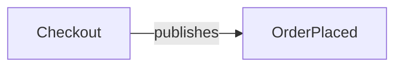

# Checkout architecture

## Glossary

API Gateway means the participant-facing routing boundary.

## Constraints

Checkout must encrypt PaymentToken.
Checkout publishes OrderPlaced.

```mermaid
flowchart LR
Checkout -->|publishes| OrderPlaced
```
